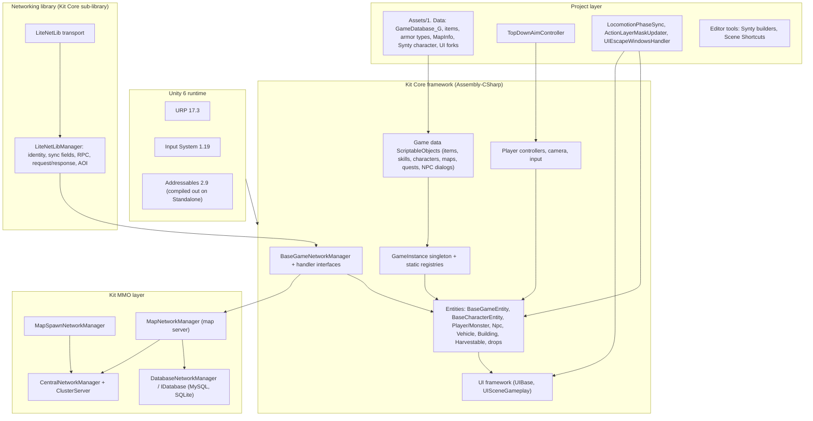
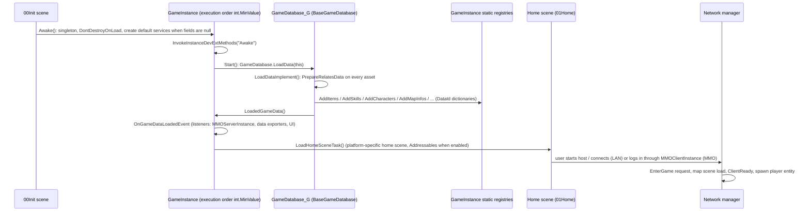
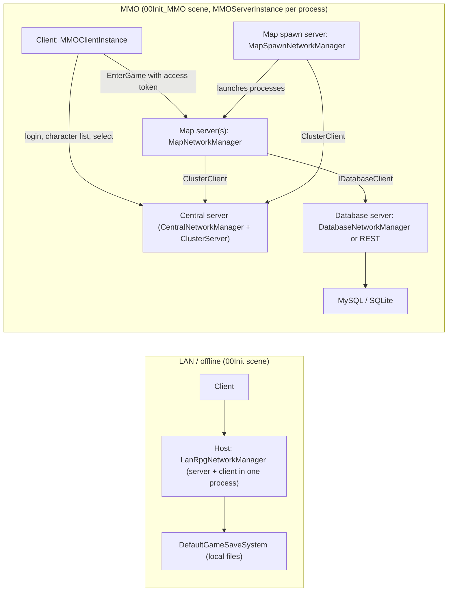
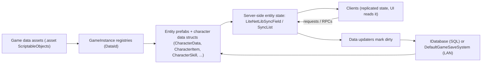

# MMORPG Granny: Project Architecture Overview

This is the entry point to the architecture documentation of the `MMORPG Granny` Unity project. It explains what the project is built from, how the pieces fit together, what happens at runtime, and where to go for details. Every subsystem has its own document under [Systems/](Systems/).

The documentation was produced by reading the source code in this repository. Where the official MMORPG KIT documentation or the Asset Store version differ from what is in this repository, the repository wins and the difference is called out.

## 1. What this repository is

| Fact | Value |
|---|---|
| Product | `MMORPG Granny` (`ProjectSettings/ProjectSettings.asset`, bundle version 1.97) |
| Engine | Unity 6000.3.13f1, Universal Render Pipeline 17.3.0, Input System 1.19.0 in "Both" mode |
| Framework | Suriyun **MMORPG KIT** ("UnityMultiplayerARPG"), namespaces `MultiplayerARPG` and `MultiplayerARPG.MMO` |
| Kit provenance | `Core/` mirrors GitHub `suriyun-mmorpg/UnityMultiplayerARPG_Core` at commit `2830829`; `MMO/` mirrors `UnityMultiplayerARPG_MMO` at `cbccdcf` (both applied 2026-08-29). `Demo*/` folders are older Asset Store content (February 2026) with no public repository. See [Systems/00_PROJECT_CUSTOMIZATIONS_AND_KIT_DIVERGENCE.md](Systems/00_PROJECT_CUSTOMIZATIONS_AND_KIT_DIVERGENCE.md). |
| Networking | LiteNetLib 1.0.1-1 through the kit's `LiteNetLibManager` layer (UDP, WebSocket, offline transports) |
| Persistence | MySQL or SQLite inside Unity server builds; PostgreSQL and Redis exist in source for the .NET server build only |
| Official kit docs | https://suriyun-production.github.io/mmorpg-kit-docs/ |
| Project change log | [CHANGELOG.md](../CHANGELOG.md) at the repository root. It is the authoritative record of every project customization and the reasoning behind it. |

The project is at an early stage: it is the kit plus a first slice of project content (a Synty modular player character, a top-down cursor-aim controller, two swords, two armor slots, a prototype world scene, and a handful of editor tools). Most gameplay data still comes from the kit's demo folder.

## 2. How to use this documentation

Read in this order if you are new:

1. This overview (sections 3 to 8).
2. [Systems/00_PROJECT_CUSTOMIZATIONS_AND_KIT_DIVERGENCE.md](Systems/00_PROJECT_CUSTOMIZATIONS_AND_KIT_DIVERGENCE.md): what is project-owned versus kit-owned, and which kit files were edited in place.
3. [Systems/01_CORE_ARCHITECTURE.md](Systems/01_CORE_ARCHITECTURE.md), [Systems/03_NETWORKING_FOUNDATION.md](Systems/03_NETWORKING_FOUNDATION.md), [Systems/07_ENTITY_FRAMEWORK.md](Systems/07_ENTITY_FRAMEWORK.md), [Systems/08_CHARACTER_SYSTEM.md](Systems/08_CHARACTER_SYSTEM.md): the four documents everything else builds on.
4. [Systems/39_DEV_EXTENSION_SYSTEM.md](Systems/39_DEV_EXTENSION_SYSTEM.md) before writing any code, so that new functionality lands outside the kit tree.
5. The subsystem document for the area you are changing (section 10).

Every system document uses the same section order: Purpose, Scope, High-Level Architecture, Key Components, Important Classes and Interfaces, Data Flow, Runtime Behaviour, Networking and Authority, Persistence, Dependencies, Extension and Customization Points, Core Framework vs Project Customization, Differences from Official MMORPG Kit Documentation and Known Issues, Related Documents. Paths are repository-relative and start with `Assets/`.

Conventions used throughout:

- **Kit Core** means `Assets/UnityMultiplayerARPG/Core/`. **Kit MMO** means `Assets/UnityMultiplayerARPG/MMO/`. **Kit Demo content** means `Assets/UnityMultiplayerARPG/Demo*/`. **Project custom** means `Assets/Scripts/`, `Assets/1. Data/`, `Assets/TopDownController/`, project-authored prefabs and any kit file this project edited in place.
- Demo2D, DemoShooter, DemoSurvival and the Shooter controller family exist in the repository but are out of scope for this documentation pass. They are mentioned only where a system branches on them.

## 3. Repository layout

| Path | Content | Origin |
|---|---|---|
| `Assets/UnityMultiplayerARPG/Core/Scripts/` | The gameplay framework: GameInstance, game data ScriptableObjects, entities, character systems, networking handlers, UI, LAN game (1480 C# files) | Kit Core |
| `Assets/UnityMultiplayerARPG/Core/LiteNetLibManager/` | Networking library (transport, identity, sync fields, RPC, request/response) plus bundled LiteNetLib, UniTask, ZString, Fleck (374 C# files) | Kit Core sub-library |
| `Assets/UnityMultiplayerARPG/Core/SharedData/` | Plain C# data types shared with the .NET server projects: `CharacterData`, `PlayerCharacterData`, `CharacterItem`, `GuildData`, `PartyData`, `Mail`, UI key enums | Kit Core sub-library |
| `Assets/UnityMultiplayerARPG/Core/{CameraAndInput,AudioManager,GraphicSettings,UpdateManager,DevExtension,AddressableAssetTools,UnityEditorUtils,UnityRestClient,SpatialPartitioningSystems,SerializableCallback,SerializationSurrogates,xNode}/` | Independent sub-libraries, each with its own assembly definition | Kit Core sub-libraries |
| `Assets/UnityMultiplayerARPG/Core/Editor/` | Kit editor tooling: game database editor, entity creators, NPC dialog graph editor, build helpers (38 files) | Kit Core |
| `Assets/UnityMultiplayerARPG/MMO/Scripts/MMOGame/` | MMO layer: `MMOServerInstance`, `MMOClientInstance`, `MapNetworkManager`, server-side handlers; `Src/` holds the Central, Cluster, MapSpawn and Database sources shared with the .NET server projects (329 C# files) | Kit MMO |
| `Assets/UnityMultiplayerARPG/MMO/{Plugins,SQLs}/` | MySqlConnector, Mono.Data.Sqlite, sqlite3 natives, I18N; `mysql_main.sql` schema | Kit MMO |
| `Assets/UnityMultiplayerARPG/GuildWar/` | Guild war add-on (12 files) talking to an external Node.js service | Kit add-on |
| `Assets/UnityMultiplayerARPG/Demo/` | 3D demo content: game data under `GameData/Resources/`, entity and UI prefabs, scenes `00Init`, `01Home`, `Map001`, `Map002`, input actions asset, nine demo scripts | Kit Demo content (Asset Store era) |
| `Assets/UnityMultiplayerARPG/{Demo2D,DemoShooter,DemoSurvival,DemoGuildWar,DemoAddressable}/` | Other template flavours | Kit Demo content (out of scope this pass, except DemoGuildWar assets registered in the project database) |
| `Assets/UnityMultiplayerARPG/MMO/Demo/` | MMO entry scenes and prefabs (`00Init_MMO`, `01Home_MMO`, `GameInstance`, `MMOServerInstance`, `MMOClientInstance`, `MapNetworkManager`) | Kit MMO demo |
| `Assets/1. Data/` | Project game data and prefabs: `GameDatabase_G.asset`, `GameData/` category folders, `Prefabs/SyntyPlayerCharacter.prefab`, forked UI prefabs, weapon prefab, `Scenes/Prototype_World_01.unity` | Project custom |
| `Assets/Scripts/` | Project runtime and editor code (6 files) | Project custom |
| `Assets/TopDownController/` | Cursor-aim controller and top-down camera prefabs (1 script, 3 prefabs) | Project custom, derived from the creator's TopDownController add-on |
| `Assets/Settings/` | URP pipeline and renderer assets, quality levels | Project custom (Unity URP template) |
| `Assets/Resources/BillingMode.json` | Unity IAP store selection (Google Play) | Unity Purchasing |
| `Packages/manifest.json` | Unity package set (Addressables, AI Navigation, Purchasing, Vivox, Cinemachine, unity-mcp, ...) | Project configuration |
| `ProjectSettings/` | Player settings, build scene list, define symbols, input axes, tags and layers | Project configuration |
| `CHANGELOG.md` | Project change record with reasoning | Project custom |

Purchased art and audio packs (Synty Polygon Fantasy Hero Characters, Synty Animation Base Locomotion, Synty interface packs, Action RPG SFX V2, Hovl Studio VFX, Kevin Iglesias Human Animations, Melee Weapons Pack 1, BLINK icons) are excluded by `.gitignore` and must be re-imported after cloning. Prefabs under `Assets/1. Data/` reference them.

## 4. Architecture at a glance

Layering rules that hold in the code:

- Everything in `Core/Scripts`, `MMO/Scripts`, `GuildWar`, `Demo*/Scripts`, `Assets/Scripts` and `Assets/TopDownController` compiles into the single default `Assembly-CSharp`. Only the sub-libraries (LiteNetLibManager, UniTask, xNode, CameraAndInput, and so on) have assembly definitions. This means project code can use `partial class` and `[DevExtMethods]` hooks on kit classes directly.
- The MMO layer inherits from the Core layer: `MapNetworkManager : BaseGameNetworkManager : LiteNetLibGameManager : LiteNetLibManager`. LAN/offline play uses `LanRpgNetworkManager : BaseGameNetworkManager` instead.
- Game data is loaded once into static dictionaries on `GameInstance` keyed by an integer `DataId` derived from the asset name. Entities reference data by id, never by asset reference, so the same data works on client, server and in the database.
- Server authority is the rule: clients send requests or RPCs, the server validates and mutates synchronized state, and the state replicates back. Movement is the main client-driven exception (see [Systems/07_ENTITY_FRAMEWORK.md](Systems/07_ENTITY_FRAMEWORK.md)).

## 5. What happens when the game starts

Build scene 0 is `Assets/UnityMultiplayerARPG/Demo/Scenes/00Init.unity` (the LAN/offline flavour). Its `GameInstance` object references the project's `Assets/1. Data/GameDatabase_G.asset`, the project's `Assets/1. Data/Prefabs/UI Prefabs/CanvasGameplay_G.prefab` and the project's `Assets/TopDownController/Demo/Prefabs/TopDownAimController.prefab`. The MMO flavour starts from `Assets/UnityMultiplayerARPG/MMO/Demo/Scenes/00Init_MMO.unity`, whose `GameInstance` prefab still points at the kit's demo database, stock controller and stock canvas (see section 9).

Details, including which default services are created and the execution-order constants, are in [Systems/01_CORE_ARCHITECTURE.md](Systems/01_CORE_ARCHITECTURE.md). The MMO server start sequence (command-line arguments, `serverConfig.json`, which of central / map spawn / database / map servers a process starts) is in [Systems/04_MMO_SERVER_ARCHITECTURE.md](Systems/04_MMO_SERVER_ARCHITECTURE.md).

## 6. Who owns global state

| State | Owner | Notes |
|---|---|---|
| Loaded game data (items, skills, attributes, characters, map infos, quests, NPC dialogs, factions, ...) | Static dictionaries on `GameInstance` (`Assets/UnityMultiplayerARPG/Core/Scripts/GameInstance/GameInstance_Data.cs`) | Filled once by the game database at start; keyed by `DataId` |
| Gameplay services (gameplay rule, inventory manager, save system, GM commands, day/night, bones setup, network setting, message manager) | Serialized ScriptableObject fields on `GameInstance`, with defaults created in `Awake()` | Swap by assigning a subclass asset |
| Client/server feature handlers (inventory, character, party, guild, chat, storage, mail, cash shop, ...) | Static interface properties on `GameInstance`, assigned by the active network manager's `_FeatureHandlers` partial | Different implementations for LAN (`LanRpg*`) and MMO (`MMOServer*`) |
| The local player | `GameInstance.PlayingCharacter` / `PlayingCharacterEntity`, `JoinedParty`, `JoinedGuild`, `OpenedStorages`, `UserId`, `AccessToken` | Static; set by the network manager when the player entity spawns |
| Networked objects and players | `LiteNetLibGameManager.Assets` (spawned objects), `Players` | Server keeps the authoritative set |
| Per-map server state (online players, warp requests, instance ids, pending saves) | `MapNetworkManager` (MMO) or `LanRpgNetworkManager` (LAN) | One per process |
| Cluster-wide state (registered app servers, online users, channels) | `CentralNetworkManager` + `ClusterServer` | One central per cluster |
| Persistent state | SQL through `IDatabase` (MMO) or `DefaultGameSaveSystem` files (LAN) | See [Systems/05_DATABASE_AND_PERSISTENCE_SYSTEM.md](Systems/05_DATABASE_AND_PERSISTENCE_SYSTEM.md) |

## 7. Runtime topologies

Both topologies run the same gameplay code; the difference is which `BaseGameNetworkManager` subclass is active and which handler implementations it installs. The MMO topology is documented in [Systems/04_MMO_SERVER_ARCHITECTURE.md](Systems/04_MMO_SERVER_ARCHITECTURE.md) and the network foundation in [Systems/03_NETWORKING_FOUNDATION.md](Systems/03_NETWORKING_FOUNDATION.md).

## 8. How data flows

- Definitions are ScriptableObjects; instances are plain structs/classes (`CharacterItem`, `CharacterSkill`, `CharacterBuff`, `CharacterQuest`, ...) that carry a `dataId` and per-instance values. [Systems/02_GAME_DATA_AND_SCRIPTABLE_OBJECTS.md](Systems/02_GAME_DATA_AND_SCRIPTABLE_OBJECTS.md)
- Derived values (final stats, resistances, calculated buffs) are computed and cached per entity, never persisted. [Systems/09_CHARACTER_STATS_AND_PROGRESSION.md](Systems/09_CHARACTER_STATS_AND_PROGRESSION.md)
- Custom per-character values use the built-in public/private/server boolean, int and float collections instead of schema changes. [Systems/34_CUSTOM_DATA_SYSTEM.md](Systems/34_CUSTOM_DATA_SYSTEM.md)

## 9. Core framework versus project customization

The kit is treated as a vendored framework. Project work is meant to live in `Assets/1. Data`, `Assets/Scripts`, `Assets/TopDownController` and in forked prefabs, using the kit's extension mechanisms (subclassing, partial classes, `[DevExtMethods]` hooks, entity events, handler interface swaps, ScriptableObject service swaps). The full inventory, including the kit files that were edited in place and the checklist to re-apply after a kit update, is in [Systems/00_PROJECT_CUSTOMIZATIONS_AND_KIT_DIVERGENCE.md](Systems/00_PROJECT_CUSTOMIZATIONS_AND_KIT_DIVERGENCE.md).

Summary of what the project currently owns:

| Area | Project element | Kit element it builds on |
|---|---|---|
| Game database | `Assets/1. Data/GameDatabase_G.asset` (explicit `GameDatabase`), `Assets/1. Data/GameData/**` | `GameDatabase`, `BaseGameData` |
| Player character | `Assets/1. Data/Prefabs/SyntyPlayerCharacter.prefab` (Synty FixedScale rig, `PlayableCharacterModel`) | `PlayerCharacterEntity`, `PlayableCharacterModel`, `CharacterControllerEntityMovement` |
| Animation | `LocomotionPhaseSync`, `ActionLayerMaskUpdater`, `SyntyUpperBody.mask` | `AnimationPlayableBehaviour` layer mixers |
| Controller and camera | `TopDownAimController`, `TopDownGameplayCamera.prefab` | `PlayerCharacterController`, `FollowCameraControls` |
| UI | `CanvasGameplay_G`, `UIDialogs_G`, `UIItemsDialog` forks, `UIEscapeWindowsHandler` | `UISceneGameplay`, `UIBase`, `UIEquipItems` |
| Items and equipment | `Legs`/`Cloak` armor types, `Legs001_G`, `DarkFortressSword001_G`, `SyntySword001_G`, `SM_Wep_Sword_01_G.prefab` | `ArmorType`, `ArmorItem`, `WeaponItem`, `EquipmentModel` |
| World | `Prototype_World_01.unity` + `MapInfo` (terrain, NavMesh, one spawn point, no spawn areas yet) | `MapInfo`, `BaseGameNetworkManager` scene flow |
| Editor tools | Scene Shortcuts, Synty Equipment Container Builder, Synty Locomotion Animation Builder | `BaseCharacterModel.EquipmentContainers`, `PlayableCharacterModel.defaultAnimations` |

Both entry scenes matter: `00Init.unity` (LAN) is wired to the project assets above, while `00Init_MMO.unity` still instantiates the kit's `GameInstance.prefab`, which references `Assets/UnityMultiplayerARPG/Demo/GameData/GameDatabase.asset`, the stock `PlayerCharacterController.prefab` and the stock `CanvasGameplay.prefab`. The kit's demo `GameDatabase.asset` has itself been edited to include the project content, so the two databases differ only by the two project swords.

## 10. System catalogue

Numbering reflects dependency order: lower numbers are foundations that higher numbers rely on. The `00` document is the cross-cutting customization index.

| Document | System | Key classes | Project status |
|---|---|---|---|
| [00_PROJECT_CUSTOMIZATIONS_AND_KIT_DIVERGENCE.md](Systems/00_PROJECT_CUSTOMIZATIONS_AND_KIT_DIVERGENCE.md) | Customization and divergence index | all project files | Project |
| [01_CORE_ARCHITECTURE.md](Systems/01_CORE_ARCHITECTURE.md) | Bootstrap, GameInstance, services, assemblies, defines | `GameInstance`, `BaseGameDatabase`, `DefaultExecutionOrders` | Kit, configured by project |
| [02_GAME_DATA_AND_SCRIPTABLE_OBJECTS.md](Systems/02_GAME_DATA_AND_SCRIPTABLE_OBJECTS.md) | Data assets and registries | `BaseGameData`, `GameDatabase`, `GameDataHelpers` | Kit, project data added |
| [03_NETWORKING_FOUNDATION.md](Systems/03_NETWORKING_FOUNDATION.md) | Transport, replication, RPC, handlers | `LiteNetLibManager`, `LiteNetLibGameManager`, `BaseGameNetworkManager`, `LanRpgNetworkManager` | Kit |
| [04_MMO_SERVER_ARCHITECTURE.md](Systems/04_MMO_SERVER_ARCHITECTURE.md) | Central, cluster, map spawn, map, database servers | `MMOServerInstance`, `CentralNetworkManager`, `MapNetworkManager`, `MapSpawnNetworkManager` | Kit, not yet configured for deployment |
| [05_DATABASE_AND_PERSISTENCE_SYSTEM.md](Systems/05_DATABASE_AND_PERSISTENCE_SYSTEM.md) | SQL persistence, LAN save system | `IDatabase`, `MySQLDatabase`, `SQLiteDatabase`, `DatabaseNetworkManager`, `DefaultGameSaveSystem` | Kit |
| [06_AUTHENTICATION_AND_ACCOUNT_SYSTEM.md](Systems/06_AUTHENTICATION_AND_ACCOUNT_SYSTEM.md) | Login, tokens, accounts | `CentralNetworkManager_Login`, `DefaultDatabaseUserLogin` | Kit |
| [07_ENTITY_FRAMEWORK.md](Systems/07_ENTITY_FRAMEWORK.md) | Entity base classes, movement, hit boxes, pooling | `BaseGameEntity`, `DamageableEntity`, `EntityInfo`, `CharacterControllerEntityMovement` | Kit |
| [08_CHARACTER_SYSTEM.md](Systems/08_CHARACTER_SYSTEM.md) | Player and monster characters, creation, lifecycle | `BaseCharacterEntity`, `PlayerCharacterEntity`, `PlayerCharacterData` | Kit, project prefab added |
| [09_CHARACTER_STATS_AND_PROGRESSION.md](Systems/09_CHARACTER_STATS_AND_PROGRESSION.md) | Attributes, stats, exp, levels | `CharacterStats`, `Attribute`, `ExpTable`, `CharacterDataCacheManager` | Kit |
| [10_COMBAT_AND_DAMAGE_SYSTEM.md](Systems/10_COMBAT_AND_DAMAGE_SYSTEM.md) | Attacks, damage, hit registration, death, respawn | `DamageInfo`, `DefaultCharacterAttackComponent`, `DamageableEntity` | Kit, project aim controller feeds it |
| [11_SKILL_AND_ABILITY_SYSTEM.md](Systems/11_SKILL_AND_ABILITY_SYSTEM.md) | Skills | `BaseSkill`, `Skill`, `DefaultCharacterUseSkillComponent` | Kit |
| [12_BUFF_AND_STATUS_EFFECT_SYSTEM.md](Systems/12_BUFF_AND_STATUS_EFFECT_SYSTEM.md) | Buffs, status effects, ailments | `Buff`, `StatusEffect`, `CharacterBuff` | Kit |
| [13_ITEM_AND_INVENTORY_SYSTEM.md](Systems/13_ITEM_AND_INVENTORY_SYSTEM.md) | Items, inventory, drops | `BaseItem`, `CharacterItem`, `BaseInventoryManager` | Kit, project items added |
| [14_EQUIPMENT_SYSTEM.md](Systems/14_EQUIPMENT_SYSTEM.md) | Equip slots, weapon sets, visuals | `EquipWeapons`, `ArmorType`, `EquipmentModel`, `EquipmentContainer` | Kit, project slots and sockets added |
| [15_CHARACTER_MODEL_AND_ANIMATION_SYSTEM.md](Systems/15_CHARACTER_MODEL_AND_ANIMATION_SYSTEM.md) | Models, Playables animation graph, equipment visuals | `BaseCharacterModel`, `PlayableCharacterModel`, `AnimationPlayableBehaviour` | Kit plus project components and builders |
| [16_QUEST_SYSTEM.md](Systems/16_QUEST_SYSTEM.md) | Quests | `Quest`, `QuestTask`, `CharacterQuest` | Kit |
| [17_NPC_AND_DIALOGUE_SYSTEM.md](Systems/17_NPC_AND_DIALOGUE_SYSTEM.md) | NPCs, dialog graphs, conditions, actions | `NpcEntity`, `NpcDialog`, `NpcDialogGraph` | Kit |
| [18_MONSTER_AI_AND_SPAWN_SYSTEM.md](Systems/18_MONSTER_AI_AND_SPAWN_SYSTEM.md) | Monster AI, spawn areas, loot | `MonsterCharacterEntity`, `MonsterActivityComponent`, `MonsterSpawnArea` | Kit |
| [19_WORLD_MAP_AND_SCENE_SYSTEM.md](Systems/19_WORLD_MAP_AND_SCENE_SYSTEM.md) | Maps, scenes, portals, day/night | `MapInfo`, `WarpPortalEntity`, `UISceneLoading` | Kit, project map added |
| [20_INSTANCE_AND_DUNGEON_SYSTEM.md](Systems/20_INSTANCE_AND_DUNGEON_SYSTEM.md) | Instanced maps | `MapSpawnNetworkManager`, instance map info settings | Kit |
| [21_SOCIAL_SYSTEM.md](Systems/21_SOCIAL_SYSTEM.md) | Party, guild, friends | `PartyData`, `GuildData`, party/guild handlers | Kit |
| [22_PVP_SYSTEM.md](Systems/22_PVP_SYSTEM.md) | PK, dueling, alliances | `PlayerCharacterPkComponent`, `PlayerCharacterDuelingComponent` | Kit |
| [23_GAMEPLAY_RULES_AND_RESTRICTIONS.md](Systems/23_GAMEPLAY_RULES_AND_RESTRICTIONS.md) | Gameplay rule service, configs, restrictions | `BaseGameplayRule`, `DefaultGameplayRule` | Kit |
| [24_BUILDING_SYSTEM.md](Systems/24_BUILDING_SYSTEM.md) | Construction | `BuildingEntity`, `BuildingArea`, `PlayerCharacterBuildingComponent` | Kit |
| [25_HARVESTING_AND_RESOURCE_SYSTEM.md](Systems/25_HARVESTING_AND_RESOURCE_SYSTEM.md) | Harvestables | `HarvestableEntity`, `HarvestableSpawnArea` | Kit |
| [26_CRAFTING_SYSTEM.md](Systems/26_CRAFTING_SYSTEM.md) | Crafting | `ItemCraft`, `PlayerCharacterCraftingComponent`, `WorkbenchEntity` | Kit |
| [27_MOUNT_AND_VEHICLE_SYSTEM.md](Systems/27_MOUNT_AND_VEHICLE_SYSTEM.md) | Mounts and vehicles | `VehicleEntity`, `MountEntity`, `MountItem` | Kit |
| [28_PET_AND_SUMMON_SYSTEM.md](Systems/28_PET_AND_SUMMON_SYSTEM.md) | Pets and summons | `CharacterSummon`, `PetItem`, `SkillSummon` | Kit |
| [29_EFFECTS_SYSTEM.md](Systems/29_EFFECTS_SYSTEM.md) | Visual effects | `GameEffect`, `PoolingGameEffectsPlayer` | Kit |
| [30_UI_SYSTEM.md](Systems/30_UI_SYSTEM.md) | UI framework | `UIBase`, `UISceneGameplay`, `UIList` | Kit plus project forks and escape handler |
| [31_CHAT_AND_COMMUNICATION_SYSTEM.md](Systems/31_CHAT_AND_COMMUNICATION_SYSTEM.md) | Chat | `ChatMessage`, chat handlers | Kit |
| [32_ECONOMY_CURRENCY_TRADE_AND_STORAGE.md](Systems/32_ECONOMY_CURRENCY_TRADE_AND_STORAGE.md) | Gold, currencies, shops, dealing, vending, storage, bank, mail | `Currency`, `Storage`, storage/mail handlers | Kit |
| [33_CASH_SHOP_AND_IAP_SYSTEM.md](Systems/33_CASH_SHOP_AND_IAP_SYSTEM.md) | Cash shop, Unity IAP | `CashShopItem`, `CashPackage`, `GameInstance_Purchasing` | Kit, not configured |
| [34_CUSTOM_DATA_SYSTEM.md](Systems/34_CUSTOM_DATA_SYSTEM.md) | Custom character data | `CharacterDataBoolean/Int32/Float32` | Kit |
| [35_ADDRESSABLES_AND_CONTENT_LOADING.md](Systems/35_ADDRESSABLES_AND_CONTENT_LOADING.md) | Addressables | `AddressableAssetTools`, `AssetReference*` | Kit, disabled on Standalone |
| [36_INPUT_CAMERA_AND_CONTROLLER_SYSTEM.md](Systems/36_INPUT_CAMERA_AND_CONTROLLER_SYSTEM.md) | Input, camera, player controller | `InputManager`, `FollowCameraControls`, `PlayerCharacterController`, `TopDownAimController` | Kit plus project controller |
| [37_MULTI_PLATFORM_SUPPORT.md](Systems/37_MULTI_PLATFORM_SUPPORT.md) | Platform branches | `GameInstance` platform fields, defines | Kit |
| [38_LOCALIZATION_SYSTEM.md](Systems/38_LOCALIZATION_SYSTEM.md) | Languages | `LanguageManager`, `UITextKeys` | Kit |
| [39_DEV_EXTENSION_SYSTEM.md](Systems/39_DEV_EXTENSION_SYSTEM.md) | Extension mechanisms | `DevExtUtils`, `GameExtensionInstance`, entity events | Kit, used by project |
| [40_BUILD_AND_DEPLOYMENT_SYSTEM.md](Systems/40_BUILD_AND_DEPLOYMENT_SYSTEM.md) | Builds, server processes, config files | `Builder`, `ProcessArguments`, `ServerConfig` | Kit |
| [41_THIRD_PARTY_DEPENDENCIES.md](Systems/41_THIRD_PARTY_DEPENDENCIES.md) | Dependency catalogue | packages, DLLs, asset packs | Project |
| [42_AUDIO_AND_GRAPHIC_SETTINGS.md](Systems/42_AUDIO_AND_GRAPHIC_SETTINGS.md) | Audio manager, graphics settings | `AudioManager`, `GraphicSettingManager` | Kit |
| [43_GM_COMMANDS_AND_ADMIN_TOOLS.md](Systems/43_GM_COMMANDS_AND_ADMIN_TOOLS.md) | GM commands, logging, bans | `DefaultGMCommands`, `IServerLogHandlers` | Kit |
| [44_EDITOR_TOOLING.md](Systems/44_EDITOR_TOOLING.md) | Editor windows and menus | kit editors, project tools | Kit plus project tools |
| [45_GUILD_WAR_EXTENSION.md](Systems/45_GUILD_WAR_EXTENSION.md) | Guild war add-on | `GuildWarMapInfo`, `GuildWarCastleHeart` | Kit add-on, registered in project database |

## 11. Conditional compilation and build flavours

`ProjectSettings/ProjectSettings.asset` defines `STEAMWORKS_NET` for Standalone, Android, iOS and WebGL (no Steamworks code exists; the define is inert) and `DISABLE_ADDRESSABLES` for Standalone. The second one matters: every `#if !DISABLE_ADDRESSABLES` path in the kit (addressable entity, UI and scene loading) is compiled out of PC builds, and the direct prefab references on `GameInstance` and `GameDatabase` are used instead. The editor compiles both paths. Legacy numeric entries carry `UNITY_SERVER`, `NO_GPGS` and `ENABLE_PURCHASING;UNITY_PURCHASING`.

Kit-recognised symbols with the largest footprint: `UNITY_SERVER` and `EXCLUDE_SERVER_CODES` (strip server code from clients), `EXCLUDE_PREFAB_REFS` (addressables-only builds), `DISABLE_CUSTOM_CHARACTER_DATA`, `DISABLE_CLASSIC_PK`, `DISABLE_DIFFER_MAP_RESPAWNING`, `ENABLE_INPUT_SYSTEM`, `ENABLE_PURCHASING`. See [Systems/40_BUILD_AND_DEPLOYMENT_SYSTEM.md](Systems/40_BUILD_AND_DEPLOYMENT_SYSTEM.md).

## 12. Where to change what

| I want to... | Go to |
|---|---|
| Add an item, skill, quest, NPC, map or monster definition | Create the asset under `Assets/1. Data/GameData/<Category>/`, register it in `Assets/1. Data/GameDatabase_G.asset`. [02](Systems/02_GAME_DATA_AND_SCRIPTABLE_OBJECTS.md) |
| Add a new item or skill type | Subclass `BaseItem`/`Item` or `BaseSkill`/`Skill` with `CreateAssetMenu`. [13](Systems/13_ITEM_AND_INVENTORY_SYSTEM.md), [11](Systems/11_SKILL_AND_ABILITY_SYSTEM.md) |
| Change damage, exp, gold or drop formulas | Subclass `BaseGameplayRule` and assign it on `GameInstance`. [23](Systems/23_GAMEPLAY_RULES_AND_RESTRICTIONS.md), [10](Systems/10_COMBAT_AND_DAMAGE_SYSTEM.md) |
| React to entity lifecycle or damage without touching kit code | Partial class with `[DevExtMethods("Awake")]` subscribing to `onReceivedDamage`, `onApplyBuff`, and so on. [39](Systems/39_DEV_EXTENSION_SYSTEM.md) |
| Store a custom per-character value | Use the public/private/server custom data collections. [34](Systems/34_CUSTOM_DATA_SYSTEM.md) |
| Add a new network request | Register in a `BaseGameNetworkManager` partial under `[DevExtMethods("RegisterMessages")]`, add a message struct and handler. [03](Systems/03_NETWORKING_FOUNDATION.md) |
| Change how the player controls the character or camera | Extend `TopDownAimController` or swap `GameInstance.defaultControllerPrefab`. [36](Systems/36_INPUT_CAMERA_AND_CONTROLLER_SYSTEM.md) |
| Add equipment visuals to the Synty character | Run the Synty Equipment Container Builder, set `EquipmentModel.equipSocket` and `instantiatedObjectIndex` on the item. [14](Systems/14_EQUIPMENT_SYSTEM.md), [15](Systems/15_CHARACTER_MODEL_AND_ANIMATION_SYSTEM.md) |
| Add or change animations | Fill `PlayableCharacterModel.defaultAnimations` / `weaponAnimations` or the `WeaponType` playable settings. [15](Systems/15_CHARACTER_MODEL_AND_ANIMATION_SYSTEM.md) |
| Add a dialog window | Add it under the forked `UIDialogs_G.prefab`; it is auto-collected by `UIEscapeWindowsHandler`. [30](Systems/30_UI_SYSTEM.md) |
| Run a dedicated server or an MMO cluster | [40](Systems/40_BUILD_AND_DEPLOYMENT_SYSTEM.md), [04](Systems/04_MMO_SERVER_ARCHITECTURE.md), [05](Systems/05_DATABASE_AND_PERSISTENCE_SYSTEM.md) |
| Update the kit from GitHub | Follow the re-apply checklist in [00](Systems/00_PROJECT_CUSTOMIZATIONS_AND_KIT_DIVERGENCE.md) |

## 13. Known gaps and risks (project level)

- The `Demo*/` content is February-2026 Asset Store data running against August-2026 Core and MMO code. Prefab and scene deserialization against changed code is the first suspect when a demo scene misbehaves (recorded in `CHANGELOG.md`, "Known follow-ups").
- Nine kit files or assets have been edited in place (listed in the `00` document). A kit re-import or GitHub mirror overwrites them.
- The project scene `Prototype_World_01.unity` contains terrain, lights, a NavMesh surface and one spawn point, but no monster spawn areas, NPCs, portals or harvestables yet.
- `Assets/1. Data/GameData/` is mostly empty placeholder folders; the game still runs on kit demo data (attributes, currencies, skills, quests, NPCs, monsters).
- The MMO entry scene is not wired to the project's database, controller or canvas.
- Purchased art is not in the repository; a fresh clone shows missing meshes and clips on the Synty character until the packs are re-imported.
- Installed but unused packages (Vivox, Cinemachine, Splines, Timeline, Visual Scripting, Memory Profiler, Multiplayer Center) add editor and build weight without kit integration. See [Systems/41_THIRD_PARTY_DEPENDENCIES.md](Systems/41_THIRD_PARTY_DEPENDENCIES.md).

## 14. Out of scope for this pass

Demo2D, DemoShooter, DemoSurvival, `MMO/Demo2D`, the 2D entity and movement classes, the Shooter controller family, and survival-specific mechanics are not documented in depth. They remain in the repository and compile.
