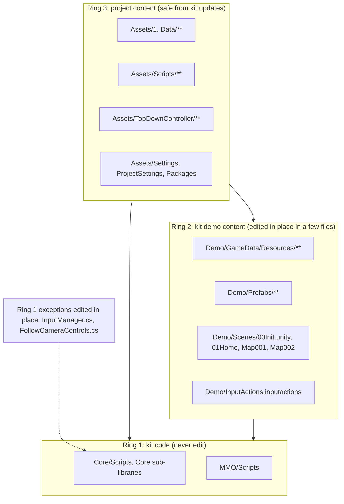
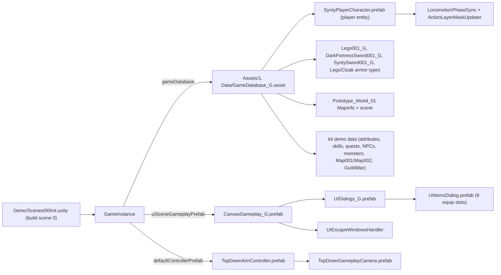

# Project Customizations and Kit Divergence Index

## Purpose

This document is the single place that answers "is this file ours or the kit's?", "what did we change inside the kit tree?", and "what breaks when the kit is updated?". It exists so that humans and AI agents can tell project-owned work apart from the vendored MMORPG KIT framework before touching anything, and so that a kit update can be re-applied safely. It complements the per-system documents, which describe how each system works; this one describes where the project deviates.

Facts here come from the repository (git history, asset YAML, source) and from `CHANGELOG.md`, which the project keeps as the running record of every customization and its reasoning.

## Scope

Inside this document:

- The provenance and version of every kit tree in the repository.
- Every project-authored script, asset, prefab and scene.
- Every kit file that was modified in place, with the reason and the consequence of a kit update.
- Configuration divergences (entry scenes, define symbols, packages) between this project and a stock kit install.
- Installed-but-unused dependencies, removed kit pieces, and content excluded from git.
- Behavioural differences from the official kit documentation that are caused by the project.
- The re-apply checklist after a kit update.

Outside this document:

- How each system works internally: see the numbered system documents.
- Third-party dependency details: `Packages/manifest.json`.
- The extension mechanisms themselves: `Assets/UnityMultiplayerARPG/Core/DevExtension/`.

## High-Level Architecture

The project treats the kit as a vendored framework with three ownership rings. The inner ring is kit code that is never edited. The middle ring is kit demo content that the project has partially adopted and, in a few places, edited in place. The outer ring is project content that only depends on public kit API.

Kit provenance (verified in `CHANGELOG.md` on 2026-08-29 and reflected in commit `f2e39d8` "Update to latest version"):

| Tree | Source | Version | Notes |
|---|---|---|---|
| `Assets/UnityMultiplayerARPG/Core/` | GitHub `suriyun-mmorpg/UnityMultiplayerARPG_Core` | commit `2830829` (August 2026) with 14 submodules mirrored | 368 commits newer than the Asset Store copy it replaced (`7876b7e`, February 2026). All `.cs.meta` GUIDs were verified identical, so references survived. |
| `Assets/UnityMultiplayerARPG/MMO/` | GitHub `suriyun-mmorpg/UnityMultiplayerARPG_MMO` | commit `cbccdcf` with `MMOSource` and `DatabaseManagerSource` submodules | `MMO/Scripts/MMOGame/Src/**` is shared with the .NET server projects |
| `Assets/UnityMultiplayerARPG/GuildWar/` | GitHub `suriyun-mmorpg/UnityMultiplayerARPG_GuildWar` | `main` at update time | Replaced byte-for-byte after the Core update broke the store copy |
| `Assets/UnityMultiplayerARPG/Demo*/`, `MMO/Demo*/` | Asset Store package | February 2026 era | No public repository. Not updated. Prefabs and scenes from February deserialize against August code; this is the first suspect for odd demo behaviour. |
| `Assets/TopDownController/` | GitHub `suriyun-mmorpg/UnityMultiplayerARPG_TopDownController` | installed 2026-08-28, then mostly replaced | Only the camera prefab is kept from the add-on; the controller script is project-written |

There is no version string in the kit code. Identify the version by diffing a known file against upstream history, as the changelog did to find `7876b7e`. Rollback point for the pre-update state: commit `e3a5a32` ("safe start from here").

## Key Components

| Component | Type | Responsibility | Location |
|---|---|---|---|
| Project change log | Markdown | Authoritative record of customizations with reasoning, environment notes, known follow-ups | `CHANGELOG.md` |
| Project game database | ScriptableObject (`GameDatabase`) | Explicit list of every data asset and entity prefab the game loads | `Assets/1. Data/GameDatabase_G.asset` |
| Project data folders | asset folders | Category folders mirroring the kit's, mostly `.gitkeep` placeholders | `Assets/1. Data/GameData/` |
| Synty player character | prefab (`PlayerCharacterEntity` + `PlayableCharacterModel`) | The project's playable character on the Synty FixedScale modular rig | `Assets/1. Data/Prefabs/SyntyPlayerCharacter.prefab` |
| Forked gameplay canvas | prefab | Fork of the kit's `CanvasGameplay` wired to `UIDialogs_G` and `UIEscapeWindowsHandler` | `Assets/1. Data/Prefabs/UI Prefabs/CanvasGameplay_G.prefab` |
| Forked dialogs container | prefab | Fork of `UIDialogs_Standalone` whose `UIItemsDialog` child is the project fork | `Assets/1. Data/Prefabs/UI Prefabs/UIDialogs_G.prefab` |
| Forked items dialog | prefab | `UIEquipItems.otherEquipSlots` with eight slots (Head, Body, Gloves, Shoes, Ring, Ring, Legs, Cloak) | `Assets/1. Data/Prefabs/UI Prefabs/UIItemsDialog.prefab` |
| Project weapon prefab | prefab | Copy of the Dark Fortress sword mesh prefab in project space | `Assets/1. Data/Prefabs/Weapons/SM_Wep_Sword_01_G.prefab` |
| Project map | scene + `MapInfo` | Prototype world with terrain, NavMesh and one spawn point | `Assets/1. Data/Scenes/Prototype_World_01.unity`, `Assets/1. Data/GameData/MapInfos/Prototype_World_01.asset` |
| Top-down aim controller | MonoBehaviour (`PlayerCharacterController` subclass) + prefab | Cursor-plane aiming, strafing movement states, UI-aware attack input | `Assets/TopDownController/Scripts/TopDownAimController.cs`, `Assets/TopDownController/Demo/Prefabs/TopDownAimController.prefab` |
| Top-down camera | prefab (`FollowCameraControls`) | Fixed-angle gameplay camera with persisted zoom | `Assets/TopDownController/Demo/Prefabs/TopDownGameplayCamera.prefab` |
| Locomotion phase sync | MonoBehaviour | Keeps stride phase continuous across locomotion clip transitions | `Assets/Scripts/Gameplay/LocomotionPhaseSync.cs` |
| Action layer mask updater | MonoBehaviour | Re-evaluates the action layer avatar mask while attacking so legs follow locomotion | `Assets/Scripts/Gameplay/ActionLayerMaskUpdater.cs` |
| Escape windows handler | MonoBehaviour | Escape closes all open windows first, then toggles the system menu | `Assets/Scripts/UI/UIEscapeWindowsHandler.cs` |
| Synty equipment container builder | Editor window | Wires `EquipmentContainer` entries from a Synty modular hierarchy | `Assets/Scripts/Editor/SyntyEquipmentContainerBuilder.cs` |
| Synty locomotion animation builder | Editor window | Assigns eight-direction locomotion clips and measures stride phases | `Assets/Scripts/Editor/SyntyLocomotionAnimationBuilder.cs` |
| Scene shortcuts | Editor window | Scene bookmarks with Open and Play buttons | `Assets/Scripts/Editor/SceneShortcutsWindow.cs` |
| Upper-body avatar mask | asset | Masks the Synty lower body for attacks while moving | `Assets/1. Data/AvatarMasks/SyntyUpperBody.mask` |
| URP settings | assets | PC and mobile pipeline assets, renderer assets, six quality levels | `Assets/Settings/` |

## Important Classes and Interfaces

### TopDownAimController

Purpose: the project's active player controller. Subclasses the kit's `PlayerCharacterController` in WASD mode and adds cursor aiming.

Responsibilities:
- Project the mouse cursor onto a horizontal plane at the character's feet and turn the character toward it.
- Force pending attack and skill actions to fire toward the cursor rather than toward the nearest enemy.
- Report facing-relative movement states so strafe and back-pedal animations play.
- Mute the `Attack` Input System action while the pointer is over UI.

Important methods:
- `UpdateWASDInput()` override: runs the aim update before the base attack logic in the same frame.
- `UpdateInput()` override: disables and re-enables the `Attack` action around the base call.
- `RedirectPendingActionToCursor()`: repoints `_turnToTargetPosition` when `_turnToTargetActionType` is Attack or UseSkill.
- `ApplyStrafeMovementState()`: re-sends `KeyMovement` with `GameplayUtils.GetMovementStateByDirection`.
- `TryGetCursorWorldPosition(out Vector3)`: plane raycast from `InputManager.MousePosition()`.

Dependencies: `PlayerCharacterController` protected members (`_moveDirection`, `_turnToTargetPosition`, `_turnToTargetActionType`), `InputManager.TryGetInputAction`, `UISceneGameplay.IsPointerOverUIObject`, `BaseCharacterEntity.SetLookRotation`, `KeyMovement`.

Used by: `GameInstance.defaultControllerPrefab` in `Assets/UnityMultiplayerARPG/Demo/Scenes/00Init.unity`. All player entity prefabs leave `controllerPrefab` empty, so this one field drives every character in the LAN flavour.

Extension points: every behaviour flag is a serialized field; `SetAttackInputEnabled`, `RedirectPendingActionToCursor`, `ApplyStrafeMovementState`, `UpdateTopDownAim` and `TryGetCursorWorldPosition` are virtual. `CurrentAimPosition` is exposed for future cursor-aimed skill shots through `UseHotkey`.

### LocomotionPhaseSync and ActionLayerMaskUpdater

Purpose: two runtime components on `SyntyPlayerCharacter.prefab` that correct animation blending on top of the kit's Playables graph without editing kit code.

Responsibilities:
- `LocomotionPhaseSync`: in `LateUpdate`, when a mixer has more than one input, set the incoming clip's time so the stride phase matches the outgoing clip, using per-clip `ClipPhases` offsets measured by the locomotion builder. Only looping clips of comparable length are synced.
- `ActionLayerMaskUpdater`: in `LateUpdate`, while any action layer has weight, swap that layer's avatar mask between `movingMask` and `AnimationPlayableBehaviour.EmptyMask` based on grounded movement.

Dependencies: public members of `PlayableCharacterModel` (`Behaviour`, `MovementState`) and `AnimationPlayableBehaviour` (`BaseLayerMixer`, `LeftHandWieldingLayerMixer`, `LayerMixer`, `ACTION_LAYER`, `EmptyMask`). If a kit update makes these non-public, compilation fails loudly rather than the behaviour failing silently; this was chosen on purpose.

Used by: `Assets/1. Data/Prefabs/SyntyPlayerCharacter.prefab`.

Extension points: `ClipPhases` property (filled by the builder), `movingMask` field.

### UIEscapeWindowsHandler

Purpose: World of Warcraft style Escape handling on the gameplay canvas.

Responsibilities: collect `UIBase` components from `windowContainers` children and `windowObjects` at `Awake`, excluding `excludingWindows`; on Escape (or the `CloseUI` button), hide every visible collected window and call `UISceneGameplay.HideNpcDialog()` so the server clears the NPC conversation; if nothing was open, toggle `uiSystemMenu`.

Dependencies: `UIBase.IsVisible/Hide/Toggle`, `InputManager.GetKeyDown/GetButtonDown`, `GenericUtils.IsFocusInputField`, `BaseUISceneGameplay.Singleton`.

Used by: `Assets/1. Data/Prefabs/UI Prefabs/CanvasGameplay_G.prefab` and the edited kit `Assets/UnityMultiplayerARPG/Demo/Prefabs/UI/_Gameplay/CanvasGameplay.prefab`. The Escape entry was removed from `UISceneGameplay.toggleUis` on both so the menu does not open while windows close.

Extension points: the three lists and `uiSystemMenu` are inspector fields; `CollectWindows()` is public and re-runnable.

### SyntyEquipmentContainerBuilder and SyntyLocomotionAnimationBuilder

Purpose: editor windows (menu `Tools/MMORPG KIT/...`) that turn a Synty modular character into a kit-compatible model without hand-wiring hundreds of references.

Responsibilities: the container builder maps Synty part folders to `EquipmentContainer` sockets (Body, Gloves, Legs, Head, Eyebrows, FacialHair, HeadCovering_BaseHair, HeadCovering_NoFacialHair, HeadCovering_NoHair, Hair, Helmet, ChestAttachment, Cloak, Shoulders, Elbows, HipsAttachment, Knees, Extra) using instantiated-object groups indexed by the trailing number of the Synty mesh name, and replaces only same-named sockets so hand-made ones survive. The locomotion builder assigns the eight directional `MoveStates` clips per move type from the Synty Animation Base Locomotion pack (forward hemisphere from `FwdStrafe`, rear hemisphere from `BckStrafe`), plus idle, sprint forward, jump, fall and land, and measures each clip's stride phase by sampling left-foot height and cross-correlating against the forward clip.

Important methods: static `SyntyEquipmentContainerBuilder.Build(...)` and `SyntyLocomotionAnimationBuilder.Assign(...)` for headless use.

Dependencies: `BaseCharacterModel.EquipmentContainers`, `EquipmentContainer`, `EquipmentInstantiatedObjectGroup`, `PlayableCharacterModel.defaultAnimations`, `DefaultAnimations`, `MoveStates`, `AnimState`, `LocomotionPhaseSync`.

Used by: the project owner when (re)building `SyntyPlayerCharacter.prefab`.

Extension points: the slot map and direction map are static tables at the top of each file.

## Data Flow

How project content reaches the running game in the LAN flavour:

The kit's demo `Warrior` class asset was edited so that its `startMap` is `Prototype_World_01` and its `rightHandEquipItem` is the demo `TwoHandSword001`, which is why a new Warrior spawns in the project map holding a two-hand sword whose animations come from the edited `TwoHandSword` weapon type.

## Runtime Behaviour

Nothing in the project layer changes the kit's startup order. The differences are all in what gets loaded:

- The LAN entry scene loads the project database, canvas and controller (section above).
- The MMO entry scene `Assets/UnityMultiplayerARPG/MMO/Demo/Scenes/00Init_MMO.unity` instantiates `Assets/UnityMultiplayerARPG/MMO/Demo/Prefabs/GameInstance.prefab`, which still references `Assets/UnityMultiplayerARPG/Demo/GameData/GameDatabase.asset`, `Assets/UnityMultiplayerARPG/Demo/Prefabs/Gameplay/PlayerCharacterController.prefab` and `Assets/UnityMultiplayerARPG/Demo/Prefabs/UI/_Gameplay/CanvasGameplay.prefab`. The kit's demo `GameDatabase.asset` was edited to hold the same entries as `GameDatabase_G` except the two project swords, so the MMO flavour would spawn the Synty character with the stock controller and stock canvas (which itself now carries the escape handler).
- On the Synty character, `LocomotionPhaseSync` and `ActionLayerMaskUpdater` run in `LateUpdate` on every peer that has the model (server included when `updateAnimationAtServer` is on); they touch only the local Playables graph and never network state.
- `TopDownAimController` exists only on the owning client, like every `BasePlayerCharacterController`.

## Networking and Authority

No project code adds network messages, sync fields or RPCs. `TopDownAimController` only changes which look rotation and `MovementState` the owning client sends through the kit's existing movement path (`SetLookRotation`, `KeyMovement`) and where a pending attack is aimed before the kit's own `RequestAttack` runs. Server validation of attacks, skills and movement is unchanged. See `Assets/UnityMultiplayerARPG/Core/Scripts/Networking/` and `Assets/UnityMultiplayerARPG/Core/Scripts/GameData/Damage/`.

## Persistence

No project code changes persistence. The camera prefab persists zoom and rotation through the kit's `FollowCameraControls` PlayerPrefs keys (`isSaveCamera` enabled on `TopDownGameplayCamera.prefab`); the project's edit moved the save from every frame to `OnDisable`/`OnApplicationQuit`. Scene shortcuts are stored in `ProjectSettings/EditorUserSettings.asset` (editor only, not committed).

## Dependencies

Depends on these parts of the kit, which are the API surface the project's own code binds to:
- `Core/Scripts/GameInstance/` for the `GameInstance` fields the entry scene sets.
- `Core/Scripts/GameData/Model/` for the Playables API the two animation components use.
- `Core/Scripts/Gameplay/CharacterControllerSystems/` for the controller base class.
- `Core/Scripts/UI/` for `UIBase` and `UISceneGameplay`.

Depended on by: `CLAUDE.md`, which states the rules this document justifies, and by anyone deciding whether a file is safe to edit.

## Extension and Customization Points

Rules the project follows (and future work should keep following):

1. New data goes under `Assets/1. Data/GameData/<Category>/` with a `_G` suffix and is registered in `GameDatabase_G.asset`. Never under a `Resources/` folder: the project uses the explicit-list `GameDatabase`, and `Resources/` would force-include assets in every build.
2. Kit assets that need changes are forked into `Assets/1. Data/` (prefabs) with `PrefabUtility.ReplacePrefabAssetOfPrefabInstance` so that the instances inside keep their references, and only the changed dialog is detached from its kit prefab.
3. Runtime behaviour is added by subclassing (`TopDownAimController : PlayerCharacterController`) or by side components that read public API (`LocomotionPhaseSync`, `ActionLayerMaskUpdater`, `UIEscapeWindowsHandler`), never by editing kit scripts, unless no hook exists (see the next section).
4. Editor tooling lives in `Assets/Scripts/Editor/` under namespace `MMORPGGranny.EditorTools` and menu `Tools/`.

Mechanisms available but not yet used by the project: `[DevExtMethods]` hooks and partial classes on kit types, entity events (`onReceivedDamage`, `onApplyBuff`, ...), `GameExtensionInstance` delegates, `BaseGameplayRule` subclassing, handler interface swaps. See `Assets/UnityMultiplayerARPG/Core/DevExtension/`.

## Core Framework vs Project Customization

### Kit files modified in place

A kit re-import from the Asset Store or a fresh GitHub mirror overwrites every row in this table. `Core/` rows are the highest risk because that tree is mirrored from GitHub on update; `Demo/` rows survive a GitHub mirror but not an Asset Store re-import.

| File | Origin | Change | Why an extension hook was not enough | Commit |
|---|---|---|---|---|
| `Assets/UnityMultiplayerARPG/Core/CameraAndInput/Scripts/Input/InputManager.cs` | Kit Core | `GetAxis` no longer falls back to the legacy Input Manager when an Input System action exists for the axis | The fallback lives inside a static method with no override point; it caused 100x scroll-zoom jumps under "Both" input handling | `de10098` |
| `Assets/UnityMultiplayerARPG/Core/CameraAndInput/Scripts/Camera/FollowCameraControls.cs` | Kit Core | Camera prefs saved in `SaveCameraPrefs()` from `OnDisable`/`OnApplicationQuit` (guarded by `Application.isPlaying`) instead of `PlayerPrefs.Save()` every frame | `Update` is not split into overridable steps; re-applied after the kit update | `f2e39d8` (re-derived) |
| `Assets/UnityMultiplayerARPG/Demo/Prefabs/UI/_Gameplay/CanvasGameplay.prefab` | Kit Demo content | `UIEscapeWindowsHandler` added to the canvas root; Escape entry removed from `UISceneGameplay.toggleUis` | Made before the `_G` fork existed; the fork now supersedes it, but the MMO entry scene still uses this prefab | `dc82142`, `5d536b3`, `fb09f63` |
| `Assets/UnityMultiplayerARPG/Demo/Prefabs/UI/Item/UIItemsDialog.prefab` | Kit Demo content | `EquipSlotLegs` and `EquipSlotCloak` objects added; `otherEquipSlots` not wired here | Superseded by the fork `Assets/1. Data/Prefabs/UI Prefabs/UIItemsDialog.prefab`; a backup copy exists at `Assets/UnityMultiplayerARPG/Demo/Prefabs/UI/Item/1. Backups/UIItemsDialog_Backup.prefab` | `306c9c3`, `f90b2e2` |
| `Assets/UnityMultiplayerARPG/Demo/GameData/GameDatabase.asset` | Kit Demo content | Project entities, items, armor types and map info added (matches `GameDatabase_G` except the two project swords) | The MMO `GameInstance.prefab` still points here | `fb09f63`, `c93bbe2`, `306c9c3`, `b1e5964` |
| `Assets/UnityMultiplayerARPG/Demo/GameData/Resources/PlayerCharacters/Warrior.asset` | Kit Demo content | `startMap` set to `Prototype_World_01`, `rightHandEquipItem` set to `TwoHandSword001`; resaved with August-era weapon stat fields | Class definitions are data, and the project has not yet created its own class assets | after `f2e39d8` |
| `Assets/UnityMultiplayerARPG/Demo/GameData/Resources/WeaponTypes/TwoHandSword.asset` | Kit Demo content | `playableCharacterModelSettings.applyWeaponAnimations` filled with the Kevin Iglesias two-hand attack clip, upper-body mask while moving, trigger rate 0.350, five swoosh clips | Forking would change the `DataId` and orphan the registered `TwoHandSword001` item | `b1e5964` |
| `Assets/UnityMultiplayerARPG/Demo/InputActions.inputactions` | Kit Demo content | `<Mouse>/leftButton` bound to the `Attack` action | The kit's `InputManager` resolves actions from this asset; no override asset mechanism | `e3a5a32` |
| `Assets/UnityMultiplayerARPG/Demo/Textures/MinimapRenderTexture.asset` | Kit Demo content | Depth format set to D16 | Unity 6 Render Graph requires a depth buffer on camera targets | `d2ae980` |
| `Assets/UnityMultiplayerARPG/Demo/Scenes/00Init.unity` | Kit Demo content | `GameInstance` fields repointed to `GameDatabase_G`, `CanvasGameplay_G`, `TopDownAimController` | This is the build entry scene; a project-owned copy would be the cleaner long-term option | `e3a5a32`, `f90b2e2`, `b1e5964` |
| `Assets/UnityMultiplayerARPG/Demo/Scripts/DevExt/DevExtDemo_PlayerCharacterEntity.cs`, `DevExtDemo_MonsterCharacterEntity.cs` | Kit Demo content | Delegate signatures updated (`EntityInfo attacker`, leading `target` parameter) | Asset Store demo scripts with no upstream counterpart had to be hand-fixed after the Core update | `f2e39d8` |
| `Assets/UnityMultiplayerARPG/GuildWar/Scripts/**` | Kit add-on | Replaced with upstream `main` | Store copy no longer compiled against the new Core | `f2e39d8` |

Also present in the kit tree after the update, as side effects rather than intentional edits: `Assets/UnityMultiplayerARPG/Demo/Scenes/Map001_G.unity` (a project copy of `Map001`, not in build settings, added in `306c9c3`), and Unity 6 resave noise in `HealAreaBuffEntity.prefab`, `PoisonAreaDamageEntity.prefab`, `CanvasOwningCharacterUI.prefab`, `CanvasGlobal.prefab`, `Demo2D/.../Warrior2D.prefab`, `OrcsWarrior2D.prefab` (serialized version bumps, removed `onSubscriberAdded/Removed` fields that no longer exist in code).

### Project-owned files

| Element | Origin | Notes |
|---|---|---|
| `Assets/Scripts/Editor/SceneShortcutsWindow.cs` | Project custom | Editor only |
| `Assets/Scripts/Editor/SyntyEquipmentContainerBuilder.cs` | Project custom | Editor only; depends on `BaseCharacterModel.EquipmentContainers` being settable |
| `Assets/Scripts/Editor/SyntyLocomotionAnimationBuilder.cs` | Project custom | Editor only; expects the Synty pack at `Assets/Synty/AnimationBaseLocomotion/Animations/Polygon` |
| `Assets/Scripts/Gameplay/ActionLayerMaskUpdater.cs` | Project custom | Runtime, namespace `MultiplayerARPG` |
| `Assets/Scripts/Gameplay/LocomotionPhaseSync.cs` | Project custom | Runtime, namespace `MultiplayerARPG` |
| `Assets/Scripts/UI/UIEscapeWindowsHandler.cs` | Project custom | Runtime, namespace `MultiplayerARPG` |
| `Assets/TopDownController/Scripts/TopDownAimController.cs` | Project custom | Written by the project, not the add-on |
| `Assets/TopDownController/Demo/Prefabs/TopDownAimController.prefab` | Project custom | Clone of the WASD prefab with the script swapped; `controllerMode` WASD, `wasdLockAttackTarget` false |
| `Assets/TopDownController/Demo/Prefabs/TopDownWasdPlayerCharacterController.prefab` | Project custom | Stock controller in WASD mode with the top-down camera; kept as fallback |
| `Assets/TopDownController/Demo/Prefabs/TopDownGameplayCamera.prefab` | Kit add-on, edited | `minZoomDistance` 6, `maxZoomDistance` 25, `zoomSpeed` -100, `isSaveCamera` true |
| `Assets/1. Data/GameDatabase_G.asset` | Project custom | Copy of the demo database plus project entries |
| `Assets/1. Data/GameData/ArmorTypes/{Legs,Cloak}.asset` | Project custom | Moved out of the kit tree with GUIDs preserved |
| `Assets/1. Data/GameData/Items/Armors/Legs/Legs001_G.asset` | Project custom | `equipSocket: Legs`, instantiated object index 1 |
| `Assets/1. Data/GameData/Items/Weapons/DarkFortressSword001_G.asset` | Project custom | Grip offsets on the item's `EquipmentModel`; `moveSpeedRateWhileAttacking` 1 |
| `Assets/1. Data/GameData/Items/Weapons/SyntySword001_G.asset` | Project custom | Still has `moveSpeedRateWhileAttacking` 0 and no grip offsets (known follow-up) |
| `Assets/1. Data/GameData/MapInfos/Prototype_World_01.asset` | Project custom | `useMonsterFactionAsAlliance` on, PK off, start position (0, 0.1, 0) |
| `Assets/1. Data/Scenes/Prototype_World_01.unity` | Project custom | Terrain, directional light, NavMesh surface, one `SpawnPoint`; no spawn areas, NPCs or portals |
| `Assets/1. Data/Prefabs/SyntyPlayerCharacter.prefab` | Project custom | Synty FixedScale rig; components listed in `Assets/UnityMultiplayerARPG/Core/Scripts/Gameplay/CharacterEntity/` |
| `Assets/1. Data/Prefabs/UI Prefabs/{CanvasGameplay_G,UIDialogs_G,UIItemsDialog}.prefab` | Project custom | Forks; only `UIItemsDialog` is detached from its kit prefab, the other dialogs inside `UIDialogs_G` remain kit prefab instances |
| `Assets/1. Data/Prefabs/Weapons/SM_Wep_Sword_01_G.prefab` | Project custom | Carries two `MeshCollider` components from the source art (known follow-up) |
| `Assets/1. Data/Animation controllers/SyntyPlayerAnimatorController.controller` | Project custom | Present; `PlayableCharacterModel` drives animation through Playables, so check whether this controller is still referenced before relying on it |
| `Assets/1. Data/AvatarMasks/SyntyUpperBody.mask` | Project custom | Built from the avatar's bone mapping (15 lower-body transforms masked) |
| `Assets/Settings/**` | Project custom | URP assets and quality levels |
| `Assets/Resources/BillingMode.json` | Unity Purchasing | `androidStore: GooglePlay` |
| `Packages/manifest.json` | Project configuration | See `Packages/manifest.json` |
| `ProjectSettings/ProjectSettings.asset` | Project configuration | Product name, defines, input handler "Both", scripting backends |
| `CHANGELOG.md`, `.gitignore`, `.gitattributes`, `.vsconfig` | Project custom | Change record, excluded content, LFS rules |

### Removed kit pieces

| Element | Reason |
|---|---|
| `Assets/TopDownController/Scripts/TopDownPlayerCharacterController.cs` and its prefab | The add-on forced `PointClick` mode every frame; replaced by the stock controller in WASD mode and then by `TopDownAimController` |
| `Assets/TopDownController/Demo/Scenes/00Init_TopDownDemo.unity` | Orphaned demo scene |

### Excluded from git

`Assets/Synty/`, `Assets/Polygon*/`, `Assets/Interface*/`, `Assets/AnimationBaseLocomotion/`, `Assets/Action RPG SFX V2/`, `Assets/Hovl Studio/`, `Assets/Kevin Iglesias/`, `Assets/Melee Weapons Pack 1/`, `Assets/2. Art/Blink/`. Re-import these before opening a fresh clone; GUIDs are stable across re-imports so references reconnect. Until then `SyntyPlayerCharacter.prefab` shows missing meshes and clips, and icons referenced by the game databases show as missing sprites.

### Installed but unused

`com.unity.services.vivox`, `com.unity.cinemachine`, `com.unity.splines`, `com.unity.timeline`, `com.unity.visualscripting`, `com.unity.memoryprofiler`, `com.unity.multiplayer.center`, `com.unity.analytics`, `com.unity.services.analytics` have no references from kit or project code. The `STEAMWORKS_NET` define is set on four platforms with no Steamworks code present. `com.coplaydev.unity-mcp` is an editor bridge for AI tooling with no runtime footprint. `com.unity.purchasing` is installed and the kit has IAP code, but `ENABLE_PURCHASING` is only present on a legacy numeric define entry; see `Assets/UnityMultiplayerARPG/Core/Scripts/GameData/CashShop/`.

## Differences from Official MMORPG Kit Documentation and Known Issues

Behavioural differences introduced by the project:

- **Input axes**: with an Input System action present, the legacy axis is never consulted. An axis whose action exists but has no binding for the player's device no longer borrows the legacy axis.
- **Camera prefs**: saved on disable and quit, not per frame.
- **Escape key**: closes windows first, then opens the system menu; the kit's stock behaviour toggles the system dialog directly. `UIStackManager`/`UIStackEntry` are not used (the entry component is attached to nothing).
- **Attacking**: attacks and skills fire toward the cursor, not toward the nearest enemy, and `Attack` is bound to the left mouse button. Movement continues during a swing only for weapons whose `moveSpeedRateWhileAttacking` is above zero; the kit default of zero freezes the character.
- **Movement states**: the controller reports facing-relative direction bits so eight-direction strafing plays; the stock controller always reports Forward.
- **Animation**: stride-phase continuity and dynamic action masks are not kit features.
- **Equip slots**: Legs and Cloak are project additions to the six stock positions.

Differences between this repository and the documented kit (caused by the kit update, not the project): `EntityInfo` is pooled (`SetEntityInfo(...)` instead of a constructor), entity event delegates carry a leading `target` parameter, `IGameEntity attacker` became `EntityInfo attacker`, `NetManager.*` became `LiteNetManager.*`, ZLogger was dropped, `Editor/Addressables/` became `Editor/AssetTools/`, `ICharacterData` and `IPlayerCharacterData` moved into `Core/SharedData`, and `CmdPickupItemFromContainer` now clamps the requested amount (item duplication fix, upstream `13f341d`).

Known issues and follow-ups recorded by the project:

- Demo content is February-era against August code.
- `SyntySword001_G` freezes movement while attacking and sits wrong in the hand.
- `SM_Wep_Sword_01_G.prefab` has two `MeshCollider` components that should be removed.
- `hurtState`, `deadState`, `skillActivateAnimation`, `rightHandChargeState`, `pickupState` on the Synty character are empty (nothing throws; nothing plays).
- Attack arrays on weapon types do not fall back: a `WeaponAnimations` entry must carry at least one attack clip or attacks resolve to a zero-length action.
- The MMO entry scene is not pointed at the project assets.
- Compare `TopDownAimController` with the creator's `UnityMultiplayerARPG_AimAtCursorController` (pushed 2026-05-20).
- Environment: Burst JIT output was blocked by Windows Smart App Control on the developer machine; it was disabled (irreversible).

### Re-apply checklist after a kit update

1. Mirror `Core/` and `MMO/` from GitHub; verify `.cs.meta` GUIDs match before copying (the changelog records the procedure).
2. Re-derive and re-apply the two `Core/CameraAndInput` edits (`InputManager.GetAxis`, `FollowCameraControls.SaveCameraPrefs`).
3. If the Asset Store package is re-imported, re-apply every `Demo/` row in the table above, or better, move the entry scene, `Warrior` class, `TwoHandSword` type and input actions asset into `Assets/1. Data/` first.
4. Rebuild the project against the new delegate signatures; `Demo/Scripts/DevExt/*.cs` and `GuildWar/` are the files that broke last time.
5. Confirm `PlayableCharacterModel.Behaviour`, `AnimationPlayableBehaviour.LayerMixer`, `BaseLayerMixer`, `LeftHandWieldingLayerMixer`, `ACTION_LAYER` and `EmptyMask` are still public; `LocomotionPhaseSync` and `ActionLayerMaskUpdater` will not compile otherwise.
6. Confirm `PlayerCharacterController.UpdateWASDInput`, `UpdateInput` and `ManagedUpdate` are still virtual and `_turnToTargetPosition`, `_turnToTargetActionType`, `_moveDirection` still protected; `TopDownAimController` depends on them.
7. Re-run the Synty builders only if the rig or the animation pack changed; `ApplyContainers` replaces same-named sockets only.
8. Update `CHANGELOG.md`.

## Related Documents

- [../../CLAUDE.md](../../CLAUDE.md): the operating manual, which turns this inventory into rules.
- [../../CHANGELOG.md](../../CHANGELOG.md): the decision log. Every row in the tables above traces back to an entry there.
- [../PROJECT_OVERVIEW.md](../PROJECT_OVERVIEW.md): architecture orientation and the map into the source.
- [01_BATTLEGROUND_QUEUE_DESIGN.md](01_BATTLEGROUND_QUEUE_DESIGN.md): design for the battleground queue and instance system. Project-owned feature, not yet implemented.
- [02_ARENA_1V1_2V2_DESIGN.md](02_ARENA_1V1_2V2_DESIGN.md): design for ranked 1v1 and 2v2 arena on the same transport. Project-owned feature, not yet implemented.
- [03_BOSS_ENCOUNTER_DESIGN.md](03_BOSS_ENCOUNTER_DESIGN.md): how complex a boss can be in this kit, and the design for phase-scripted encounters. Project-owned feature, not yet implemented.
- [04_CAMERA_SHAKE_DESIGN.md](04_CAMERA_SHAKE_DESIGN.md): design for a locally callable camera shake API and server-decided shakes. Project-owned feature, not yet implemented.
- [05_AI_CONTENT_PIPELINE_DESIGN.md](05_AI_CONTENT_PIPELINE_DESIGN.md): design for authoring quests, items, dialogs and NPCs from an AI assistant over MCP, via JSON content specs and an editor-side importer. Project-owned tooling, not yet implemented.

There are no per-subsystem documents describing the *kit*; see section 2 of the overview for why. Numbered documents from 01 onward cover project-owned features, where the reasoning is ours and cannot be recomputed from kit source.
