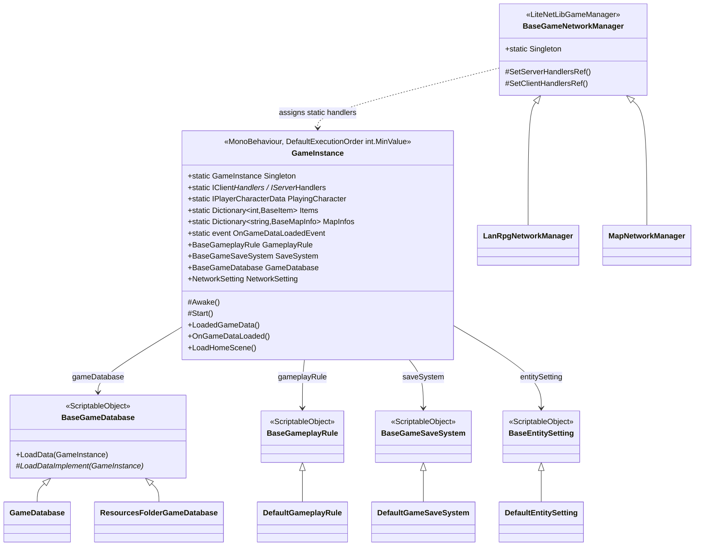
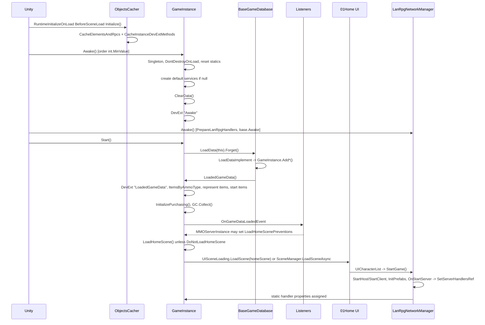
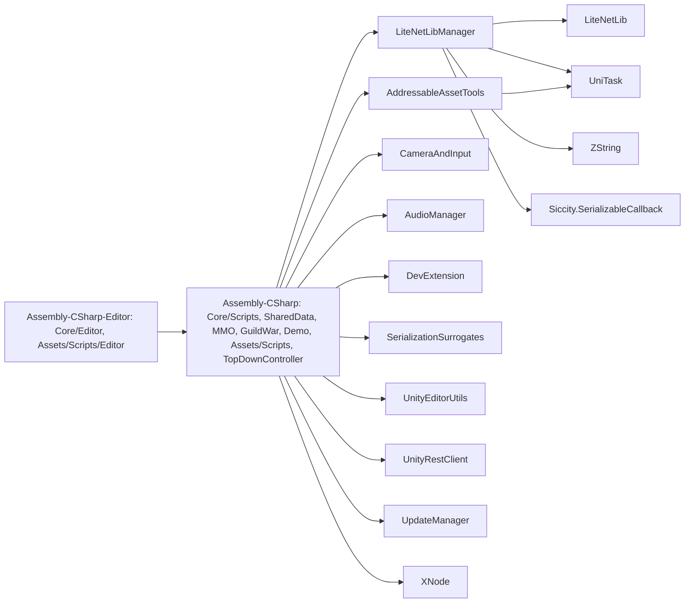

# Core Architecture

## Purpose

This document describes how the MMORPG Kit based project boots, which object owns global state, where configuration lives, how the code is split into assemblies, and which compilation symbols change what gets compiled. It is the entry point for anyone who needs to know "what runs first" and "who owns this" before touching any other system. The central object is `GameInstance` (`Assets/UnityMultiplayerARPG/Core/Scripts/GameInstance/GameInstance.cs`), a `DontDestroyOnLoad` singleton that loads the game database, creates default service ScriptableObjects, holds static handler interfaces and static game-data dictionaries, and then loads the home scene.

## Scope

Inside this document:

- Build scene 0 (`00Init.unity` / `00Init_MMO.unity`) and the objects it contains.
- `GameInstance` lifecycle: `Awake`, `Start`, `LoadedGameData`, `OnGameDataLoaded`, `LoadHomeScene`, `GetHomeScene`.
- Execution order constants (`DefaultExecutionOrders`, `DefaultExecutionOrders_MMO`).
- Static state owners: `GameInstance` statics, `GameInstance_Data` dictionaries, feature handler interfaces, `PlayingCharacter`, `BaseGameData.DataIdMap`, `PatchDataManager`.
- ScriptableObject services (`BaseGameplayRule`, `BaseGameSaveSystem`, `BaseInventoryManager`, `BaseGMCommands`, `BaseDayNightTimeUpdater`, `BaseEntitySetting`, `NetworkSetting`, `ExpTable`, `BaseGameDatabase`, `SocialSystemSetting`, `NewCharacterSetting`).
- The `UpdateManager` managed update loop.
- Assembly layout (25 `.asmdef` files, `Assembly-CSharp`, `Assembly-CSharp-Editor`), runtime vs editor separation.
- Scripting define symbols and their effect.
- Startup ordering of `MMOServerInstance` / `MMOClientInstance` relative to `GameInstance` (only the ordering).

Outside this document:

- Game data asset types, `DataId` hashing, `GameDatabase` contents: [02_GAME_DATA_AND_SCRIPTABLE_OBJECTS.md](02_GAME_DATA_AND_SCRIPTABLE_OBJECTS.md).
- LiteNetLibManager transport, `BaseGameNetworkManager` messages, `LanRpgNetworkManager` connection flow: [03_NETWORKING_FOUNDATION.md](03_NETWORKING_FOUNDATION.md).
- MMO server topology, `ServerConfig`, command line arguments: [04_MMO_SERVER_ARCHITECTURE.md](04_MMO_SERVER_ARCHITECTURE.md) and [40_BUILD_AND_DEPLOYMENT_SYSTEM.md](40_BUILD_AND_DEPLOYMENT_SYSTEM.md).
- Entity base classes and components in depth: [07_ENTITY_FRAMEWORK.md](07_ENTITY_FRAMEWORK.md).
- DevExt hooks, partial classes, `GameExtensionInstance`: [39_DEV_EXTENSION_SYSTEM.md](39_DEV_EXTENSION_SYSTEM.md).
- Addressables loading paths: [35_ADDRESSABLES_AND_CONTENT_LOADING.md](35_ADDRESSABLES_AND_CONTENT_LOADING.md).
- Third-party libraries as a catalogue: [41_THIRD_PARTY_DEPENDENCIES.md](41_THIRD_PARTY_DEPENDENCIES.md).
- Demo2D, DemoShooter, DemoSurvival, MMO/Demo2D: exist, out of scope for this pass.

## High-Level Architecture

The kit is layered as follows. Data assets (`BaseGameData` ScriptableObjects, collected by a `BaseGameDatabase`) are loaded once into static dictionaries on `GameInstance`. Runtime entities (`BaseGameEntity` and subclasses, which are `LiteNetLibBehaviour`s) look data up by `DataId` from those dictionaries. A `BaseGameNetworkManager` subclass (`LanRpgNetworkManager` for LAN/offline, `MapNetworkManager` for MMO map servers) spawns entities and assigns the feature handler interfaces that `GameInstance` exposes as static properties. Persistence is behind `BaseGameSaveSystem` (LAN, binary files) or the MMO database layer (SQL).

`GameInstance` is a `partial class` split over six files in `Assets/UnityMultiplayerARPG/Core/Scripts/GameInstance/`:

| File | Content |
|---|---|
| `GameInstance.cs` (2097 lines) | Static handlers and session state, inspector configuration, `Awake`/`Start`/`OnDestroy`, `LoadedGameData`, layer mask helpers |
| `GameInstance_Data.cs` | Static `Dictionary<int, T>` per data type and the `Add*` registration methods |
| `GameInstance_Workflow.cs` | Home scene fields, `LoadHomeScene`, `LoadHomeSceneTask`, `GetHomeScene`, addressable scene handles |
| `GameInstance_DataMigration.cs` | `MigrateLevelUpEffect`, `MigrateEquipmentEntities` (editor only body) |
| `GameInstance_DataExporting.cs` | Editor-only inspector buttons that export JSON (social setting, minimal items, character creation data) |
| `GameInstance_Purchasing.cs` | `cashShopDatabase` field and Unity IAP initialisation (`ENABLE_PURCHASING && (UNITY_IOS || UNITY_ANDROID)`) |

Execution order. `DefaultExecutionOrders` (`Assets/UnityMultiplayerARPG/Core/Scripts/Consts/DefaultExecutionOrders.cs`) and the MMO partial (`Assets/UnityMultiplayerARPG/MMO/Scripts/MMOGame/Consts/DefaultExecutionOrders_MMO.cs`) define:

| Constant | Value | Applied to |
|---|---|---|
| `GAME_INSTANCE` | `int.MinValue` | `GameInstance` |
| `MMO_SERVER_INSTANCE` | -899 | `MMOServerInstance` |
| `MMO_CLIENT_INSTANCE` | -898 | `MMOClientInstance` |
| `DATABASE_NETWORK_MANAGER` | -898 | `DatabaseNetworkManager` |
| `CENTRAL_NETWORK_MANAGER` | -897 | `CentralNetworkManager` |
| `MAP_SPAWN_NETWORK_MANAGER` | -896 | `MapSpawnNetworkManager` |
| `MAP_NETWORK_MANAGER` | -895 | `MapNetworkManager` |
| `PLAYER_CHARACTER_CONTROLLER` | -1 | player controllers |
| `BASE_GAME_ENTITY` | 0 | `BaseGameEntity` |
| `CHARACTER_MODEL_MANAGER` | 100 | `CharacterModelManager` |
| `GAME_ENTITY_MODEL` / `_IK` / `_POST_IK` | 101 / 102 / 103 | model, IK, post-IK behaviours (also used as `UpdateManager` order keys) |
| `UI_*` | 100 to 102 | crafting queue / hotkey UIs |

`GameInstance.Awake` therefore always runs before any MMO instance, network manager, entity or controller `Awake` in the same scene load. `LanRpgNetworkManager` has no execution order attribute of its own, so it runs at the default order 0, after `GameInstance` but before `BaseGameEntity`-derived scene objects only by component order.

## Key Components

| Component | Type | Responsibility | Location |
|---|---|---|---|
| `GameInstance` | MonoBehaviour (partial) | Bootstrap singleton, service defaults, static handlers, static data dictionaries, home scene loading | `Assets/UnityMultiplayerARPG/Core/Scripts/GameInstance/` |
| `DefaultExecutionOrders` | static class (partial) | Script execution order constants | `Assets/UnityMultiplayerARPG/Core/Scripts/Consts/DefaultExecutionOrders.cs`, `Assets/UnityMultiplayerARPG/MMO/Scripts/MMOGame/Consts/DefaultExecutionOrders_MMO.cs` |
| `BaseGameDatabase` | ScriptableObject | Abstract loader; `LoadData` awaits `LoadDataImplement` then calls `GameInstance.LoadedGameData()` | `Assets/UnityMultiplayerARPG/Core/Scripts/GameData/Database/BaseGameDatabase.cs` |
| `GameDatabase` | ScriptableObject | Explicit arrays of entities and game data | `Assets/UnityMultiplayerARPG/Core/Scripts/GameData/Database/GameDatabase.cs` |
| `ResourcesFolderGameDatabase` | ScriptableObject | `Resources.LoadAll<T>("")` for every data type | `Assets/UnityMultiplayerARPG/Core/Scripts/GameData/Database/ResourcesFolderGameDatabase.cs` |
| `BaseGameplayRule` / `DefaultGameplayRule` / `SimpleGameplayRule` | ScriptableObject | Damage, recovery, reward, fee and movement formulas | `Assets/UnityMultiplayerARPG/Core/Scripts/Gameplay/Rule/` |
| `BaseGameSaveSystem` / `DefaultGameSaveSystem` | ScriptableObject | LAN/offline persistence of characters, world, storage, summon buffs | `Assets/UnityMultiplayerARPG/Core/Scripts/LanGame/SaveSystem/` |
| `BaseEntitySetting` / `DefaultEntitySetting` | ScriptableObject | Adds optional components (ladder, building, crafting, dealing, dueling, vending, PK, `DashAttackHandler`) to entities at `Awake` | `Assets/UnityMultiplayerARPG/Core/Scripts/Gameplay/EntitySettings/` |
| `NetworkSetting` | ScriptableObject | `networkAddress`, `networkPort`, `maxConnections` for LAN | `Assets/UnityMultiplayerARPG/Core/Scripts/GameData/NetworkSetting/NetworkSetting.cs` |
| `MmoNetworkSetting` | ScriptableObject | MMO central server list entries used by `MMOClientInstance` | `Assets/UnityMultiplayerARPG/MMO/Scripts/MMOGame/GameData/NetworkSetting/MmoNetworkSetting.cs` |
| `ExpTable` | ScriptableObject | `expTree` per level, `GetNextLevelExp` | `Assets/UnityMultiplayerARPG/Core/Scripts/GameData/ExpTable.cs` |
| `SocialSystemSetting` | ScriptableObject | Party/guild limits, guild roles, guild exp table (`Migrate()` builds the table from a legacy array) | `Assets/UnityMultiplayerARPG/Core/Scripts/Gameplay/Social/SocialSystemSetting.cs` |
| `NewCharacterSetting` | ScriptableObject | `startGold`, `startItems` | `Assets/UnityMultiplayerARPG/Core/Scripts/GameData/Database/NewCharacterSetting.cs` |
| `BaseMessageManager` / `DefaultMessageManager` | ScriptableObject | Replaces `@characterName`, `@level` style keys in strings | `Assets/UnityMultiplayerARPG/Core/Scripts/GameData/StringFormat/` |
| `BaseGameNetworkManager` | LiteNetLibBehaviour (partial, `LiteNetLibGameManager` subclass) | Owns feature handlers, assigns them to `GameInstance` statics in `OnStartServer`/`OnStartClient` | `Assets/UnityMultiplayerARPG/Core/Scripts/Networking/BaseGameNetworkManager.cs`, `BaseGameNetworkManager_FeatureHandlers.cs` |
| `LanRpgNetworkManager` | LiteNetLibBehaviour (partial) | LAN/offline manager, `StartGame()` from home UI | `Assets/UnityMultiplayerARPG/Core/Scripts/LanGame/Networking/LanRpgNetworkManager.cs` |
| `MMOServerInstance` | MonoBehaviour | Parses args/config, starts central/map-spawn/database/map servers after `OnGameDataLoadedEvent` | `Assets/UnityMultiplayerARPG/MMO/Scripts/MMOGame/MMOServerInstance.cs` |
| `MMOClientInstance` | MonoBehaviour (partial) | Client side central/map connections, sets `GameInstance.UserId`/`AccessToken`/`SelectedCharacterId` | `Assets/UnityMultiplayerARPG/MMO/Scripts/MMOGame/MMOClientInstance.cs` |
| `UpdateManager` | MonoBehaviour (sealed, self-created) | Central `Update`/`LateUpdate`/`FixedUpdate` dispatcher for `IManagedUpdate*` implementers | `Assets/UnityMultiplayerARPG/Core/UpdateManager/Scripts/UpdateManager.cs` |
| `ObjectsCacher` | static class (partial) | `[RuntimeInitializeOnLoadMethod(BeforeSceneLoad)]` pre-caches RPC/sync-field reflection and DevExt method lookups | `Assets/UnityMultiplayerARPG/Core/Scripts/Modding/ObjectsCacher.cs`, `ObjectsCacher_BuiltIn.cs` |
| `EventSystemManager` | MonoBehaviour | Required component on the `GameInstance` object (`[RequireComponent]`) | `Assets/UnityMultiplayerARPG/Core/Scripts/UI/EventSystems/EventSystemManager.cs` |
| `00Init.unity` | scene | Build scene 0, LAN/offline flavour | `Assets/UnityMultiplayerARPG/Demo/Scenes/00Init.unity` |
| `00Init_MMO.unity` | scene | MMO flavour entry scene | `Assets/UnityMultiplayerARPG/MMO/Demo/Scenes/00Init_MMO.unity` |
| `GameInstance.prefab` (MMO) | prefab | MMO `GameInstance` configuration | `Assets/UnityMultiplayerARPG/MMO/Demo/Prefabs/GameInstance.prefab` |
| `BuildSetupMenu` | Editor window (menu) | Adds/removes `EXCLUDE_SERVER_CODES`, `UNITY_SERVER`, `DISABLE_ADDRESSABLES`, `EXCLUDE_PREFAB_REFS` defines | `Assets/UnityMultiplayerARPG/Core/Editor/BuildSetupMenu.cs` |

## Important Classes and Interfaces

### GameInstance

Purpose: Process-wide singleton that owns configuration, default services, static game data and static feature handler references.

Responsibilities:
- Enforce a single instance (`Singleton`, `DontDestroyOnLoad`, destroys duplicates) in `Awake()` (`GameInstance.cs:1463`).
- Create default ScriptableObject services when inspector fields are null (`GameInstance.cs:1503-1567`).
- Create runtime-only default data: `DefaultArmorType`, `DefaultWeaponType`, default weapon `Item`, `MonsterWeaponItem`, default `DamageElement` (`GameInstance.cs:1488-1526`).
- Reset per-session statics (`PlayingCharacter`, `JoinedParty`, `JoinedGuild`, `OpenedStorages`, `LoadHomeScenePreventions`) and clear all data dictionaries via `ClearData()`.
- Kick off data loading in `Start()` with `GameDatabase.LoadData(this).Forget()` (`GameInstance.cs:1603`).
- Post-process loaded data in `LoadedGameData()` (`GameInstance.cs:1762`) and raise `OnGameDataLoadedEvent` in `OnGameDataLoaded()` (`GameInstance.cs:1837`), then load the home scene unless `DoNotLoadHomeScene` is true.
- Provide layer/tag configuration and mask helpers (`GetDamageableLayerMask`, `GetTargetLayerMask`, `GetBuildLayerMask`, ...).

Important methods:
- `Awake()`: virtual; headless target framerate (`serverTargetFrameRate`) when `SystemInfo.graphicsDeviceType == GraphicsDeviceType.Null`, `Application.runInBackground = true`, service defaults, `ClearData()`, then `this.InvokeInstanceDevExtMethods("Awake")`.
- `Start()`: virtual; only calls `GameDatabase.LoadData(this).Forget()`.
- `LoadedGameData()`: builds `ItemsByAmmoType`, registers represent items (exp/gold/currency drop items with `MaxStack = int.MaxValue`), `MigrateLevelUpEffect()`, registers `startItems` from `newCharacterSetting`/`testingNewCharacterSetting`/`startItems`, `AddMapWarpPortals`, `AddMapNpcs`, `InitializePurchasing()` (when playing), `System.GC.Collect()`, `OnGameDataLoaded()`. Invokes DevExt hook `"LoadedGameData"` first.
- `OnGameDataLoaded()`: invokes `OnGameDataLoadedEvent`, then `LoadHomeScene()` if `Application.isPlaying && !DoNotLoadHomeScene`.
- `LoadHomeScene()` / `LoadHomeSceneTask()` (`GameInstance_Workflow.cs`): unloads addressable scenes, then loads through `UISceneLoading.Singleton.LoadScene(...)` when a loading UI exists, otherwise `SceneManager.LoadSceneAsync`.
- `GetHomeScene(out SceneField scene[, out AssetReferenceScene addressableScene])`: picks `homeMobileScene` / `homeConsoleScene` / `homeScene` by platform or `TestInEditorMode`; returns `true` when the addressable variant is valid.
- `ClearData()`: static; clears every dictionary in `GameInstance_Data.cs`.
- `UseMobileInput()`, `UseConsoleInput()`, `IsMobileTestInEditor()`, `IsConsoleTestInEditor()`: platform branching helpers.
- `Validate()` (editor): validates addressable hash asset ids on entity references and home scenes; `OnValidate` marks the scene/prefab dirty.
- `OnDestroy()`: DevExt hook `"OnDestroy"`.

Dependencies: `BaseGameDatabase`, all service ScriptableObjects, `UISceneLoading`, `InputManager` (editor test mode), `EventSystemManager`, `Insthync.DevExtension`, UniTask.

Used by: every gameplay class through `GameInstance.Singleton`, `BaseGameEntity.CurrentGameInstance`, static dictionaries and static handlers.

Extension points: `protected virtual Awake/Start/OnDestroy` (subclassing is possible but the kit does not do it), `partial class` (add fields/methods in a new file), DevExt hooks `"Awake"`, `"LoadedGameData"`, `"OnDestroy"`, static events `OnGameDataLoadedEvent`, `OnSetPlayingCharacterEvent`, `OnSetPartyDataEvent`, `OnSetGuildDataEvent`, `LoadHomeScenePreventions` dictionary, every service field accepts a subclass asset.

### BaseGameDatabase

Purpose: Abstract entry point that fills `GameInstance` static dictionaries.

Responsibilities:
- `LoadData(GameInstance)` awaits `LoadDataImplement` and then calls `gameInstance.LoadedGameData()`.
- Editor-side `Validate()` / `OnValidate` with delayed `SetDirty`.

Important methods:
- `LoadData(GameInstance gameInstance)`: `UniTaskVoid`, the only caller is `GameInstance.Start` (and the editor export buttons in `GameInstance_DataExporting.cs`).
- `LoadDataImplement(GameInstance)`: abstract.

Dependencies: `GameInstance.Add*` methods.

Used by: `GameInstance`.

Extension points: subclass to load from any source (JSON, addressables, remote); both built-in subclasses are `partial` and invoke DevExt `"LoadDataImplement"` (and `GameDatabase` also `"LoadReferredData"`).

### BaseGameNetworkManager (bootstrap role only)

Purpose: The network manager assigns the feature handler implementations into `GameInstance` static properties so UI and entities can reach them without knowing whether the game is LAN or MMO.

Responsibilities:
- `Awake()` (`BaseGameNetworkManager.cs:101`): sets `Singleton`, adds `ILagCompensationManager`, `IHitRegistrationManager`, an AOI `BaseInterestManager` (`JobifiedGridSpatialPartitioningAOI` when none is present), collects `BaseGameNetworkManagerComponent`s.
- `RegisterMessages()`: `RegisterHandlerMessages()` registers request/response handlers for every non-null handler interface; then DevExt hooks `"RegisterClientMessages"`, `"RegisterServerMessages"`, `"RegisterMessages"`, then components.
- `OnStartServer()` calls `SetServerHandlersRef()` (`BaseGameNetworkManager_FeatureHandlers.cs:243`), `OnStartClient()` calls `SetClientHandlersRef()` (`:258`).
- `StartServer()` and `StartClient()` call `InitPrefabs()` (DevExt hook `"InitPrefabs"`) before the base start.

Important methods:
- `SetServerHandlersRef()`, `SetClientHandlersRef()`: the swap points that publish handlers to `GameInstance`.
- `PrepareLanRpgHandlers()` (`LanRpgNetworkManager_FeatureHandlers.cs`) and `PrepareMapHandlers()` (`Assets/UnityMultiplayerARPG/MMO/Scripts/MMOGame/Networking/Map/MapNetworkManager_FeatureHandlers.cs`): `gameObject.GetOrAddComponent<IInterface, DefaultImpl>()` for each handler, called from the subclass `Awake` before `base.Awake()`.

Dependencies: `LiteNetLibGameManager`, `GameInstance`.

Used by: entities, UI, `MMOServerInstance`.

Extension points: add the handler component to the manager prefab before `Awake` (the `GetOrAddComponent<TInterface, T>` helper in `Assets/UnityMultiplayerARPG/Core/Scripts/Utils/GenericUtils.cs:122` keeps an existing implementation), `BaseGameNetworkManagerComponent` subclasses on the same GameObject, DevExt hooks, `partial class`.

### MMOServerInstance / MMOClientInstance (ordering only)

Purpose: MMO-specific bootstrappers in `00Init_MMO.unity`.

Responsibilities:
- `MMOServerInstance.Awake()` (order -899, after `GameInstance`): singleton, subscribes `GameInstance.OnGameDataLoadedEvent += OnGameDataLoaded` (only under `(UNITY_EDITOR || UNITY_SERVER || !EXCLUDE_SERVER_CODES) && UNITY_STANDALONE`), reads `serverConfig.json` through `ConfigManager.ReadServerConfig()` and command line arguments through `ConfigReader`/`ProcessArguments` outside the editor.
- `MMOServerInstance.OnGameDataLoaded()`: sets `GameInstance.LoadHomeScenePreventions[nameof(MMOServerInstance)]` to `!Application.isEditor || _startingMapServer` when any server is starting, then `StartServers()` (waits one frame, then database, central, map spawn, map servers in that order, then the database client).
- `MMOClientInstance.Awake()` (order -898): singleton, accepts all SSL certificates; `OnEnable` subscribes to `CentralNetworkManager` client events.
- `CentralNetworkManager` also subscribes to `GameInstance.OnGameDataLoadedEvent` (`Assets/UnityMultiplayerARPG/MMO/Scripts/MMOGame/Src/Central/CentralNetworkManager.cs:128`).

Important methods: `StartCentralServer()`, `StartMapSpawnServer()`, `StartMapServer()`, `StartDatabaseManagerServer()`, `StartDatabaseManagerClient()`.

Dependencies: `GameInstance`, `ConfigManager`, `DatabaseNetworkManager`, `CentralNetworkManager`, `MapSpawnNetworkManager`, `MapNetworkManager`.

Used by: MMO builds only.

Extension points: see [04_MMO_SERVER_ARCHITECTURE.md](04_MMO_SERVER_ARCHITECTURE.md).

### UpdateManager

Purpose: One `MonoBehaviour` that drives `ManagedUpdate`/`ManagedLateUpdate`/`ManagedFixedUpdate` on registered objects, avoiding per-object Unity message overhead.

Responsibilities:
- Lazily creates a hidden `DontDestroyOnLoad` GameObject (`UpdateManager.Instance`).
- `Register(IManagedUpdateBase)` goes to a default `Updater`; `Register(int order, IManagedUpdateBase)` goes to a `SortedList<int, Updater>` keyed by order.

Important methods: `Register`, `Unregister`, both with and without `order`.

Dependencies: none (own asmdef `UpdateManager`, namespace `Insthync.ManagedUpdating`).

Used by: `GameEffect`, `ProjectileEffect`, `UISelectionEntry`, `AreaBuffEntity`, `MissileDamageEntity`, `ThrowableDamageEntity`, `AreaDamageEntity`, `CharacterAlignOnGround` and `CharacterPitchIK` (order `GAME_ENTITY_MODEL_IK`), `CharacterControllerAdjustment`, `DefaultCharacterUseSkillComponent`, `PlayerCharacterItemLockAndExpireComponent`, player controllers.

Extension points: implement `IManagedUpdate` / `IManagedLateUpdate` / `IManagedFixedUpdate` and register in `OnEnable`, or derive from `BaseManagedUpdateBehaviour`, or add `ManagedUpdateRegisterer` to a GameObject.

### ObjectsCacher

Purpose: Warm reflection caches before the first scene loads.

Responsibilities: `Initialize()` is `[RuntimeInitializeOnLoadMethod(RuntimeInitializeLoadType.BeforeSceneLoad)]` and calls the partial `CacheDevExtMethods()`, whose built-in body caches `LiteNetLibBehaviour.CacheElementsAndRpcs(typeof(...))` for every kit entity/component type and `DevExtUtils.CacheInstanceDevExtMethods(type, "Awake"/"OnDestroy"/...)`.

Important methods: `Initialize()`, `CacheDevExtMethods()` (partial method).

Dependencies: `LiteNetLibBehaviour`, `DevExtUtils`.

Used by: runtime only.

Extension points: the class is `static partial`; you cannot add a second implementation of a partial method, so add your own `[RuntimeInitializeOnLoadMethod]` in a new static class to cache project types (for example `TopDownAimController`).

## Data Flow

Startup sequence for the LAN/offline entry scene (`00Init.unity`). The MMO scene follows the same order with `MMOServerInstance`/`MMOClientInstance`/`MapNetworkManager` prefabs instead of `LanRpgNetworkManager`.

Concrete listeners of `OnGameDataLoadedEvent` in this repository: `MMOServerInstance.OnGameDataLoaded` (`MMOServerInstance.cs:154`), `CentralNetworkManager.GameInstance_OnGameDataLoadedEvent` (`CentralNetworkManager.cs:128`), and the editor export callbacks in `GameInstance_DataExporting.cs`. Nothing in `Assets/Scripts` or `Assets/TopDownController` subscribes to it.

Data ownership after startup:

| State | Owner | Set by |
|---|---|---|
| `GameInstance.Items`, `Skills`, `Attributes`, `Characters`, `PlayerCharacters`, `MonsterCharacters`, `MapInfos`, `Quests`, `NpcDialogs`, `Factions`, `Currencies`, `DamageElements`, `ArmorTypes`, `WeaponTypes`, `AmmoTypes`, `StatusEffects`, `EquipmentSets`, `Harvestables`, `ItemCraftFormulas`, `PlayerIcons`/`Frames`/`Backgrounds`/`Titles`, `GuildSkills`, `GuildIcons`, `Gachas`, `PlayerCharacterEntityMetaDataList` | static readonly `Dictionary<int, T>` (`MapInfos` keyed by `string`) in `GameInstance_Data.cs:15-72` | `GameInstance.Add*` from `BaseGameDatabase.LoadDataImplement` and from `PrepareRelatesData` |
| `PlayerCharacterEntities`, `MonsterCharacterEntities`, `VehicleEntities`, `ItemDropEntities`, `HarvestableEntities`, `WarpPortalEntities`, `NpcEntities`, `BuildingEntities`, `OtherNetworkObjectPrefabs` (+ `Addressable*` twins) | static dictionaries keyed by `LiteNetLibIdentity.HashAssetId` | `AddManyGameEntity` / `AddAssetReference` |
| `MapWarpPortals`, `MapNpcs` | static `Dictionary<string, List<...>>` keyed by map id | `AddMapWarpPortals`, `AddMapNpcs` from `WarpPortalDatabase` / `NpcDatabase` |
| `Client*Handlers` (13), `Server*Handlers` (11) | static properties on `GameInstance` | `BaseGameNetworkManager.SetClientHandlersRef` / `SetServerHandlersRef` |
| `ItemUIVisibilityManager`, `ItemsContainerUIVisibilityManager` | static properties | `BaseUISceneGameplay` on enable/disable (`BaseUISceneGameplay.cs:96-103`) |
| `CustomSummonManager` | static property (`ICustomSummonManager`) | never assigned by kit code; used by `CharacterSummon` and `AssetReferenceExtensions` when `SummonType.Custom` is used |
| `UserId`, `AccessToken`, `SelectedCharacterId` | static properties | `MMOClientInstance` login/select responses |
| `RefreshToken` | static property backed by `PlayerPrefs` key `__REFRESH_TOKEN` | MMO login flow |
| `PlayingCharacter`, `PlayingCharacterEntity`, `JoinedParty`, `JoinedGuild`, `OpenedStorages` | static properties with change events | network manager / client handlers |
| `BaseGameData.IdMap`, `BaseGameData.DataIdMap` | static dictionaries | `BaseGameData.MakeDataId` |
| `PatchDataManager.PatchableData`, `PatchingData` | static dictionaries | `BaseGameData.OnEnable/OnDisable` |
| `BaseGameNetworkManager.Singleton`, `BaseUISceneGameplay.Singleton`, `UISceneLoading.Singleton`, `MMOClientInstance.Singleton`, `UpdateManager.Instance` | static singletons | their own `Awake` |
| `GameExtensionInstance.on*` delegates | static fields | `[DevExtMethods("Init")]` static methods |

## Runtime Behaviour

Scene 0 contents (`Assets/UnityMultiplayerARPG/Demo/Scenes/00Init.unity`, resolved from the YAML and `.meta` GUIDs):

- `GameInstance` GameObject with components `GameInstance`, `InputSettingManager` (`Assets/UnityMultiplayerARPG/Core/CameraAndInput/Scripts/Input/InputSettingManager.cs`, key bindings and the `InputActions.inputactions` reference), `CollisionIgnore` (`Assets/UnityMultiplayerARPG/Core/Scripts/Utils/CollisionIgnore.cs`, layer pair ignores for layers 9, 17, 18, 19, 20), `AudioManager` (`Assets/UnityMultiplayerARPG/Core/AudioManager/Scripts/AudioManager.cs`), `LanguageManager` (`Assets/UnityMultiplayerARPG/Core/Scripts/Language/LanguageManager.cs`, default `ENG`), `EventSystemManager`.
- `NetworkManager` GameObject with `LanRpgNetworkManager` and `LiteNetLibAssets`.
- `Main Camera`, `Directional Light`, and a `UINetworkSceneLoading` object.

Serialized `GameInstance` values in `00Init.unity` that matter for this project:

| Field | Value |
|---|---|
| `gameplayRule` | `Assets/UnityMultiplayerARPG/Demo/GameData/SimpleGameplayRule.asset` (type `SimpleGameplayRule : DefaultGameplayRule`, kept for backward compatibility per its source comment) |
| `networkSetting` | `Assets/UnityMultiplayerARPG/Demo/GameData/NetworkSetting.asset` |
| `gameDatabase` | `Assets/1. Data/GameDatabase_G.asset` |
| `npcDatabase`, `warpPortalDatabase`, `socialSystemSetting`, `newCharacterSetting` | kit assets in `Assets/UnityMultiplayerARPG/Demo/GameData/` |
| `defaultWeaponItem` | `Assets/UnityMultiplayerARPG/Demo/GameData/Resources/Items/Weapons/DefaultWeaponItem.asset` |
| `expDropRepresentItem`, `goldDropRepresentItem` | `Demo/GameData/Resources/Items/Represent/Exp.asset`, `Gold.asset` |
| `uiSceneGameplayPrefab` | `Assets/1. Data/Prefabs/UI Prefabs/CanvasGameplay_G.prefab` |
| `uiSceneGameplayMobilePrefab`, `uiSceneGameplayConsolePrefab` | kit `CanvasGameplayMobile.prefab`, `CanvasGameplayConsole.prefab` |
| `defaultControllerPrefab` | `Assets/TopDownController/Demo/Prefabs/TopDownAimController.prefab` |
| `serverCharacterPrefab` | `Assets/UnityMultiplayerARPG/Demo/Prefabs/Gameplay/ServerCharacter.prefab` |
| `cashShopDatabase` | `Assets/UnityMultiplayerARPG/Demo/GameData/CashPackageDatabase.asset` |
| `homeScene` | `01Home` (mobile/console home empty, so they fall back to `01Home` in `Awake`) |
| `messageManager`, `saveSystem`, `inventoryManager`, `dayNightTimeUpdater`, `gmCommands`, `equipmentModelBonesSetupManager`, `entitySetting`, `expTable`, `defaultDamageElement` | null, so `Awake` creates `DefaultMessageManager`, `DefaultGameSaveSystem`, `DefaultInventoryManager`, `DefaultDayNightTimeUpdater`, `DefaultGMCommands`, `EquipmentModelBonesSetupByHumanBodyBonesManager`, `DefaultEntitySetting`, an `ExpTable` from the legacy inline `expTree` array, and a default `DamageElement` |
| `inventorySystem` | `1` = `LimitSlots`, `baseSlotLimit` 60 |
| `monsterGoldRewardingMode` | `1` = `DropOnGround` (exp and currency stay `Immediately`) |
| `pickUpItemDistance` 2, `conversationDistance` 3, `maxCharacterSaves` 5, `serverTargetFrameRate` 30 |

MMO entry (`Assets/UnityMultiplayerARPG/MMO/Demo/Scenes/00Init_MMO.unity`) instantiates the prefabs `GameInstance.prefab`, `MMOServerInstance.prefab`, `MMOClientInstance.prefab`, `MapNetworkManager.prefab` and `CanvasLoading_MMO.prefab` from `Assets/UnityMultiplayerARPG/MMO/Demo/Prefabs/`. The scene only overrides the `mapNetworkManager` reference on the two instance prefabs; the `GameInstance.prefab` itself points to `gameDatabase = Assets/UnityMultiplayerARPG/Demo/GameData/GameDatabase.asset`, `uiSceneGameplayPrefab = Demo/Prefabs/UI/_Gameplay/CanvasGameplay.prefab`, `defaultControllerPrefab = Demo/Prefabs/Gameplay/PlayerCharacterController.prefab`, `homeScene = 01Home_MMO`. The MMO flavour therefore does not use `GameDatabase_G`, `CanvasGameplay_G` or `TopDownAimController`.

Lifecycle summary:

1. `ObjectsCacher.Initialize()` before the first scene.
2. `GameInstance.Awake()`; duplicates from re-entering scene 0 destroy themselves.
3. Other scene 0 `Awake`s: `LanRpgNetworkManager.Awake()` (`PrepareLanRpgHandlers()` then `LiteNetLibGameManager.Awake`), or on MMO `MMOServerInstance` (-899), `MMOClientInstance` (-898), `MapNetworkManager` (-895, `PrepareMapHandlers()` and `MapNetworkManagerDataUpdater`).
4. `GameInstance.Start()` -> async load -> `LoadedGameData()` -> `OnGameDataLoadedEvent` -> `LoadHomeScene()`.
5. Home scene (`01Home.unity` contains `UISceneHome`, `UICharacterList`, `UICharacterCreate`, `UILanConnection`, `UIBodyPartManager`). `UICharacterList` calls `(BaseGameNetworkManager.Singleton as LanRpgNetworkManager).StartGame()` (`UICharacterList.cs:279`), which sets `Assets.onlineScene` from `CurrentMapInfo.Scene` and calls `StartHost(false)` / `StartHost(true)` / `StartClient()` depending on `startType`, using `NetworkSetting.networkPort` and `maxConnections`.
6. `BaseGameNetworkManager.OnStartServer()` -> `SetServerHandlersRef()` -> DevExt `"OnStartServer"` -> `BaseGameNetworkManagerComponent.OnStartServer` -> `DayNightTimeUpdater.InitTimeOfDay(this)`; `OnStartClient()` -> `SetClientHandlersRef()`.
7. `BaseGameNetworkManager.Update()` runs network message handling first (`base.Update()`), then online character and time-of-day broadcasts on the server, then `DayNightTimeUpdater.UpdateTimeOfDay` on both sides.
8. `UpdateManager` drives managed updates in its own `Update`/`LateUpdate`/`FixedUpdate`.
9. `GameInstance.OnDestroy()` only fires on application quit (DevExt `"OnDestroy"`).

Editor behaviour: `testInEditorMode` (`Standalone`, `Mobile`, `MobileWithKeyInputs`, `Console`) switches `InputManager.UseMobileInputOnNonMobile` and the home scene / gameplay UI selection; `networkManagerForOfflineTesting` exists only when addressables are enabled (`!DISABLE_ADDRESSABLES`), so on this project's Standalone define set it is compiled out of players but still visible in the editor.

## Networking and Authority

`GameInstance` itself is not networked. It runs on every process (client, LAN host, map server, central server, database server) and holds the same static game data everywhere; server-only data and client-only data are distinguished only by which handler statics get assigned:

- `SetServerHandlersRef()` runs in `OnStartServer` (LAN host and MMO map server). Client-only builds leave `GameInstance.Server*Handlers` null.
- `SetClientHandlersRef()` runs in `OnStartClient` (LAN host, LAN client, MMO client). Headless servers leave `GameInstance.Client*Handlers` null.
- `BaseGameNetworkManager.RegisterHandlerMessages()` registers each `RegisterRequestToServer<...>(GameNetworkingConsts.*, handler)` only when the matching `IServer*MessageHandlers` component exists, so a missing handler component silently disables that feature's requests.

`NetworkSetting` (`networkAddress` 127.0.0.1, `networkPort` 7770, `maxConnections` 4 by default) is read by `LanRpgNetworkManager.StartGame()`; MMO clients use `MmoNetworkSetting` assets on `MMOClientInstance` or `ClientConfig` instead. See [03_NETWORKING_FOUNDATION.md](03_NETWORKING_FOUNDATION.md).

## Persistence

`GameInstance` persists only `RefreshToken` (PlayerPrefs `__REFRESH_TOKEN`). Everything else on it is rebuilt at startup. Persistence of game state is delegated:

- LAN/offline: `GameInstance.SaveSystem` (`DefaultGameSaveSystem`) writes `Application.persistentDataPath/<characterId>.sav` and related `_world_`, `_storage`, `_summon_buffs` files through `PlayerCharacterDataExtensions.SavePersistentCharacterData` (BinaryFormatter with surrogates). Called from `LanRpgNetworkManager` on character save points. See [05_DATABASE_AND_PERSISTENCE_SYSTEM.md](05_DATABASE_AND_PERSISTENCE_SYSTEM.md).
- MMO: `MapNetworkManagerDataUpdater` and `IDatabaseClient`; `MMOServerInstance` also writes a default `serverConfig.json` through `ConfigManager.WriteServerConfigIfNotExisted` when a server starts and none exists.

Game data assets are never written at runtime (editor only via `EditorUtility.SetDirty`).

## Dependencies

Depends on:
- [02_GAME_DATA_AND_SCRIPTABLE_OBJECTS.md](02_GAME_DATA_AND_SCRIPTABLE_OBJECTS.md) for `BaseGameDatabase` and the `Add*` registration.
- [03_NETWORKING_FOUNDATION.md](03_NETWORKING_FOUNDATION.md) for `LiteNetLibGameManager` and `BaseGameNetworkManager`.
- [35_ADDRESSABLES_AND_CONTENT_LOADING.md](35_ADDRESSABLES_AND_CONTENT_LOADING.md) for the `Addressable*` twins of every prefab field.
- [36_INPUT_CAMERA_AND_CONTROLLER_SYSTEM.md](36_INPUT_CAMERA_AND_CONTROLLER_SYSTEM.md) for `InputManager`/`InputSettingManager` on the same GameObject.
- [38_LOCALIZATION_SYSTEM.md](38_LOCALIZATION_SYSTEM.md) for `LanguageManager`.

Depended on by:
- Every other system document; in particular [07_ENTITY_FRAMEWORK.md](07_ENTITY_FRAMEWORK.md), [08_CHARACTER_SYSTEM.md](08_CHARACTER_SYSTEM.md), [23_GAMEPLAY_RULES_AND_RESTRICTIONS.md](23_GAMEPLAY_RULES_AND_RESTRICTIONS.md), [04_MMO_SERVER_ARCHITECTURE.md](04_MMO_SERVER_ARCHITECTURE.md), [30_UI_SYSTEM.md](30_UI_SYSTEM.md), [39_DEV_EXTENSION_SYSTEM.md](39_DEV_EXTENSION_SYSTEM.md), [40_BUILD_AND_DEPLOYMENT_SYSTEM.md](40_BUILD_AND_DEPLOYMENT_SYSTEM.md).

## Extension and Customization Points

- Replace a service without editing kit code: create a ScriptableObject subclass of `BaseGameplayRule` (or `DefaultGameplayRule`), `BaseGameSaveSystem`, `BaseInventoryManager`, `BaseGMCommands`, `BaseDayNightTimeUpdater`, `BaseEntitySetting`, `BaseMessageManager`, `BaseEquipmentModelBonesSetupManager`, `BaseGameDatabase`; create the asset (menus under `Create GameDatabase/...`, `Create Entity Setting/...`, `Create MessageManager/...` in `GameDataMenuConsts`) and drag it into the matching `GameInstance` field in `00Init.unity`. This project already does this for `gameDatabase` (`GameDatabase_G`) and `gameplayRule` (kit `SimpleGameplayRule.asset`).
- Add startup logic: a `partial class GameInstance` file with `[DevExtMethods("Awake")]` or `[DevExtMethods("LoadedGameData")]` (example: `Assets/UnityMultiplayerARPG/Demo/Scripts/DevExt/DevExtDemo_GameInstance.cs`), or subscribe to `GameInstance.OnGameDataLoadedEvent` from any `Awake` that runs after `GameInstance` (everything does).
- Prevent the home scene from loading (custom launcher, server-only process): `GameInstance.LoadHomeScenePreventions["MyKey"] = true` before data loading finishes, as `MMOServerInstance` does.
- Register extra data at load time: `[DevExtMethods("LoadDataImplement")]` on a `partial class GameDatabase`, or call `GameInstance.AddItems(...)` etc. from an `OnGameDataLoadedEvent` handler (note that `LoadedGameData` has already run `ItemsByAmmoType` and represent-item logic at that point).
- Add components to every player/monster entity: subclass `DefaultEntitySetting` and override `InitialPlayerCharacterEntityComponents`; assign it to `entitySetting`. This is how `PlayerCharacterPkComponent`, `PlayerCharacterDealingComponent` and friends get added today (`DefaultEntitySetting.cs`).
- Swap network handlers: add your `IServer*Handlers` / `IClient*Handlers` implementation as a component on the `NetworkManager` GameObject in `00Init.unity`; `GetOrAddComponent<TInterface, T>` keeps it and skips the default.
- Change the default controller / gameplay UI: the `defaultControllerPrefab` and `uiSceneGameplayPrefab` fields. The project points them at `TopDownAimController.prefab` and `CanvasGameplay_G.prefab`.
- Execution order: define your own `[DefaultExecutionOrder(...)]` relative to the constants in `DefaultExecutionOrders` (a `partial class`, so a project file can add constants).
- Managed updates: implement `IManagedUpdate` and `UpdateManager.Register(this)` in `OnEnable`, or `UpdateManager.Register(DefaultExecutionOrders.GAME_ENTITY_MODEL_IK, this)` to run after the model update.
- Compile-time switches: use `MMORPG KIT/Setup For ...` menu items (`BuildSetupMenu`) instead of editing `ProjectSettings.asset` by hand.

## Core Framework vs Project Customization

| Element | Origin | Notes |
|---|---|---|
| `GameInstance` and partials | Kit Core | Unmodified |
| `DefaultExecutionOrders`, `DefaultExecutionOrders_MMO` | Kit Core / Kit MMO | Unmodified |
| `00Init.unity` | Kit Demo content | Scene file itself is kit content; its `GameInstance` fields were repointed to project assets (`GameDatabase_G`, `CanvasGameplay_G`, `TopDownAimController`) |
| `Assets/1. Data/GameDatabase_G.asset` | Project custom | Explicit `GameDatabase`; see 02 |
| `Assets/1. Data/Prefabs/UI Prefabs/CanvasGameplay_G.prefab` | Project custom | Fork of kit `CanvasGameplay.prefab`, carries `UIEscapeWindowsHandler` |
| `Assets/TopDownController/Demo/Prefabs/TopDownAimController.prefab` + `TopDownAimController.cs` | Kit add-on / Project custom | Subclass of `PlayerCharacterController`; only the camera prefab of the original add-on was kept |
| `SimpleGameplayRule.asset`, `NetworkSetting.asset`, `NpcDatabase.asset`, `WarpPortalDatabase.asset`, `SocialSystemSetting.asset`, `NewCharacterSetting.asset`, `CashPackageDatabase.asset` | Kit Demo content | Still the demo assets; no project-owned copies exist |
| `00Init_MMO.unity` and MMO prefabs | Kit MMO (demo) | Not repointed to project assets; MMO flavour still runs the kit demo database, UI and controller |
| `Assets/UnityMultiplayerARPG/Core/CameraAndInput/Scripts/Input/InputManager.cs`, `FollowCameraControls.cs` | Kit Core, modified in place | Project changes listed in PROJECT_FACTS; both live in the `CameraAndInput` assembly |
| `Assets/UnityMultiplayerARPG/Demo/Scripts/DevExt/DevExtDemo_PlayerCharacterEntity.cs`, `DevExtDemo_MonsterCharacterEntity.cs` | Kit Demo content, modified in place | Hand-fixed to the new delegate signatures |
| `ProjectSettings/ProjectSettings.asset` defines | Project custom | `Standalone: STEAMWORKS_NET;DISABLE_ADDRESSABLES`, plus legacy numeric entries (see next section) |
| `Assets/Scripts/**`, `Assets/TopDownController/Scripts/**` | Project custom | Compile into `Assembly-CSharp` / `Assembly-CSharp-Editor` next to kit code |

Assembly architecture (25 `.asmdef` files, all under `Assets/UnityMultiplayerARPG/Core/`; `find Assets -name '*.asmdef'` finds none elsewhere):

| Assembly | Folder | References (by name or resolved GUID) | Platform |
|---|---|---|---|
| `LiteNetLib` | `Core/LiteNetLibManager/Plugins/LiteNetLib` | none, `allowUnsafeCode` | all |
| `UniTask`, `UniTask.Linq`, `UniTask.Addressables`, `UniTask.DOTween`, `UniTask.TextMeshPro` | `Core/LiteNetLibManager/Plugins/UniTask/Runtime/**` | `UniTask` (+ `Unity.Addressables`/`Unity.ResourceManager`, `DOTween.Modules`, `Unity.TextMeshPro`) | all |
| `UniTask.Editor` | `.../UniTask/Editor` | `UniTask`, `autoReferenced: false` | Editor |
| `ZString` | `Core/LiteNetLibManager/Plugins/ZString` | `Unity.TextMeshPro`, unsafe | all |
| `Siccity.SerializableCallback` (+ `.Editor`) | `Core/SerializableCallback/Runtime`, `/Editor` | none / runtime asmdef | all / Editor |
| `LiteNetLibManager` | `Core/LiteNetLibManager/Scripts` | `LiteNetLib`, `UniTask`, `ZString`, `Siccity.SerializableCallback`, plus three Unity package assemblies by GUID (Addressables and ResourceManager among them; not resolvable in this checkout because `Library/` is absent) | all |
| `LiteNetLibManagerEditor`, `LiteNetLibManager.Tests` | `Core/LiteNetLibManager/Editor`, `/Tests/Editor` | `LiteNetLibManager` (+ TestRunner, define constraint `UNITY_INCLUDE_TESTS`) | Editor |
| `AddressableAssetTools` (+ `AddressableAssetToolsEditor`) | `Core/AddressableAssetTools/Scripts`, `/Editor` | `UniTask`, `UniTask.Addressables`, Unity Addressables package GUIDs | all / Editor |
| `AudioManager` | `Core/AudioManager/Scripts` | one Unity package GUID | all |
| `CameraAndInput` | `Core/CameraAndInput/Scripts` | one Unity package GUID (Input System, given `ENABLE_INPUT_SYSTEM` usage in `InputManager.cs`) | all |
| `DevExtension` | `Core/DevExtension/Scripts` | none | all |
| `SerializationSurrogates` | `Core/SerializationSurrogates/Scripts` | none | all |
| `UnityEditorUtils` (+ `UnityEditorUtilsEditor`) | `Core/UnityEditorUtils/Scripts`, `/Editor` | none / runtime asmdef | all / Editor |
| `UnityRestClient` | `Core/UnityRestClient/Runtime` | none | all |
| `UpdateManager` | `Core/UpdateManager/Scripts` | none | all |
| `XNode` (+ `XNodeEditor`) | `Core/xNode/Scripts`, `/Scripts/Editor` | none / `XNode` | all / Editor |

Everything else is in the default assemblies: `Assembly-CSharp` holds `Core/Scripts`, `Core/SharedData/Scripts`, `Core/SpatialPartitioningSystems/Scripts`, `Core/GraphicSettings/Scripts` (these three sub-libraries have no `.asmdef`), `MMO/Scripts`, `GuildWar/Scripts`, `Demo*/Scripts`, `Assets/Scripts/Gameplay`, `Assets/Scripts/UI`, `Assets/TopDownController/Scripts`; `Assembly-CSharp-Editor` holds `Core/Editor` and `Assets/Scripts/Editor`. `GameDataCreatorEditor.AssemblyNames` is hard-coded to `"Assembly-CSharp"`, which is why kit data types must stay in the default assembly for the creator window to list them. Precompiled DLLs: `Core/Plugins/ConcurrentCollections.dll`, `Core/LiteNetLibManager/Plugins` (Fleck, `System.Runtime.CompilerServices.Unsafe`), `MMO/Plugins` (MySqlConnector, Mono.Data.Sqlite, sqlite3 natives).

Runtime vs editor separation: editor code lives in `Editor/` folders (own asmdefs or `Assembly-CSharp-Editor`) and in `#if UNITY_EDITOR` blocks inside runtime files (`GameInstance.Validate`, `MarkDirty`, the whole of `GameInstance_DataExporting.cs`, `BaseGameData.OnValidate`, `ExpTable` calculator fields). `UnityHelpBox` fields on `GameInstance` only exist under `UNITY_EDITOR && EXCLUDE_PREFAB_REFS && !DISABLE_ADDRESSABLES`.

## Differences from Official MMORPG Kit Documentation and Known Issues

Not compared against online docs. Findings from source and project settings:

- `ProjectSettings.asset` `scriptingDefineSymbols` contains both named keys (`Standalone`, `Android`, `WebGL`, `iPhone`) and numeric keys (`1: UNITY_SERVER`, `4: NO_GPGS`, `7: UNITY_SERVER;ENABLE_PURCHASING;UNITY_PURCHASING`). The numeric keys are the legacy `BuildTargetGroup` id format; Unity 6 reads the named keys. Treat the numeric entries as stale (not verified in the editor). `UNITY_SERVER` is defined automatically by Unity for the Dedicated Server subtarget, so no named entry is needed.
- `EXCLUDE_SERVER_CODES` is not defined for any target. Standalone client builds therefore compile the map server, central server and database code (including `MySqlConnector`/SQLite) into the client, matching the `MMORPG KIT/Setup For MMO with Server Codes Build` menu state rather than the leaner `Setup For MMO Build` state.
- `DISABLE_ADDRESSABLES` is defined for Standalone only. Android, iOS and WebGL players compile the addressable code paths and the `networkManagerForOfflineTesting` field; the editor compiles both paths for whichever build target is active. Prefab references in `GameInstance`/`GameDatabase` remain because `EXCLUDE_PREFAB_REFS` is not set.
- `STEAMWORKS_NET` is defined on all four platforms but no Steamworks code exists under `Assets`; harmless leftover.
- `expTree` on `GameInstance` is flagged deprecated in its tooltip ("you should setup Exp Table instead") but the project still relies on it: `expTable` is null in `00Init.unity`, so an `ExpTable` is created at runtime from the inline array.
- `levelUpEffect` (single) is `[HideInInspector]` and migrated into `levelUpEffects` by `MigrateLevelUpEffect()`; already migrated in `00Init.unity` (`levelUpEffect: {fileID: 0}`).
- `SimpleGameplayRule` is marked in source as a class that "should be deleted but kept for backward compatibility"; the project still assigns `SimpleGameplayRule.asset`. Functionally identical to `DefaultGameplayRule`.
- `GameInstance.CustomSummonManager` is never assigned anywhere in the repository. Using `SummonType.Custom` would throw a null reference in `CharacterSummon`.
- `Assets/Resources/` exists at the project root but only contains Unity IAP's `BillingMode.json`; no game data is loaded from `Resources` because `GameDatabase_G` is an explicit `GameDatabase`.
- `00Init_MMO.unity` has not been repointed to project assets (database, gameplay UI, controller). Starting the MMO flavour runs the kit demo configuration, including the demo `GameDatabase.asset` with a different entity list than `GameDatabase_G`.
- `cashShopDatabase` on the project's `GameInstance` references `Demo/GameData/CashPackageDatabase.asset`; purchasing only initialises under `ENABLE_PURCHASING && (UNITY_IOS || UNITY_ANDROID)`, and the named define for Android is `STEAMWORKS_NET` only, so IAP is effectively off unless the legacy numeric entry `7:` is honoured.
- `ObjectsCacher_BuiltIn.CacheDevExtMethods` caches `PlayerCharacterController` and `ShooterPlayerCharacterController` but not the project's `TopDownAimController`; the first `Awake` of that controller pays the reflection cost once (functionally harmless).
- The three sub-libraries `SharedData`, `SpatialPartitioningSystems`, `GraphicSettings` ship without `.asmdef` and compile into `Assembly-CSharp`; PROJECT_FACTS' "check before claiming" is confirmed by `find`.
- Unity package assembly GUIDs referenced by `LiteNetLibManager`, `AddressableAssetTools`, `AudioManager` and `CameraAndInput` cannot be resolved in this checkout (no `Library/PackageCache`); the identities given above are inferred from the code that uses them and are marked as such.

## Related Documents

- [02_GAME_DATA_AND_SCRIPTABLE_OBJECTS.md](02_GAME_DATA_AND_SCRIPTABLE_OBJECTS.md)
- [03_NETWORKING_FOUNDATION.md](03_NETWORKING_FOUNDATION.md)
- [04_MMO_SERVER_ARCHITECTURE.md](04_MMO_SERVER_ARCHITECTURE.md)
- [05_DATABASE_AND_PERSISTENCE_SYSTEM.md](05_DATABASE_AND_PERSISTENCE_SYSTEM.md)
- [07_ENTITY_FRAMEWORK.md](07_ENTITY_FRAMEWORK.md)
- [23_GAMEPLAY_RULES_AND_RESTRICTIONS.md](23_GAMEPLAY_RULES_AND_RESTRICTIONS.md)
- [35_ADDRESSABLES_AND_CONTENT_LOADING.md](35_ADDRESSABLES_AND_CONTENT_LOADING.md)
- [36_INPUT_CAMERA_AND_CONTROLLER_SYSTEM.md](36_INPUT_CAMERA_AND_CONTROLLER_SYSTEM.md)
- [37_MULTI_PLATFORM_SUPPORT.md](37_MULTI_PLATFORM_SUPPORT.md)
- [39_DEV_EXTENSION_SYSTEM.md](39_DEV_EXTENSION_SYSTEM.md)
- [40_BUILD_AND_DEPLOYMENT_SYSTEM.md](40_BUILD_AND_DEPLOYMENT_SYSTEM.md)
- [41_THIRD_PARTY_DEPENDENCIES.md](41_THIRD_PARTY_DEPENDENCIES.md)
- [44_EDITOR_TOOLING.md](44_EDITOR_TOOLING.md)
- [PROJECT_OVERVIEW.md](../PROJECT_OVERVIEW.md)
