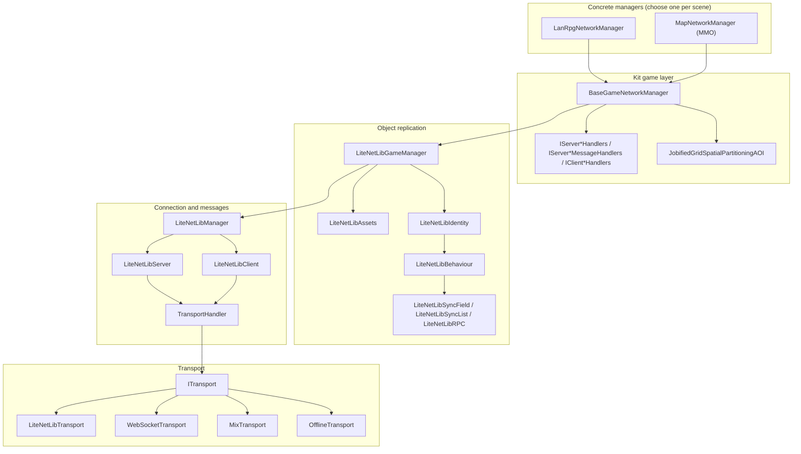
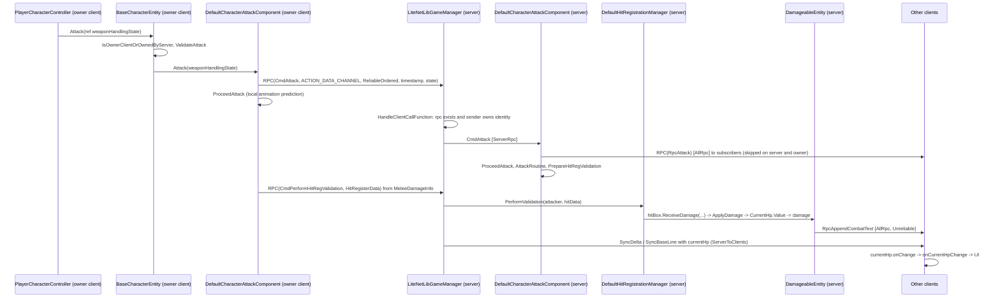
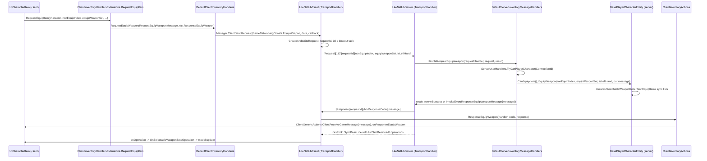

# Networking Foundation

## Purpose

The networking foundation is the stack that moves every byte between a game server and its clients: the transport sockets, the connection and scene handshake, networked object identity and ownership, interest management (which client sees which object), automatic state replication (sync fields and sync lists), remote procedure calls, and the request/response pattern that all gameplay services (inventory, party, guild, mail, ...) are built on. It is server authoritative by design: the server owns every networked object, decides what each client may see, and validates every client action. This document describes the stack from the `ITransport` sockets up to `BaseGameNetworkManager` and its two concrete managers (`LanRpgNetworkManager` and the MMO `MapNetworkManager`), and explains how entity code declares synchronized data and RPCs on top of it.

## Scope

Inside this document:

- The `LiteNetLibManager` library: `Assets/UnityMultiplayerARPG/Core/LiteNetLibManager/` (transports, `LiteNetLibManager`, `LiteNetLibGameManager`, identity, behaviour, sync field/list, RPC, request/response, serialization registries, logging, `LogicUpdater`, `LiteNetLibDiscovery`).
- The kit's game network layer: `Assets/UnityMultiplayerARPG/Core/Scripts/Networking/` (`BaseGameNetworkManager` partials, handler interfaces and default implementations, `GameNetworkingConsts`, message structs, client action hubs, AOI).
- The LAN/offline manager `Assets/UnityMultiplayerARPG/Core/Scripts/LanGame/Networking/` and `NetworkSetting`.
- How entities declare sync fields, sync lists and RPCs (`BaseCharacterEntity_NetworkData.cs`, `_NetworkRequest.cs`, `_NetworkResponse.cs`).
- Connection lifecycle, spawning, ownership, AOI, delivery channels, serialization, WebGL/WebSocket path, UniTask usage.

Outside this document:

- Central/cluster/map-spawn/database server topology, channels, warping between map servers: [04_MMO_SERVER_ARCHITECTURE.md](04_MMO_SERVER_ARCHITECTURE.md).
- What is saved and where (SQL tables, LAN save files): [05_DATABASE_AND_PERSISTENCE_SYSTEM.md](05_DATABASE_AND_PERSISTENCE_SYSTEM.md).
- Login, access tokens: [06_AUTHENTICATION_AND_ACCOUNT_SYSTEM.md](06_AUTHENTICATION_AND_ACCOUNT_SYSTEM.md).
- Entity lifecycle, movement simulation, hit boxes, lag compensation internals: [07_ENTITY_FRAMEWORK.md](07_ENTITY_FRAMEWORK.md).
- Per-feature message semantics (party, guild, chat, storage, ...): the feature documents listed in [Related Documents](#related-documents).
- Demo2D, DemoShooter, DemoSurvival and the Shooter controller family: exist, out of scope for this pass.

## High-Level Architecture

The stack has five layers. Each layer only knows the one below it.



- **Transport** (`Scripts/Transports/`): `ITransport` abstracts a socket pair. `LiteNetLibTransport` wraps two `LiteNetLib.NetManager` instances (client and server) over UDP with 16 data channels by default. `WebSocketTransport` uses Fleck (`Plugins/Fleck.dll`) as server and `System.Net.WebSockets.ClientWebSocket` (or `Plugins/WebSocketClient_JSLIB.jslib` on WebGL) as client. `MixTransport` runs both servers on `port` and `port + webSocketPortOffset` and picks one client transport. `OfflineTransport` is an in-memory queue pair used for single player.
- **Connection and messages** (`LiteNetLibManager.cs`, `LiteNetLibServer.cs`, `LiteNetLibClient.cs`, `TransportHandler.cs`): message type registration, request/response with `AckResponseCode`, connection ids, the fixed-step `LogicUpdater`.
- **Object replication** (`Scripts/GameApi/`): `LiteNetLibGameManager` adds players, scene changes, spawn/destroy, the `EnterGame`/`ClientReady` handshake, and the per-tick state sync protocol. `LiteNetLibIdentity` is the networked object; `LiteNetLibBehaviour` hosts sync elements and RPCs.
- **Kit game layer** (`Core/Scripts/Networking/`): `BaseGameNetworkManager` wires the kit's feature handlers, entity movement state messages, map info, time of day, chat, safe disconnect, and readiness gating; `JobifiedGridSpatialPartitioningAOI` replaces the default interest manager.
- **Concrete managers**: `LanRpgNetworkManager` (host, single player, LAN client, discovery, local save) and `MapNetworkManager` (MMO map server with database and cluster clients, see 04).

Runtime placement: on a dedicated server build (`UNITY_SERVER`) only the server half of every class runs; on a client only the client half; a LAN host runs both in one process and its local client talks to its own server through the transport (`StartHost(false)`) or through `OfflineTransport` (`StartHost(true)`). Code guarded by `#if UNITY_EDITOR || UNITY_SERVER || !EXCLUDE_SERVER_CODES` (server RPC bodies, MMO enter-game validation) is compiled out of client builds that define `EXCLUDE_SERVER_CODES`; this project does not define it, so client builds still carry the server code paths but never execute them.

## Key Components

| Component | Type | Responsibility | Location |
|---|---|---|---|
| `ITransport`, `BaseTransportFactory` | interface / MonoBehaviour | Socket abstraction and its factory (`Build()`), reliability flags (`IsReliableOnly`, `HasImplementedPing`) | `Assets/UnityMultiplayerARPG/Core/LiteNetLibManager/Scripts/Transports/` |
| `LiteNetLibTransport`, `LiteNetLibTransportFactory` | class / MonoBehaviour | UDP transport over `LiteNetLib.NetManager`, connect key, channel counts | `Assets/UnityMultiplayerARPG/Core/LiteNetLibManager/Scripts/Transports/LiteNetLib/` |
| `WebSocketTransport`, `WebSocketServer`, `WebSocketClient`, `WebSocketTransportFactory` | class / MonoBehaviour | WebSocket transport (Fleck server, ClientWebSocket or jslib client), TLS certificate options | `Assets/UnityMultiplayerARPG/Core/LiteNetLibManager/Scripts/Transports/WebSocket/` |
| `MixTransport`, `MixTransportFactory`, `OfflineTransport` | class / MonoBehaviour | UDP plus WebSocket on two ports; in-process loopback for single player | `Assets/UnityMultiplayerARPG/Core/LiteNetLibManager/Scripts/Transports/` |
| `TransportHandler` | class | Packet framing (`PutPackedUShort` message type), message handler table, request/response bookkeeping, timeouts | `Assets/UnityMultiplayerARPG/Core/LiteNetLibManager/Scripts/TransportHandler.cs` |
| `LiteNetLibManager` | MonoBehaviour | Owns `Server`, `Client`, `LogicUpdater`, start/stop server/client/host, message registration API | `Assets/UnityMultiplayerARPG/Core/LiteNetLibManager/Scripts/LiteNetLibManager.cs` |
| `LiteNetLibGameManager` | partial class (MonoBehaviour) | Players, scene loading, EnterGame/ClientReady, ping/RTT, spawn/destroy, state sync, RPC dispatch | `Assets/UnityMultiplayerARPG/Core/LiteNetLibManager/Scripts/GameApi/LiteNetLibGameManager.cs`, `LiteNetLibGameManager.StateSyncing.cs` |
| `LiteNetLibAssets` | MonoBehaviour | Prefab registry by `HashAssetId`, scene object registry, pooling, `NetworkSpawn`/`NetworkDestroy`, owner changes, spawn points, scene events | `Assets/UnityMultiplayerARPG/Core/LiteNetLibManager/Scripts/GameApi/LiteNetLibAssets.cs` |
| `LiteNetLibIdentity` | MonoBehaviour (sealed) | Networked object: `ObjectId`, `HashAssetId`, `ConnectionId`, behaviours, sync elements, RPC table, subscribers, hiding | `Assets/UnityMultiplayerARPG/Core/LiteNetLibManager/Scripts/GameApi/LiteNetLibIdentity.cs` |
| `LiteNetLibBehaviour` | partial class (MonoBehaviour) | Base for networked scripts: reflection registration of sync elements and attribute RPCs, `RPC(...)` overloads, lifecycle virtuals | `Assets/UnityMultiplayerARPG/Core/LiteNetLibManager/Scripts/GameApi/LiteNetLibBehaviour.cs` |
| `LiteNetLibSyncField<T>`, `LiteNetLibSyncList<T>`, `LiteNetLibSyncElement` | class | Replicated variables with sync mode, delta/baseline, `onChange` / `onOperation` | `Assets/UnityMultiplayerARPG/Core/LiteNetLibManager/Scripts/GameApi/LiteNetLibSyncField.cs`, `LiteNetLibSyncList.cs`, `LiteNetLibSyncElement.cs` |
| `LiteNetLibRPC`, `RpcAttribute` family | class / attribute | RPC element, `RPCReceivers`, `[ServerRpc]`, `[AllRpc]`, `[TargetRpc]`, `[ElasticRpc]`, `canCallByEveryone` | `Assets/UnityMultiplayerARPG/Core/LiteNetLibManager/Scripts/GameApi/LiteNetLibRPC.cs`, `GameApi/Attributes/` |
| `LiteNetLibTransform` | LiteNetLibBehaviour | Generic tick-buffered transform sync with interpolation (not used by kit entity movement, see below) | `Assets/UnityMultiplayerARPG/Core/LiteNetLibManager/Scripts/GameApi/LiteNetLibTransform.cs` |
| `BaseInterestManager`, `DefaultInterestManager` | MonoBehaviour | Subscription (AOI) policy; default is distance check every `updateInterval` | `Assets/UnityMultiplayerARPG/Core/LiteNetLibManager/Scripts/GameApi/BaseInterestManager.cs`, `DefaultInterestManager.cs` |
| `WriterRegistry`, `ReaderRegistry`, `NetDataWriterExtension`, `NetDataReaderExtension` | static class | Type to (de)serializer tables, `PutValue`/`GetValue`, packed varints, lists, dictionaries | `Assets/UnityMultiplayerARPG/Core/LiteNetLibManager/Scripts/Serialization/`, `Scripts/Extensions/` |
| `SerializeRegistrySourceGenerator.dll` | DLL | Roslyn source generator that emits `WriterRegistry`/`ReaderRegistry` partials for every `INetSerializable` type at build time | `Assets/UnityMultiplayerARPG/Core/LiteNetLibManager/Scripts/SourceGenerators/` |
| `LogicUpdater`, `RttCalculator` | class | Fixed-step tick loop (`1/updateFps`), tick offset sync, RTT and server timestamp estimate | `Assets/UnityMultiplayerARPG/Core/LiteNetLibManager/Scripts/Utils/LogicUpdater.cs`, `GameApi/RttCalculator.cs` |
| `BaseGameNetworkManager` | partial class (abstract) | Kit manager: handler wiring, message registration, readiness gating, entity movement state, map info, chat, kick, safe disconnect | `Assets/UnityMultiplayerARPG/Core/Scripts/Networking/BaseGameNetworkManager.cs`, `_FeatureHandlers.cs`, `_PlayerActivity.cs` |
| `BaseGameNetworkManagerComponent` | MonoBehaviour | Hook component: same lifecycle callbacks as the manager, for extensions without subclassing | `Assets/UnityMultiplayerARPG/Core/Scripts/Networking/BaseGameNetworkManagerComponent.cs` |
| `GameNetworkingConsts` | partial class (static) | Message ids 100 to 122 and request ids 100 to 194 | `Assets/UnityMultiplayerARPG/Core/Scripts/Networking/GameNetworkingConsts.cs` |
| `Default*Handlers`, `LanRpg*Handlers`, `MMO*Handlers` | MonoBehaviour | Implementations of the handler interfaces | `Assets/UnityMultiplayerARPG/Core/Scripts/Networking/Implements/`, `Assets/UnityMultiplayerARPG/Core/Scripts/LanGame/Networking/`, `Assets/UnityMultiplayerARPG/MMO/Scripts/MMOGame/Networking/` |
| `Client*Actions` | static class | Client-side response hubs: static events per response type, cleaned in `BaseGameNetworkManager.Clean()` | `Assets/UnityMultiplayerARPG/Core/Scripts/Networking/Actions/` |
| `JobifiedGridSpatialPartitioningAOI`, `AOIMapBounds` | MonoBehaviour | Grid based, Burst-jobified interest manager used by the kit | `Assets/UnityMultiplayerARPG/Core/Scripts/Networking/AOI/` |
| `LanRpgNetworkManager` | partial class | LAN host / single player / LAN client, discovery, autosave | `Assets/UnityMultiplayerARPG/Core/Scripts/LanGame/Networking/LanRpgNetworkManager.cs` |
| `NetworkSetting` | ScriptableObject | `networkAddress`, `networkPort`, `maxConnections` used by `LanRpgNetworkManager.StartGame()` | `Assets/UnityMultiplayerARPG/Core/Scripts/GameData/NetworkSetting/NetworkSetting.cs` |
| `UIGameNetworkManagerConnection`, `UINetworkTime` | MonoBehaviour | Connection state indicator, RTT and server timestamp readout | `Assets/UnityMultiplayerARPG/Core/Scripts/UI/Networking/` |

## Important Classes and Interfaces

### LiteNetLibManager

Purpose: the connection manager. Knows nothing about game objects.

Responsibilities:
- Build the transport from `TransportFactory` (`PrepareTransportFactory`: on WebGL a `WebSocketTransportFactory` is forced; otherwise `useWebSocket` selects WebSocket, else the factory component on the same GameObject, else a `LiteNetLibTransportFactory` is added at runtime).
- `StartServer()`, `StartClient(address, port)`, `StartHost(isOfflineConnection)`, `StopServer()`, `StopClient()`, `StopHost()`. `StartHost(true)` swaps both transports for one shared `OfflineTransport`.
- Drive `LogicUpdater.Update()` and `Server.Update()` / `Client.Update()` from `Update()`.
- Message registration: `RegisterServerMessage`, `RegisterClientMessage`, `EnableRequestResponse`, `RegisterRequestToServer<TReq,TRes>(reqType, serverHandler, clientResponseHandler)`, `RegisterRequestToClient`.
- Send helpers: `ClientSendPacket`, `ServerSendPacket`, `ServerSendPacketToAllConnections`, `ClientSendRequest`, `ClientSendRequestAsync<TReq,TRes>`, `ServerSendRequest`.

Important methods:
- `RegisterMessages()` (virtual, called once from `Start()` via `InitTransportAndHandlers()`; all subclasses override it and call base).
- `OnStartServer()`, `OnStartClient(client)`, `OnStartHost()`, `OnStopServer()`, `OnStopClient()`, `OnStopHost()` (virtual lifecycle hooks).
- `OnPeerConnected(connectionId)`, `OnPeerDisconnected(connectionId, reason, socketError)`, `OnClientConnected()`, `OnClientDisconnected(reason, socketError, data)`, `OnPeerNetworkError`, `OnClientNetworkError` (virtual network events).
- `OnServerUpdate(LogicUpdater)`, `OnClientUpdate(LogicUpdater)` (virtual per-tick hooks).

Dependencies: `ITransport`, `LiteNetLibServer`, `LiteNetLibClient`, `LogicUpdater`, `Logging`.

Used by: `LiteNetLibGameManager`; the MMO `CentralNetworkManager`, `MapSpawnNetworkManager`, `DatabaseNetworkManager` derive from it directly (see 04).

Extension points: all virtuals above; `TransportFactory` property; `currentLogLevel` (`ELogLevel`: Developer 0, Debug 1, Info 2, Warn 3, Error 4, Fatal 5).

### TransportHandler (LiteNetLibServer / LiteNetLibClient)

Purpose: packet framing and dispatch shared by the server and client halves.

Responsibilities:
- `ReadPacket(connectionId, reader)`: reads `GetPackedUShort()` message type; routes `RequestMessageType` to `ProceedRequest`, `ResponseMessageType` to `ProceedResponse`, otherwise to `_messageHandlers[messageType]`. Handler exceptions are caught and logged so one bad packet does not kill the receive loop.
- Requests: `CreateAndWriteRequest` allocates a `uint` request id, stores a `LiteNetLibRequestCallback` in a `ConcurrentDictionary`, starts `HandleRequestTimeout` (`UniTask.Delay(millisecondsTimeout)`, default 30000 ms) which fires `AckResponseCode.Timeout`. Wire format: `[Request][requestType][requestId][request payload][extra]`, sent `DeliveryMethod.ReliableUnordered` on channel 0.
- Responses: `RequestProceeded` writes `[Response][requestId][AckResponseCode][response payload][extra]`. Unknown request type answers `Unimplemented`; a throwing handler answers `Exception`.
- `RegisterRequestHandler<TReq,TRes>` / `RegisterResponseHandler<TReq,TRes>` with typed `LiteNetLibRequestHandler` / `LiteNetLibResponseHandler`; `IsRequestTypeValid` guards against sending the wrong struct for a request type.

Important methods: `SendMessage(connectionId, dataChannel, deliveryMethod, writer)` (abstract), `WritePacket(writer, msgType)` (static), `EnableRequestResponse(reqType, resType)`.

Dependencies: `ITransport`, `LiteNetLib.Utils.NetDataWriter/Reader`, UniTask.

Used by: `LiteNetLibManager` and everything above it.

Extension points: none intended; behaviour is fixed. `LiteNetLibServer.OnServerReceive` and `LiteNetLibClient.OnClientReceive` are virtual.

### LiteNetLibGameManager

Purpose: object replication manager.

Responsibilities:
- `Players` (`Dictionary<long, LiteNetLibPlayer>`) created in `OnPeerConnected`, removed in `OnPeerDisconnected` (which also calls `player.ClearSubscribing(false)` and `player.DestroyObjectsWhenDisconnect()`).
- Registers the built in protocol in `RegisterMessages()`: request/response on `GameMsgTypes.Request` (0) / `GameMsgTypes.Response` (1); requests `GameReqTypes.EnterGame` (0), `ClientReady` (1), `ClientNotReady` (2); server messages `RPC` (2), `SyncBaseLine` (3), `Ping` (8), `Pong` (9); client messages `RPC`, `SyncBaseLine`, `SyncDelta` (4), `ServerError` (5), `ServerSceneChange` (6), `ServerSetObjectOwner` (7), `Ping`, `Pong`, `Disconnect` (10).
- Scene flow: `ServerSceneChange(ServerSceneInfo)` and `LoadSceneRoutine` (single scene load, then every `LiteNetLibAdditiveSceneLoader` in the loaded scene, addressable or build-index scene) followed by `ProceedOnlineSceneLoaded` (`Assets.Initialize()`, `Assets.InitPoolingQueues()`, server: `Assets.SpawnSceneObjects()`, `OnServerOnlineSceneLoaded()`, `SendServerSceneChange`; client: `OnClientOnlineSceneLoaded()` and `SendClientReady()` unless `doNotReadyOnSceneLoaded`).
- Per tick: `OnServerUpdate` runs `ProceedServerGameStateSync`, server ping every `pingDuration` (1 s), `InterestManager.UpdateInterestManagement`; `OnClientUpdate` runs `ProceedClientGameStateSync` and client ping.
- Time: `Rtt`, `ServerTimestamp` (unix ms, server local or client estimate from `RttCalculator`), `Tick` (`LocalTick + offset`, offset synced from `PongMessage.tick` in `HandleServerPong` via `LogicUpdater.OnSyncTick`).
- RPC dispatch: `HandleClientCallFunction` (server) validates that the RPC exists on the spawned identity and that the sender owns it unless `CanCallByEveryone`; `HandleServerCallFunction` (client) trusts the server and buffers RPCs for objects that have not spawned yet in `_pendingRpcs`, replaying them in `ReadSpawnGameState`.
- `KickClient(connectionId, byte[] data)`: sends `GameMsgTypes.Disconnect` with the payload, waits 500 ms, then `ServerTransport.ServerDisconnect`.

Important methods:
- `SerializeEnterGameData(writer)` / `DeserializeEnterGameData(requestId, connectionId, request, reader)` (virtual; returns `UniTask<bool>`; base checks `packetVersion`).
- `SerializeClientReadyData(writer)` / `DeserializeClientReadyData(requestId, connectionId, reader, playerIdentity)` (virtual).
- `WriteExtraEnterGameResponse` / `ReadExtraEnterGameResponse` / `WriteExtraClientReadyResponse` / `ReadExtraClientReadyResponse` (virtual, extra payload after the response struct).
- `SetPlayerReady(requestId, connectionId, reader)`: sets `player.IsReady = true`, calls `SpawnPlayer(connectionId)` (spawns `Assets.PlayerPrefab` if set, otherwise returns null), then `DeserializeClientReadyData`; on failure resets `IsReady`.
- `OnServerOnlineSceneLoaded()`, `OnClientOnlineSceneLoaded()`, `OnClientConnectionRefused()`, `OnServerError(message)` (virtual).
- `InterestManager` property (setter calls `Setup(this)`).

Dependencies: `LiteNetLibAssets` (required component), `BaseInterestManager`, `LiteNetLibPlayer`, `RttCalculator`, Addressables tools (`#if !DISABLE_ADDRESSABLES`), UniTask.

Used by: `BaseGameNetworkManager`.

Extension points: every virtual above; `packetVersion` (client and server must match or `EnterGame` fails); `baseLineSyncInterval`; `doNotEnterGameOnConnect`, `doNotReadyOnSceneLoaded`, `doNotDestroyOnSceneChanges`, `loadOfflineSceneWhenClientStopped`.

### LiteNetLibIdentity

Purpose: the networked object. One per prefab root; all `LiteNetLibBehaviour` components on the root and its children belong to it.

Responsibilities:
- Identity: `assetId` (a GUID string assigned in the editor, `HashAssetId` is its 32-bit hash via `GetHashedId`), `sceneObjectId` (`HashSceneObjectId`, auto assigned as `name_N` for scene placed objects), `ObjectId` (`uint`, server assigned by `GetNewObjectId()`, `HighestObjectId` counter reset by `LiteNetLibAssets.Clear`), `ConnectionId` (owner, `-1` means server owned).
- Authority flags: `IsServer`, `IsClient`, `IsOwnerClient` (`Manager.ClientConnectionId == ConnectionId`), `IsOwnerHost`, `IsOwnedByServer`, `IsOwnerClientOrOwnedByServer`.
- `Initial(manager, isSceneObject, objectId, connectionId)`: assigns ids, calls `Behaviours[i].Setup(i)` once (index is a `byte`, maximum 255 behaviours per identity), adds itself to `Assets.SpawnedObjects`, to the owner player's `SpawnedObjects` and subscribes the owner to itself, calls `InterestManager.NotifyNewObject(this)`, then `OnIdentityInitialize` on every behaviour. On a host the object is hidden until subscribed.
- Subscription bookkeeping: `Subscribers` (connection ids that receive this object), `Subscribings` (object ids this player object receives), `AddSubscribing`/`RemoveSubscribing`/`UpdateSubscribings(newSet)`/`ClearSubscribings` (always keeps the owned object subscribed).
- Hiding: `subChannelId` (objects with different sub channel ids never see each other), `SetIsHide(setter, bool)` plus `HideExceptions`, static `ForceHideFunctions` and `HideExceptionFunctions` delegate lists, `IsHideFrom(identity)`.
- Visibility settings: `visibleRange` (0 means interest manager default), `alwaysVisible`, `doNotDestroyWhenDisconnect` (object is re-owned by the server instead of destroyed), `poolingSize` (pooled through `LiteNetLibAssets`), `forceRenderingOffWhileHidding` / `muteAudioSourceWhileHidding` (host side visual hiding in `OnServerSubscribingRemoved`).
- `NetworkDestroy()` / `NetworkDestroy(delay)`; `OnNetworkDestroy(reasons)` appends a destroy state for every subscriber and removes the object from all tables.
- `SetOwnerClient(connectionId)` (server) forwards to `LiteNetLibAssets.SetObjectOwner`.

Important methods: `ProcessRPC(info, reader, hookCallback)`, `GetRPC(info)`, `TryGetSyncElement(elementId, out element)`, `OnSetOwnerClient(bool)`, `OnServerSubscribingAdded()`, `OnServerSubscribingRemoved()`, editor `AssignAssetID()`, `AssignSceneObjectID()`.

Dependencies: `LiteNetLibGameManager`, `LiteNetLibAssets`, `LiteNetLibPlayer`.

Used by: every `LiteNetLibBehaviour`, `LiteNetLibAssets`, interest managers, `BaseGameEntity.HashAssetId`/`EntityId`.

Extension points: the events `onGetInstance`, `onPushBack`, `onSubscriberAdded`, `onSubscriberRemoved`, `onServerSubscribingAdded`, `onServerSubscribingRemoved`, `overrideSetTransform`; the static hide delegate lists. The class is sealed: do not subclass.

### LiteNetLibBehaviour

Purpose: base class for anything that owns sync elements or RPCs. `BaseGameEntity`, `BaseNetworkedGameEntityComponent<T>`, `CharacterControllerEntityMovement`, `NavMeshEntityMovement`, `LiteNetLibTransform` all derive from it.

Responsibilities:
- `Setup(behaviourIndex)`: calls `OnSetup()` (the kit's `BaseGameEntity.OnSetup` is sealed and calls `SetupNetElements()`), then `CacheElements` (reflection over all instance fields whose type derives from `LiteNetLibSyncElement`, walking base types, cached per `Type`) and `CacheRpcs` for `[ElasticRpc]`, `[ServerRpc]`, `[AllRpc]`, `[TargetRpc]` methods (`DeclaredOnly` per type, walking base types, return type must be `void`).
- Element ids: `TypeFullName_behaviourIndex_fieldName` hashed with `LiteNetLibIdentity.GetHashedId`; RPC ids: `TypeFullName_behaviourIndex_methodName`. Both sides compute the same ids from the same prefab, so prefab component order and class names are part of the protocol. Hash collisions are detected and logged, the colliding element is skipped.
- `RPC(method, [channel, delivery], [receivers | connectionId], params)` overloads for 0 to 10 parameters; `RegisterElasticRPC`/`RegisterServerRPC`/`RegisterAllRPC`/`RegisterTargetRpc` for delegate based registration inside `OnSetup()`.
- Send helpers scoped to the object: `ServerSendPacketToSubscribers`, `ServerSendMessageToSubscribers`, `ClientSendPacket`, `ServerSendPacketToAllConnections`.

Important methods (virtual lifecycle, in call order for a spawn): `OnSetup()`, `OnIdentityInitialize()`, `InitTransform(position, rotation)`, `OnSetOwnerClient(bool)`, `OnStartServer()`, `OnStartClient()`, `OnStartOwnerClient()`, `OnServerSubscribingAdded()`, `OnServerSubscribingRemoved()`, `OnNetworkDestroy(reasons)`, `OnIdentityDestroy()`.

Dependencies: `LiteNetLibIdentity` (found by `GetComponent` or `GetComponentInParent`), `LiteNetLibRPC`, `LiteNetLibSyncElement`.

Used by: all entity and networked component classes.

Extension points: the virtuals above; declaring fields of `LiteNetLibSyncField<T>` / `LiteNetLibSyncList<T>` subclasses; RPC attributes with `canCallByEveryone = true` for RPCs that non owners may invoke on an object.

### LiteNetLibSyncField&lt;T&gt; and LiteNetLibSyncList&lt;T&gt;

Purpose: replicated variables.

Responsibilities (sync field):
- `syncMode`: `ServerToClients` (default), `ServerToOwnerClient`, `ClientMulticast` (owner client writes, server re-broadcasts to the other subscribers and never echoes back to the owner because of `_latestChangeSyncedFromOwner`).
- `Value` setter is refused with an error log on the non authoritative side; `MarkAsChanged()` forces a resend; `onChange(initial, old, new)` fires on receivers and, for the initial value, on the authority.
- Delta versus baseline: `CanSyncDelta()` is true for every built in field except `SyncFieldString`; deltas go unreliable and are repeated `redundancyCount` (default 2) extra ticks on lossy transports (`ITransport.IsReliableOnly == false`), baselines go reliable every `baseLineSyncInterval`. `ReadSyncData` drops packets whose tick is not newer than `_latestReceiveTick`.
- `doNotSync` disables replication for a field. `Reset()` restores `DefaultValue` on pooled reuse.
- Typed subclasses (`SyncFieldInt`, `SyncFieldFloat`, `SyncFieldVector3`, `SyncFieldPackedInt`, ...) serialize without boxing; `SyncFieldNetSerializableStruct<T>` for `INetSerializable` structs; `SyncFieldArray<T>` for arrays (always considered changed).

Responsibilities (sync list):
- Writes are server only (`CanSync()` is `IsServer`); operations `Add`, `Insert`, `Set`, `Dirty(index)`, `RemoveAt`, `RemoveFirst`, `RemoveLast`, `Clear`, `AddInitial` (`LiteNetLibSyncListOp`) are queued as `OperationEntry` items and coalesced (`Set`/`Dirty` on the same index replace earlier ones, `Clear` drops everything) until the next tick. Lists are baseline-only (they never use the unreliable delta channel).
- `onOperation(op, index, oldItem, newItem)` fires on receivers; initial contents arrive as `AddInitial` operations.
- `forOwnerOnly` is a public field but nothing in `LiteNetLibManager` or the kit reads it (verified with a repository wide search). Every sync list is replicated to every subscriber of its identity.

Important methods: `CanSyncFromServer(player, isBaseLine)`, `CanSyncFromOwnerClient()`, `WriteSyncData`/`ReadSyncData`, `RegisterUpdating()`/`UnregisterUpdating()`, `Synced(tick, isBaseLine)`.

Dependencies: `LiteNetLibGameManager` (register lists `_updatingServerSyncElements` / `_updatingClientSyncElements`), `WriterRegistry`/`ReaderRegistry` for generic types.

Used by: `BaseGameEntity` (`syncTitle`, `syncOverrideInput`, ...), `DamageableEntity` (`currentHp`, `isInvincible`), `BaseCharacterEntity_NetworkData.cs` (17 fields, 8 lists), `VehicleEntity`, `BuildingEntity`, `ItemDropEntity`, `LiteNetLibTransform`.

Extension points: subclass `LiteNetLibSyncField<T>` and override `SerializeValue`/`DeserializeValue`/`IsValueChanged`; the kit does this in `Assets/UnityMultiplayerARPG/Core/Scripts/CharacterData/RelatesData/CharacterItem.cs` (`SyncListCharacterItem`), `CharacterMount.cs` (`SyncFieldCharacterMount`), `Assets/UnityMultiplayerARPG/Core/Scripts/Gameplay/CharacterEntity/AimPosition.cs` (`SyncFieldAimPosition`).

### BaseGameNetworkManager

Purpose: the kit's game manager. Abstract; `LanRpgNetworkManager` and `MapNetworkManager` complete it.

Responsibilities:
- `Awake()`: `Singleton = this`; forces `doNotEnterGameOnConnect = false`, `doNotReadyOnSceneLoaded = true`, `doNotDestroyOnSceneChanges = true`; `GetOrAddComponent` `DefaultLagCompensationManager` and `DefaultHitRegistrationManager` (interfaces `ILagCompensationManager`, `IHitRegistrationManager`); installs `JobifiedGridSpatialPartitioningAOI` as interest manager when no `BaseInterestManager` is present; collects `BaseGameNetworkManagerComponent[] ManagerComponents`; registers `IsHideEntity` into `LiteNetLibIdentity.ForceHideFunctions` (delegates to `BaseGameEntity.IsHideFrom`).
- `RegisterMessages()`: base protocol, then `RegisterHandlerMessages()` (client messages `Warp`, `Chat`, `UpdateTimeOfDay`, `UpdateMapInfo`, `EntityState`, `NotifyOnlineCharacter`, and all `IClientGameMessageHandlers` messages; server messages `Chat`, `EntityState`, `NotifyOnlineCharacter`; every `RegisterRequestToServer` for cash shop, mail, storage, character, inventory, party, guild, gacha, friend, bank, user content; each block is skipped when the corresponding handler property is null), `SafeDisconnect`, DevExt hooks `RegisterClientMessages`, `RegisterServerMessages`, `RegisterMessages`, then `component.RegisterMessages(this)`.
- Handler wiring: `SetServerHandlersRef()` / `SetClientHandlersRef()` copy the handler properties into the static `GameInstance.Server*Handlers` / `GameInstance.Client*Handlers` fields in `OnStartServer` / `OnStartClient`, which is how entity and UI code reaches them.
- Readiness gating: `IsServerReadyToInstantiateObjects()` and `IsClientReadyToInstantiateObjects()` evaluate `ConcurrentDictionary<string,bool>` state maps (built in key `INSTANTIATES_OBJECTS_DELAY` = 1 s after scene load, plus DevExt `UpdateServerReadyToInstantiateObjectsStates` / `UpdateClientReadyToInstantiateObjectsStates` and component hooks). `SpawnEntities()` waits for the server map, `ProceedUntilClientReady()` waits for the client map before sending `ClientReady`. `_isServerReadyToInstantiatePlayers` becomes true after `PostSpawnEntities()`.
- `SpawnEntities()`: `PreSpawnEntities()`, `RegisterEntities()` (registers spawn area prefabs and scene placed monsters, harvestables, item drops into `GameInstance`), warp portals from `GameInstance.MapWarpPortals[MapInfo.Id]`, NPCs from `GameInstance.MapNpcs`, every `GameSpawnArea.SpawnFirstTime()`, a `ServerCharacter` camera on non-headless dedicated servers, `PostSpawnEntities()`; progress events `onSpawnEntitiesStart/Progress/Finish`.
- `InitPrefabs()`: fills `Assets.spawnablePrefabs` from every entity dictionary on `GameInstance` (player, monster, vehicle, warp portal, NPC, building, item/exp/gold/currency drops, corpses, `OtherNetworkObjectPrefabs`) and sets `Assets.offlineScene` to the home scene; `Assets.playerPrefab` is set to null, so the base `SpawnPlayer` never spawns anything and player spawning is entirely done in `DeserializeClientReadyData` overrides.
- Entity movement state channel: `OnServerUpdate` -> `SendServerEntityMovementState` (packs every subscribed `IEntityMovementDataHandler.WriteServerState` per player into one reliable and one or more unreliable `GameNetworkingConsts.EntityState` packets, splitting at `MAX_UNRELIABLE_PACKET_SIZE`); `OnClientUpdate` -> `SendClientEntityMovmentState` (the playing character or the vehicle it drives). Receivers: `HandleClientEntityStateAtServer` (rejects packets whose object is not owned by the sender), `HandleServerEntityStateAtClient`.
- Periodic: `UpdateOnlineCharacters()` every 1 s (marks online, pushes party/guild member updates), `SendTimeOfDay()` every 5 s (unreliable), `DayNightTimeUpdater.UpdateTimeOfDay` every frame.
- Map info: `SetMapInfo(name | BaseMapInfo)`, `WriteMapInfo`/`ReadMapInfo` (`UpdateMapInfoMessage` plus `MapInfo.Serialize`, DevExt `WriteMapInfoExtra`/`ReadMapInfoExtra`), sent inside the EnterGame response and on change.
- Chat: `HandleChatAtServer` (fills sender ids, mute and flood checks, `IServerChatHandlers.OnChatMessage`), `ServerSendSystemAnnounce`, `ServerSendLocalMessage`.
- Registration: `RegisterPlayerCharacter`, `UnregisterPlayerCharacter`, `RegisterUserIdAndAccessToken`, `UnregisterUserIdAndAccessToken` (events `onRegisterCharacter`, `onUnregisterCharacter`, `onRegisterUser`, `onUnregisterUser`).
- `KickClient(connectionId, UITextKeys)`, `SendClientSafeDisconnect()`, `CreateBuildingEntity`, `DestroyBuildingEntity`, `Clean()`.

Important abstract members (`BaseGameNetworkManager_PlayerActivity.cs`): `WarpCharacter(...)`, `WarpCharacterToInstance(...)`, `IsInstanceMap()`, `RequestPlayerCharacterTransform(connectionId)`; virtual `CanWarpCharacter`.

Dependencies: `GameInstance`, all handler interfaces, `ClientGenericActions` and the other action hubs, `UISceneGlobal` (disconnect dialogs), `EntityMovementDataBuffers`, `PoolSystem`.

Used by: `LanRpgNetworkManager`, `MapNetworkManager`, every entity (`BaseGameEntity.CurrentGameManager`), UI.

Extension points: DevExt hook names `RegisterMessages`, `RegisterClientMessages`, `RegisterServerMessages`, `Clean`, `OnStartServer`, `OnStopServer`, `OnStartClient`, `OnStopClient`, `OnClientConnected`, `OnClientDisconnected`, `OnPeerConnected`, `OnPeerDisconnected`, `SendClientEnterGame`, `SendClientReady`, `SendClientNotReady`, `SendClientSafeDisconnect`, `HandleEnterGameResponse`, `HandleClientReadyResponse`, `HandleSafeDisconnectResponse`, `OnClientOnlineSceneLoaded`, `OnServerOnlineSceneLoaded`, `InitPrefabs`, `WriteMapInfoExtra`, `ReadMapInfoExtra`, `UpdateReadyToInstantiateObjectsStates`, `UpdateServerReadyToInstantiateObjectsStates`, `UpdateClientReadyToInstantiateObjectsStates`; the same set as virtuals on `BaseGameNetworkManagerComponent`; `PreSpawnEntities()`/`PostSpawnEntities()`; swapping any handler property before `RegisterMessages` runs.

### LanRpgNetworkManager

Purpose: LAN host, LAN client and single player manager. Instance lives in `Assets/UnityMultiplayerARPG/Demo/Scenes/00Init.unity` (object `NetworkManager`).

Responsibilities:
- `StartGame()` by `startType`: `Host` (`SetMapInfo(selectedCharacter.CurrentMapName)`, `Assets.onlineScene = CurrentMapInfo.Scene`, port and `maxConnections` from `GameInstance.NetworkSetting`, `StartHost(false)`, `LiteNetLibDiscovery.StartServer()` broadcasting `DiscoveryData` JSON), `SinglePlayer` (`StartHost(true)`, offline transport), `Client` (`StartClient()` to `networkAddress` set by the UI).
- `PrepareLanRpgHandlers()` in `Awake` installs `Default*` handlers plus `LanRpgServerStorageHandlers`, `LanRpgServerCashShopMessageHandlers`, `LanRpgServerStorageMessageHandlers`, `LanRpgServerPartyMessageHandlers`, `LanRpgServerGuildMessageHandlers`, `LanRpgServerGachaMessageHandlers`, `LanRpgServerBankMessageHandlers`, `LanRpgServerUserContentMessageHandlers`. `ServerMailHandlers`, `ServerMailMessageHandlers` and `ServerFriendMessageHandlers` stay null, so mail and friend requests are not registered in LAN mode.
- `SerializeClientReadyData` writes the whole `PlayerCharacterData` plus summon buffs and player storage (loaded from `BaseGameSaveSystem`); `DeserializeClientReadyData` spawns via `SpawnPlayerCharacter` or parks the data in `_pendingSpawnPlayerCharacters` until `_isServerReadyToInstantiatePlayers` (drained in `OnServerUpdate`).
- `Save()` every `autoSaveDuration` (2 s), on `OnStopClient`, before scene change and before warp; `WarpCharacter` teleports on the same map or saves everything and calls `ServerSceneChange` for another map; `IsInstanceMap()` is always false.
- `enableGmCommands`: `Everyone` gives every character `UserLevel = 1`, `HostOnly` only the first.

Dependencies: `BaseGameSaveSystem`, `LiteNetLibDiscovery`, `NetworkSetting`, Newtonsoft JSON.

Used by: LAN UI (`Assets/UnityMultiplayerARPG/Core/Scripts/UI/...` home scene UIs call `StartGame()`), `GameInstance`.

Extension points: partial class (the demo adds `Assets/UnityMultiplayerARPG/Demo/Scripts/DevExt/DevExtDemo_LanRpgNetworkManager.cs` with `[DevExtMethods("RegisterClientMessages")]` etc.), all `BaseGameNetworkManager` hooks.

### JobifiedGridSpatialPartitioningAOI

Purpose: the interest manager the kit installs on every `BaseGameNetworkManager`.

Responsibilities:
- `PrepareSystem()` on setup and after every online scene load: world bounds from `AOIMapBounds` components in the scene, otherwise from the union of all `Collider` bounds, padded by `bufferedCells * cellSize * 2`; creates a `JobifiedGridSpatialPartitioningSystem` (`Assets/UnityMultiplayerARPG/Core/SpatialPartitioningSystems/`) with the Y axis disabled in 3D.
- Every `updateInterval` (1 s): inserts every ready player's owned objects into the grid, then for every spawned object issues a `QuerySphere(position, GetVisibleRange(object))` job (objects find the players that can see them), plus box or sphere queries for every registered `ISpatialObjectComponent` (`GameSpawnAreaSubscribeHandler`). Jobs complete in `LateUpdate`; results are turned into `playerObj.UpdateSubscribings(set)` calls, `AlwaysVisible` objects are appended to every set, and `Manager.Assets.ApplyOwnerChanges()` is flushed (`manuallyApplyOwnerChanges` is forced to true so owner changes never happen mid-query).
- `ShouldSubscribe(subscriber, target, checkRange: false)` still applies the hide rules from `BaseInterestManager`.

Dependencies: Unity Jobs, Burst, Collections, `SpatialObjectContainer`.

Used by: `BaseGameNetworkManager.Awake`.

Extension points: `cellSize` (64), `maxObjects` (10000), `updateInterval`, `defaultVisibleRange` (80, inherited), `AOIMapBounds` in scenes; replace by adding another `BaseInterestManager` component to the manager GameObject before `Awake`.

## Data Flow

### Message families

| Family | Ids | Direction | Delivery | Handler side |
|---|---|---|---|---|
| Protocol messages `GameMsgTypes` 0 to 10 | Request 0, Response 1, RPC 2, SyncBaseLine 3, SyncDelta 4, ServerError 5, ServerSceneChange 6, ServerSetObjectOwner 7, Ping 8, Pong 9, Disconnect 10 | both | baseline and RPC default reliable ordered, delta and time of day unreliable | `LiteNetLibGameManager` |
| Protocol requests `GameReqTypes` | EnterGame 0, ClientReady 1, ClientNotReady 2 | client to server | reliable unordered (all requests) | `LiteNetLibGameManager` |
| Kit messages `GameNetworkingConsts` 100 to 122 | GameMessage, Warp, Chat, UpdatePartyMember, UpdateParty, UpdateGuildMember, UpdateGuild, UpdateMapInfo, NotifyOnlineCharacter, NotifyReward*, UpdateTimeOfDay, NotifyStorage*, NotifyPartyInvitation, NotifyGuildInvitation, EntityState (119), FormattedGameMessage, UpdateServerInfo | mostly server to client; Chat, EntityState, NotifyOnlineCharacter also client to server | mixed | `BaseGameNetworkManager`, `IClientGameMessageHandlers`, `IClientOnlineCharacterHandlers`, `IServerCharacterHandlers` |
| Kit requests `GameNetworkingConsts` 100 to 194 | CashShop*, Mail*, Storage*, Equip/UnEquip*, Party*, Guild*, Friend*, Bank*, Attribute/Skill, Dismantle/Refine/Repair/Sell/Sort, Respawn, Set Icon/Frame/Background/Title, Content unlock, SafeDisconnect (190), PlayerCharacterTransform (193) | client to server | reliable unordered | `IServer*MessageHandlers` |
| Entity RPCs | per behaviour, hashed ids | both | per call (`ACTION_DATA_CHANNEL` 3 reliable ordered for attacks, `ReliableUnordered` for pickups) | `[ServerRpc]` / `[AllRpc]` / `[TargetRpc]` methods |
| Sync fields and lists | per behaviour, hashed ids | server to clients (or owner to server for `ClientMulticast`) | baseline reliable ordered on `syncChannelId`, delta unreliable on channel 0 | `onChange` / `onOperation` |

Message ids and request ids are separate namespaces because every request is wrapped in `GameMsgTypes.Request`. Message structs live in `Assets/UnityMultiplayerARPG/Core/Scripts/Networking/Messages/` (177 files): `Bank/` (8), `CashShop/` (7), `Character/` (18), `Friend/` (17), `Gacha/` (3), `Guild/` (39), `HitRegistration/` (3: `HitRegisterData`, `HitValidateData`, `HitRegistrationUtils`), `Inventory/` (35), `Mail/` (13), `Party/` (16), `Storage/` (9), `UserContent/` (6) and the root `UpdateMapInfoMessage`, `UpdateServerInfoMessage`, `UpdateTimeOfDayMessage`. Each request has a `Request*Message` and `Response*Message` pair; responses carry a `UITextKeys message` that the client shows through `ClientGenericActions.ClientReceiveGameMessage`.

### Flow A: client input to entity RPC to server validation to sync field to other clients (basic attack)



Details worth knowing:

- `BaseCharacterEntity.Attack` (`Assets/UnityMultiplayerARPG/Core/Scripts/Gameplay/CharacterEntity/BaseCharacterEntity.cs:606`) refuses unless `IsOwnerClientOrOwnedByServer`; `DefaultCharacterAttackComponent.Attack` (`.../CharacterActionsSystem/DefaultCharacterAttackComponent.cs`) sends `CmdAttack` only when `!IsServer && IsOwnerClient`; a host or a server owned monster goes straight to `PreceedCmdAttack`.
- The server never trusts the client's animation timing: `AttackRoutine` runs on the server with `simulateSeed = timestamp % 16384`, and damage for remote players is applied only when the client reports a hit (`MeleeDamageInfo.cs:56` `willProceedHitRegByClient = !attacker.IsOwnedByServer && !attacker.IsOwnerHost`) and `DefaultHitRegistrationManager.PerformValidation` accepts it (validating data prepared by the server, per trigger, duplicate hit rejection, hit box rewind by half RTT, `hitValidationBuffer` 2 m). Server owned attackers and the host apply damage directly.
- `currentHp` is declared in `DamageableEntity` with `syncMode = ServerToClients`; the change becomes a `GameStateSyncType.Data` entry in each subscribing player's `SyncingDeltaStates` and is sent unreliably on the next tick, repeated `redundancyCount` times, and included in the next reliable baseline.

### Flow B: request/response (equip weapon)



Details: the request type is registered once in `RegisterHandlerMessages()` as `RegisterRequestToServer<RequestEquipWeaponMessage, ResponseEquipWeaponMessage>(GameNetworkingConsts.EquipWeapon, ServerInventoryMessageHandlers.HandleRequestEquipWeapon)` (no client response handler, so the per-call delegate is the only callback). `RequestDelegate` returns `UniTaskVoid`, so a server handler may `await` a database call before invoking `result` (the MMO storage and guild handlers do). If the server never answers, the client callback fires with `AckResponseCode.Timeout` and `GameNetworkingReponseUtils.ShowUnhandledResponseMessageDialog` maps `Timeout`, `Exception`, `Unimplemented`, `Error` to dialog texts.

### Connection lifecycle

```mermaid
sequenceDiagram
    participant C as Client (BaseGameNetworkManager)
    participant T as Transport
    participant S as Server (BaseGameNetworkManager)

    C->>T: StartClient(address, port)
    T->>S: ConnectEvent -> OnPeerConnected -> Players.Add(LiteNetLibPlayer)
    T->>C: ConnectEvent -> OnClientConnected -> SendClientEnterGame + SendClientPing
    C->>S: EnterGame request (packetVersion + SerializeEnterGameData)
    S->>S: DeserializeEnterGameData (MMO: token check via DatabaseClient, load character)
    S->>C: EnterGame response (connectionId, ServerSceneInfo) + UITextKeys + server info + map info + time of day
    C->>C: ClientConnectionId set, HandleServerSceneChange -> LoadSceneRoutine
    C->>C: Assets.Initialize(), OnClientOnlineSceneLoaded -> RegisterEntities, ProceedUntilClientReady
    C->>S: ClientReady request (SerializeClientReadyData; LAN: full character data)
    S->>S: SetPlayerReady: IsReady = true, SpawnPlayer (null), DeserializeClientReadyData
    S->>S: Assets.NetworkSpawn(character, 0, connectionId) -> Identity.Initial -> Player.Subscribe(self)
    S->>C: SyncBaseLine: Spawn state (hashAssetId, pos, rot, objectId, connectionId, initial sync data)
    C->>C: NetworkSpawn -> OnSetOwnerClient(true) -> controller prefab instantiated
    S->>S: InterestManager.UpdateInterestManagement -> UpdateSubscribings
    S->>C: SyncBaseLine: Spawn states for visible objects
    loop every tick
        C->>S: EntityState (movement), RPCs, ClientMulticast fields
        S->>C: EntityState, SyncDelta, SyncBaseLine, RPCs
    end
    C->>S: SafeDisconnect request (MMO override saves before answering)
    S->>C: Success
    C->>T: StopClient -> OnClientDisconnected -> ShowDisconnectDialog, LoadOfflineScene
    T->>S: DisconnectEvent -> OnPeerDisconnected -> ClearSubscribing, DestroyObjectsWhenDisconnect
```

Server startup mirrors the client: `StartServer()` -> `InitPrefabs()` -> `OnStartServer()` (`SetServerHandlersRef`, DevExt `OnStartServer`, `DayNightTimeUpdater.InitTimeOfDay`) -> `LoadSceneRoutine(onlineScene)` -> `ProceedOnlineSceneLoaded` -> `Assets.SpawnSceneObjects()` -> `OnServerOnlineSceneLoaded()` -> `SpawnEntities()` -> `_isServerReadyToInstantiatePlayers = true`. Clients that send `ClientReady` before that are parked (`LanRpgNetworkManager._pendingSpawnPlayerCharacters`; the MMO manager refuses `EnterGame` with `UI_ERROR_APP_NOT_READY` until `IsServerReadyToInstantiateObjects()`).

Kick and refusal: `BaseGameNetworkManager.KickClient(connectionId, UITextKeys)` writes the text key as a packed ushort into the `Disconnect` message payload; the client reads it back in `OnClientDisconnected` and shows it. A failed `EnterGame` or `ClientReady` puts a `UITextKeys` into `_enterGameRequestResponseMessages` / `_clientReadyRequestResponseMessages` which `WriteExtra*Response` sends and `ReadExtra*Response` shows before `StopClient()`.

## Runtime Behaviour

- **Tick loop**: `LogicUpdater` runs a fixed step of `1 / updateFps` seconds (20 Hz in both the LAN scene and the MMO map prefab) with at most 5 catch-up ticks per frame. `LocalTick` counts steps; `Tick` adds an offset that clients derive from `PongMessage.tick + rtt/2`. All replication happens on ticks, not frames. `LiteNetLibManager.Update()` first drains transport events (which invokes message handlers), then `BaseGameNetworkManager.Update()` runs per-second timers; entities update afterwards through `UpdateManager` (see 07).
- **State sync protocol** (`LiteNetLibGameManager.StateSyncing.cs`): every tick the server walks `_updatingServerSyncElements` (elements that called `RegisterUpdating()` after a change). For each ready player it appends the element to `SyncingStates` (baseline, reliable ordered, one packet per `syncChannelId`) when `syncBaseLine` is due or the element cannot delta, otherwise to `SyncingDeltaStates` (unreliable, one packet per player, split at 1023 bytes). Spawn and destroy states share the baseline packet (`GameStateSyncType.Spawn` carries identity data and the initial value of every element that passes `CanSyncFromServer(player, true)`; `Destroy` carries `DestroyObjectReasons`). The client walks `_updatingClientSyncElements` (only `ClientMulticast` fields) and sends them as a baseline every tick. Delta packets whose object is unknown or fail to parse are skipped by length.
- **Ping**: client and server both send `Ping` every `pingDuration` (1 s); `RttCalculator` averages the last ten samples and computes the timestamp offset; `LiteNetLibPlayer.RttCalculator` gives the server a per-connection RTT used by lag compensation and hit registration.
- **Spawning**: server code calls `Assets.NetworkSpawn(hashAssetId | prefab | identity, position, rotation, objectId: 0, connectionId)`. Instances come from the per-prefab pool when `poolingSize > 0`, otherwise `Instantiate`. `Initial()` assigns the `ObjectId`, subscribes the owner, notifies the interest manager, then `InitTransform`, `OnSetOwnerClient`, `OnStartServer`, `OnStartClient` (host), `OnStartOwnerClient`, `onObjectSpawn`. Clients spawn on `ReadSpawnGameState`, reading initial sync elements before the same callbacks. Scene objects are registered from all loaded scenes, deactivated in `RegisterSceneObjects()`, spawned by the server with `objectId 0` (new id) and activated on clients when subscribed; `NetworkDestroy` deactivates scene objects instead of destroying them.
- **Ownership**: `ConnectionId >= 0` means a client owns the object; the owner may call `[ServerRpc]`s, may write `ClientMulticast` fields, and is the only client that receives `ServerToOwnerClient` fields. `LiteNetLibAssets.SetObjectOwner` moves the object between `LiteNetLibPlayer.SpawnedObjects` tables and sends `ServerSetObjectOwner` to the old and new subscribers; the MMO map server uses it to hand a still-spawned character to a reconnecting connection (`SetPlayerReadyRoutine`). With `doNotDestroyWhenDisconnect` (set by `VehicleEntity.OnIdentityInitialize`) the object is re-owned by the server on disconnect instead of destroyed.
- **Interest management**: see `JobifiedGridSpatialPartitioningAOI` above. Subscription changes translate into spawn/destroy states with reason `RemovedFromSubscribing`, so on a client an object that walks out of range is destroyed (or pooled) and re-spawned when it comes back; per-object client state such as animation does not survive that. On a host the local player is subscribed like any other player; unsubscribed objects stay alive but hidden (`forceRenderingOff`, muted audio).
- **Pooling**: `LiteNetLibIdentity.poolingSize` drives `LiteNetLibAssets.GetOrInitPoolingQueue` (queues created in `InitPoolingQueues()` after scene load; `disablePooling` and `limitByPoolingSize` on the assets component). `OnGetInstance` resets sync elements to their default values; `onGetInstance`/`onPushBack` events let entities clean themselves. The gameplay side has its own non-networked `PoolSystem` for effects and damage entities (07, 29).
- **Scene changes**: only the server calls `ServerSceneChange`; clients receive `ServerSceneChange` (or the scene inside the EnterGame response) and reload. While loading, `Players[*].IsReady` is cleared and `Assets.Clear(true)` destroys spawned objects but keeps `HighestObjectId`. `LoadingServerScenes` collapses queued loads to the last requested scene.
- **Shutdown**: `OnStopServer` -> `Clean()` (handlers, action hubs, pools, readiness maps, `GameInstance.JoinedParty/JoinedGuild`) -> `LoadOfflineScene` (home scene from `GameInstance.GetHomeScene`). `OnStopClient` on a pure client does the same; `OnApplicationQuit` and `OnDestroy` call `StopHost()`.
- **UniTask**: request handlers are `UniTaskVoid` delegates and may await database or REST calls before answering; `ClientSendRequestAsync` returns `UniTask<AsyncResponseData<T>>` and is implemented with a `UniTask.Delay(100)` polling loop (100 ms granularity on completion); request timeouts, `KickClient`'s 500 ms grace period, `LoadSceneRoutine`, `SpawnEntities` (one `UniTask.NextFrame()` per spawned NPC, portal and spawn area), `ProceedUntilClientReady`, `WaitClientTeleportConfirm`, `SendClientSafeDisconnect` are all UniTask based; fire-and-forget calls use `.Forget()`. `WebSocketClient` also drives its connect/receive loops with UniTask.

## Networking and Authority

This document is the networking system, so this section summarizes the authority model that every other document assumes.

- **Server authoritative state**: all sync fields except those explicitly set to `ClientMulticast`, all sync lists, spawning, destroying, ownership, subscriptions, map info, time of day, chat routing, every request handler. Clients cannot write a `ServerToClients` field (the setter logs "Cannot access sync field from client" and returns).
- **Client authoritative or client reported**: `ClientMulticast` fields (`BaseCharacterEntity`: `isWeaponsSheathed`, `aimPosition`), entity movement when `MovementSecure.NotSecure` (the owner client writes position and rotation through `EntityState`; the server accepts it, see 07 for validation), attack and skill timing (`CmdAttack`, `CmdUseSkill` carry a client timestamp), melee and raycast hit reports (`CmdPerformHitRegValidation`, validated server side), `LiteNetLibTransform` when `syncByOwnerClient`.
- **Server RPC gate**: `HandleClientCallFunction` drops calls to unknown RPCs and calls from non-owners unless `canCallByEveryone`. `[ServerRpc]` bodies in the kit are additionally wrapped in `#if UNITY_EDITOR || UNITY_SERVER || !EXCLUDE_SERVER_CODES`.
- **Client RPC trust**: `HandleServerCallFunction` executes anything from the server; `[AllRpc]` calls are delivered only to subscribers plus the owner (`HasSubscriberOrIsOwning`), `[TargetRpc]` to one connection that subscribes or owns the object.
- **Per-entity declarations**: `BaseGameEntity.SetupNetElements()` sets `syncTitle` (`ServerToClients`, `redundancyCount 0`), `syncOverrideInput` (`ServerToOwnerClient`), `syncOverrideMoveSpeed/JumpHeight/GravityRate` (`ServerToClients`); `DamageableEntity` adds `currentHp`, `isInvincible`; `BaseCharacterEntity_NetworkData.cs` declares `id`, `metaDataId`, `level`, `exp`, `currentMp`, `currentStamina`, `currentFood`, `currentWater`, `equipWeaponSet`, `isWeaponsSheathed` (ClientMulticast), `pitch`, `lookPosition`, `aimPosition` (ClientMulticast), `targetEntityId`, `mount` (ServerToOwnerClient), `summoner`, and the lists `selectableWeaponSets`, `attributes`, `skills`, `skillUsages`, `buffs`, `equipItems`, `nonEquipItems`, `summons`; each has an `On*Change` / `On*Operation` handler that raises the entity events listed in 08. `BaseCharacterEntity_NetworkRequest.cs` holds the `CallCmd*` / `CallRpc*` wrappers (`CallCmdPickup`, `CallCmdDropItem`, `CallRpcOnDead`, ...), `_NetworkResponse.cs` the `[ServerRpc]` / `[AllRpc]` bodies with their validation (`IsGameEntityInDistance`, `CanPickup`, `IncreasingItemsWillOverwhelming`, ...).
- **Channels**: `LiteNetLibTransportFactory` allocates 16 channels each way. Channel 0 carries requests, deltas and default RPCs; `BaseGameEntity.MOVEMENT_DATA_CHANNEL` (2) carries `EntityState`; `ACTION_DATA_CHANNEL` (3) carries attack, skill and hit registration RPCs so they are ordered with respect to each other but not blocked by movement. Prefabs choose `syncChannelId` and `defaultRpcChannelId` on their `LiteNetLibIdentity` (both 0 on `SyntyPlayerCharacter`).
- **WebGL and WebSocket**: `PrepareTransportFactory` forces `WebSocketTransportFactory` on WebGL players (`UNITY_WEBGL && !UNITY_EDITOR`); the client half is `WebSocketClient` over `Plugins/WebSocketClient_JSLIB.jslib` (`SocketCreate_LnlM` and friends). Non WebGL clients use `System.Net.WebSockets.ClientWebSocket` with a 30 s connect timeout. Servers use Fleck (`UNITY_EDITOR || UNITY_STANDALONE`) with optional TLS (`webSocketSecure`, certificate file or base64 plus password) on `ws(s)://0.0.0.0:{port}/netcode/`. WebSocket is `IsReliableOnly`, so `DeliveryMethod` is ignored and delta redundancy is skipped. A server that must serve both UDP and browser clients uses `MixTransportFactory` (`shouldUseWebSocket` for the client side, `webSocketPortOffset` 100, half of `maxConnections` per transport). WebSocket connection ids start at 1000001 to avoid clashing with LiteNetLib peer ids.
- **Serialization**: message structs implement `LiteNetLib.Utils.INetSerializable`. `NetDataWriterExtension.PutValue(type, value)` and `NetDataReaderExtension.GetValue(type)` look up `WriterRegistry`/`ReaderRegistry`: built in primitives and Unity types are pre registered (ints use zigzag packed varints, `Color` is quantized to bytes `* 100`), static methods tagged `[WriterRegister(typeof(T))]` / `[ReaderRegister(typeof(T))]` are found by reflection over all non System/Unity assemblies at startup, and `SerializeRegistrySourceGenerator.dll` generates registration for every non abstract `INetSerializable` type in each assembly during builds (`Helpers.IsBuildTime`), writing `WriterRegistry.<Assembly>.generated.cs`. If no registration exists the fallback calls `INetSerializable.Serialize`/`Deserialize` directly and logs a warning in editor and development builds. Enums are written as their underlying type. `PackedVariables/` (`DirectionVector3`, `HalfVector3`, `PackedInt`, ...) are compact wire types used by movement and hit registration. `Assets/UnityMultiplayerARPG/Core/SerializationSurrogates/` is unrelated to networking: it provides `BinaryFormatter` surrogates for the LAN save system (05, 34).
- **Logging**: `LiteNetLibManager.Logging` static methods go through `LogManager` (`DefaultLoggerFactory`) with tags such as `M_LanRpgNetworkManager_NetworkManager.S_LiteNetLibServer`; the manager's `currentLogLevel` gates `LogDev`/`LogDebug`/`LogInfo`/`LogWarn`/`LogError` checks.

## Persistence

Nothing in this layer is persisted. `LiteNetLibIdentity.assetId` and `sceneObjectId` are serialized in prefabs and scenes (editor time ids, not runtime state). Runtime state that is replicated here and stored elsewhere:

- Character sync fields and lists are written to SQL (`characters`, `characterattribute`, `characteritem`, `characterskill`, `characterbuff`, ...) by the MMO map server's data updaters, or to the LAN save files by `LanRpgNetworkManager.Save()` through `BaseGameSaveSystem`. See [05_DATABASE_AND_PERSISTENCE_SYSTEM.md](05_DATABASE_AND_PERSISTENCE_SYSTEM.md).
- `ObjectId`, `ConnectionId`, subscriptions, request ids, RTT and ticks are runtime only and reset on every scene change or reconnect.
- `NetworkSetting` values are asset data; the LAN `networkAddress` typed in the UI is not saved by this layer.

## Dependencies

Depends on:
- [01_CORE_ARCHITECTURE.md](01_CORE_ARCHITECTURE.md): `GameInstance` singleton, static handler fields, entity dictionaries used by `InitPrefabs`, `NetworkSetting`, `DayNightTimeUpdater`.
- [39_DEV_EXTENSION_SYSTEM.md](39_DEV_EXTENSION_SYSTEM.md): `InvokeInstanceDevExtMethods` hooks.
- [35_ADDRESSABLES_AND_CONTENT_LOADING.md](35_ADDRESSABLES_AND_CONTENT_LOADING.md): `AssetReferenceLiteNetLibIdentity`, addressable scenes (compiled out on Standalone by `DISABLE_ADDRESSABLES`).
- [41_THIRD_PARTY_DEPENDENCIES.md](41_THIRD_PARTY_DEPENDENCIES.md): LiteNetLib 1.0.1-1, UniTask, ZString, Fleck, ConcurrentCollections, Unity Jobs/Burst/Collections/Mathematics.

Depended on by:
- [07_ENTITY_FRAMEWORK.md](07_ENTITY_FRAMEWORK.md), [08_CHARACTER_SYSTEM.md](08_CHARACTER_SYSTEM.md), [10_COMBAT_AND_DAMAGE_SYSTEM.md](10_COMBAT_AND_DAMAGE_SYSTEM.md), [11_SKILL_AND_ABILITY_SYSTEM.md](11_SKILL_AND_ABILITY_SYSTEM.md): entity sync elements, RPCs, hit registration.
- [04_MMO_SERVER_ARCHITECTURE.md](04_MMO_SERVER_ARCHITECTURE.md): every MMO server is a `LiteNetLibManager` or `BaseGameNetworkManager`.
- [13_ITEM_AND_INVENTORY_SYSTEM.md](13_ITEM_AND_INVENTORY_SYSTEM.md), [14_EQUIPMENT_SYSTEM.md](14_EQUIPMENT_SYSTEM.md), [21_SOCIAL_SYSTEM.md](21_SOCIAL_SYSTEM.md), [31_CHAT_AND_COMMUNICATION_SYSTEM.md](31_CHAT_AND_COMMUNICATION_SYSTEM.md), [32_ECONOMY_CURRENCY_TRADE_AND_STORAGE.md](32_ECONOMY_CURRENCY_TRADE_AND_STORAGE.md), [33_CASH_SHOP_AND_IAP_SYSTEM.md](33_CASH_SHOP_AND_IAP_SYSTEM.md): request/response handlers.
- [19_WORLD_MAP_AND_SCENE_SYSTEM.md](19_WORLD_MAP_AND_SCENE_SYSTEM.md), [20_INSTANCE_AND_DUNGEON_SYSTEM.md](20_INSTANCE_AND_DUNGEON_SYSTEM.md): scene change and warp flow.
- [30_UI_SYSTEM.md](30_UI_SYSTEM.md): `Client*Actions` events, `UIGameNetworkManagerConnection`.
- [45_GUILD_WAR_EXTENSION.md](45_GUILD_WAR_EXTENSION.md): `BaseGameNetworkManager_GuildWar` partial.

## Extension and Customization Points

- **Add a client-to-server request without editing kit files**: create a partial of your manager (or a `BaseGameNetworkManagerComponent` placed on the manager GameObject), declare `RequestXMessage : INetSerializable` and `ResponseXMessage : INetSerializable`, pick an id above 194 in a `partial class GameNetworkingConsts`, and in a method tagged `[DevExtMethods("RegisterMessages")]` (or `RegisterMessages(BaseGameNetworkManager)` on the component) call `RegisterRequestToServer<RequestXMessage, ResponseXMessage>(id, HandleRequestX)`. The handler signature is `UniTaskVoid HandleRequestX(RequestHandlerData requestHandler, RequestXMessage request, RequestProceedResultDelegate<ResponseXMessage> result)`; resolve the caller with `GameInstance.ServerUserHandlers.TryGetPlayerCharacter(requestHandler.ConnectionId, out var character)` and answer with `result.InvokeSuccess(...)` / `result.InvokeError(...)`. On the client call `BaseGameNetworkManager.Singleton.ClientSendRequest(id, data, responseDelegate: OnResponse)`. Working example of the hook: `Assets/UnityMultiplayerARPG/GuildWar/Scripts/Networking/BaseGameNetworkManager_GuildWar.cs` (`[DevExtMethods("RegisterMessages")]` registering `guildWarMessageTypes.statusMsgType`, plus `OnStartServer`, `OnStartClient`, `OnPeerConnected`, `OnServerOnlineSceneLoaded`, `Clean`).
- **Add a plain message**: `RegisterClientMessage(id, MessageHandlerDelegate)` / `RegisterServerMessage(id, ...)`, send with `ServerSendPacket(connectionId, channel, delivery, id, writerDelegate)` or `ClientSendPacket`. Ids must not collide with `GameNetworkingConsts` 100 to 122 or `GameMsgTypes` 0 to 10.
- **Add synchronized data to an entity**: add a `SyncFieldX` / `SyncListX` field to a partial class of the entity (partials of `BaseCharacterEntity`, `PlayerCharacterEntity`, ... are how the kit itself splits `_NetworkData.cs`), and configure `syncMode` / hooks in a `[DevExtMethods("...")]` method or by overriding `SetupNetElements()` in a subclass. The field is discovered by reflection; no registration call is needed. Custom types need `[WriterRegister]`/`[ReaderRegister]` static methods or an `INetSerializable` implementation.
- **Add an RPC**: a `void` method on any `LiteNetLibBehaviour` tagged `[ServerRpc]`, `[AllRpc]` or `[TargetRpc]`, invoked with `RPC(Method, params)` (`RPC(Method, connectionId, params)` for target RPCs). Use `[ServerRpc(canCallByEveryone = true)]` for actions any client may request on an object it does not own (for example activating a door).
- **Swap a handler implementation**: subclass the manager and assign the property before `Awake` runs `base.Awake()` (the LAN manager does this in `PrepareLanRpgHandlers()`; the MMO manager in `PrepareMapHandlers()`), or add your own component implementing the interface to the manager GameObject first, since `GetOrAddComponent<TInterface, TDefault>` reuses an existing component. Handlers are `partial` interfaces, so extra members can be added in project code.
- **Replace the interest manager**: add a component deriving from `BaseInterestManager` to the manager GameObject; `BaseGameNetworkManager.Awake` uses it instead of `JobifiedGridSpatialPartitioningAOI`. Per object: `visibleRange`, `alwaysVisible`, `subChannelId`, `SetIsHide`, static `ForceHideFunctions`/`HideExceptionFunctions`.
- **Custom transport**: implement `ITransport` and a `BaseTransportFactory`, drop the factory on the manager GameObject and assign `TransportFactory` (the library README links ENet and KCP transports).
- **Gate spawning on external work** (procedural maps, remote data): register a key in `UpdateServerReadyToInstantiateObjectsStates` / `UpdateClientReadyToInstantiateObjectsStates` and flip it to true when done; `SpawnEntities` and `ClientReady` wait for it.
- **Manager UI**: derive from `BaseGameNetworkManagerComponent` as `UIGameNetworkManagerConnection` does.
- **Project status**: this repository has no project-authored networking code. `Assets/Scripts/` and `Assets/TopDownController/` do not touch the manager; the only project-side networking data is the `LiteNetLibIdentity` on `Assets/1. Data/Prefabs/SyntyPlayerCharacter.prefab` (`assetId eed144d63bc846040b206afa9fefdb4f`, `syncChannelId 0`, `defaultRpcChannelId 0`, `visibleRange 0`, `alwaysVisible 0`, `poolingSize 0`) and its `CharacterControllerEntityMovement.movementSecure = NotSecure`.

## Core Framework vs Project Customization

| Element | Origin | Notes |
|---|---|---|
| `Assets/UnityMultiplayerARPG/Core/LiteNetLibManager/**` | Kit Core | Submodule `LiteNetLibManager` (insthync), unmodified; own asmdefs `LiteNetLibManager`, `LiteNetLibManagerEditor`, `LiteNetLibManager.Tests` (the `Tests/` folder holds only an `Editor` directory). |
| `Assets/UnityMultiplayerARPG/Core/LiteNetLibManager/Plugins/` (LiteNetLib, Fleck.dll, UniTask, ZString, jslib) | Kit Core | Third party binaries and sources bundled with the submodule. |
| `Assets/UnityMultiplayerARPG/Core/Scripts/Networking/**` | Kit Core | Unmodified kit code. |
| `Assets/UnityMultiplayerARPG/Core/Scripts/LanGame/Networking/**` | Kit Core | Unmodified. |
| `Assets/UnityMultiplayerARPG/Core/Scripts/Networking/AOI/**`, `Core/SpatialPartitioningSystems/**` | Kit Core | Unmodified. |
| `Assets/UnityMultiplayerARPG/MMO/Scripts/MMOGame/Networking/Map/**` | Kit MMO | `MapNetworkManager` and `MMO*Handlers`, see 04. |
| `Assets/UnityMultiplayerARPG/GuildWar/Scripts/Networking/BaseGameNetworkManager_GuildWar.cs` | Kit add-on | DevExt based message registration example. |
| `Assets/UnityMultiplayerARPG/Demo/Scripts/DevExt/DevExtDemo_LanRpgNetworkManager.cs` | Kit Demo content | Logging-only example of the manager hooks. |
| `Assets/UnityMultiplayerARPG/Demo/Scenes/00Init.unity` `NetworkManager` object | Kit Demo content | `LanRpgNetworkManager` with `currentLogLevel 2 (Info)`, `networkPort 7770`, `updateFps 20`, `maxConnections 4`, `transportFactory` null (a `LiteNetLibTransportFactory` with connect key `SampleConnectKey` is added at runtime), `pingDuration 1`, `baseLineSyncInterval 1`, `autoSaveDuration 2`, `startType Client`, `enableGmCommands Everyone`, plus `LiteNetLibAssets` and `UINetworkSceneLoading`. Build scene 0 for this project. |
| `Assets/UnityMultiplayerARPG/MMO/Demo/Prefabs/MapNetworkManager.prefab` | Kit MMO (demo prefab) | `networkPort 7770`, `updateFps 20`, `maxConnections 1100`, `transportFactory` null. |
| `Assets/1. Data/Prefabs/SyntyPlayerCharacter.prefab` identity and movement settings | Project custom | Values listed above; no networking script is project-authored. |
| `Assets/UnityMultiplayerARPG/Core/CameraAndInput/Scripts/Input/InputManager.cs`, `FollowCameraControls.cs` | Project custom (modified kit files) | Not networking; listed because they are the only in-place kit edits in `Core/` (see 00). |

## Differences from Official MMORPG Kit Documentation and Known Issues

Not compared against the online docs for this pass; the statements below come from the source and the bundled `Assets/UnityMultiplayerARPG/Core/LiteNetLibManager/docs/`.

- The bundled LiteNetLibManager docs are older than the code: they name messages `EnterGame (Id = 0)`, `ClientReady (Id = 1)`, `ServerSpawnObject (Id = 5)`, `ServerDestroyObject (Id = 6)`, `ServerSceneChange (Id = 13)` and describe per-object spawn messages and `OnRebuildSubscribers()` / `ShouldAddSubscriber()` overrides. The current code uses request ids `GameReqTypes`, folds spawn and destroy into `SyncBaseLine` state packets, and does interest management in `BaseInterestManager` subclasses; `BaseLiteNetLibVisibleChecker` / `LiteNetLibVisibleChecker` are `[Obsolete]` empty classes.
- `LiteNetLibSyncList.forOwnerOnly` is not implemented: nothing reads it. `BaseCharacterEntity` sets it to true for `nonEquipItems`, `skillUsages` and `summons`, but those lists are still replicated to every subscriber, so every nearby client receives every player's full inventory. Treat it as a bandwidth and information-exposure risk until the library honours the flag.
- `LiteNetLibTransform` is not used by kit entities: `NavMeshEntityMovement.Awake` disables it with a warning, and the `CharacterControllerEntityMovement` path uses the `EntityState` message instead. Only the `Simples/` movement classes (documented as examples) rely on it.
- `Assets.playerPrefab` is always null after `InitPrefabs()`, so `LiteNetLibGameManager.SpawnPlayer` is a no-op in the kit; player spawning lives in `DeserializeClientReadyData` overrides. Setting a player prefab on `LiteNetLibAssets` in the inspector has no effect.
- `SpawnEntities()` casts `(float)i / count` progress but `LoadSceneRoutine` awaits `listOfLoaders[i]` inside a loop indexed by `j` (`LiteNetLibGameManager.cs`, additive scene loop); with more than one `LiteNetLibAdditiveSceneLoader` in a scene only the first loader is awaited repeatedly. This project has no additive loaders, so it is dormant.
- Method name typo `SendClientEntityMovmentState` is part of the API surface; do not "fix" it in the kit tree.
- The LAN manager registers no mail or friend request handlers (`ServerMailMessageHandlers`, `ServerFriendMessageHandlers` are null), so those UI features answer `AckResponseCode.Unimplemented` in LAN and single player mode.
- The default connect key `SampleConnectKey` is used unless a `LiteNetLibTransportFactory` is added to the manager GameObject; any client built from the kit can connect to a LAN host.
- `EXCLUDE_SERVER_CODES` is not defined for this project, so client builds contain all `[ServerRpc]` bodies and MMO server validation code (larger builds, easier reverse engineering). `DISABLE_ADDRESSABLES` on Standalone removes the addressable spawn and scene paths, which is why `InitPrefabs` uses direct prefab references there.
- `ClientSendRequestAsync` polls with `UniTask.Delay(100)`; awaiting a response adds up to 100 ms of latency compared with the callback overload.
- `Color` is quantized to bytes (`* 100`) on the wire; values above 2.55 or HDR colours do not round trip.
- `RPC(...)` and sync elements use `TypeFullName` and the behaviour index in their ids. Renaming a class, moving a `LiteNetLibBehaviour` to a different position in the prefab's component list, or adding one in between changes the ids; server and client builds must ship the same prefabs.

## Related Documents

- [01_CORE_ARCHITECTURE.md](01_CORE_ARCHITECTURE.md)
- [04_MMO_SERVER_ARCHITECTURE.md](04_MMO_SERVER_ARCHITECTURE.md)
- [05_DATABASE_AND_PERSISTENCE_SYSTEM.md](05_DATABASE_AND_PERSISTENCE_SYSTEM.md)
- [06_AUTHENTICATION_AND_ACCOUNT_SYSTEM.md](06_AUTHENTICATION_AND_ACCOUNT_SYSTEM.md)
- [07_ENTITY_FRAMEWORK.md](07_ENTITY_FRAMEWORK.md)
- [08_CHARACTER_SYSTEM.md](08_CHARACTER_SYSTEM.md)
- [10_COMBAT_AND_DAMAGE_SYSTEM.md](10_COMBAT_AND_DAMAGE_SYSTEM.md)
- [13_ITEM_AND_INVENTORY_SYSTEM.md](13_ITEM_AND_INVENTORY_SYSTEM.md)
- [14_EQUIPMENT_SYSTEM.md](14_EQUIPMENT_SYSTEM.md)
- [19_WORLD_MAP_AND_SCENE_SYSTEM.md](19_WORLD_MAP_AND_SCENE_SYSTEM.md)
- [21_SOCIAL_SYSTEM.md](21_SOCIAL_SYSTEM.md)
- [30_UI_SYSTEM.md](30_UI_SYSTEM.md)
- [31_CHAT_AND_COMMUNICATION_SYSTEM.md](31_CHAT_AND_COMMUNICATION_SYSTEM.md)
- [34_CUSTOM_DATA_SYSTEM.md](34_CUSTOM_DATA_SYSTEM.md)
- [35_ADDRESSABLES_AND_CONTENT_LOADING.md](35_ADDRESSABLES_AND_CONTENT_LOADING.md)
- [37_MULTI_PLATFORM_SUPPORT.md](37_MULTI_PLATFORM_SUPPORT.md)
- [39_DEV_EXTENSION_SYSTEM.md](39_DEV_EXTENSION_SYSTEM.md)
- [40_BUILD_AND_DEPLOYMENT_SYSTEM.md](40_BUILD_AND_DEPLOYMENT_SYSTEM.md)
- [41_THIRD_PARTY_DEPENDENCIES.md](41_THIRD_PARTY_DEPENDENCIES.md)
- [45_GUILD_WAR_EXTENSION.md](45_GUILD_WAR_EXTENSION.md)
- [PROJECT_OVERVIEW.md](../PROJECT_OVERVIEW.md)
