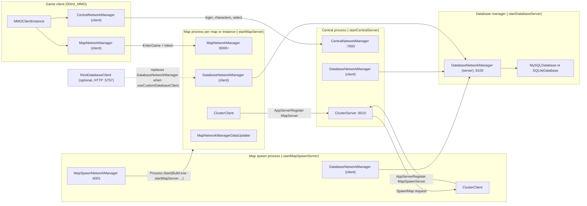
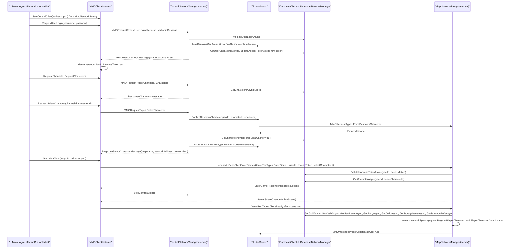
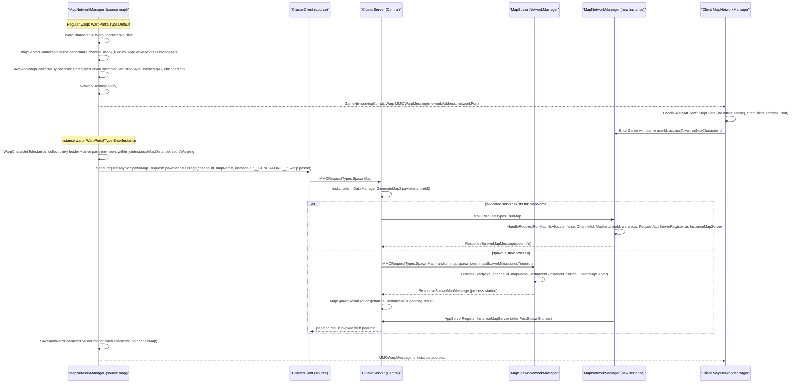

# MMO Server Architecture

## Purpose

The MMO layer (`Assets/UnityMultiplayerARPG/MMO/`) turns the single-process LAN game into a multi-process cluster: a Central server that owns accounts, character lists and the server registry, one or more Map Spawn servers that launch Map server processes, Map servers that run gameplay for one map (or one instance) each, and a Database Manager that is the only process talking to SQL. All of these are Unity components driven by one bootstrap component, `MMOServerInstance`, which reads command line arguments and `serverConfig.json` and decides which roles the current process plays. The client side is driven by `MMOClientInstance`, which talks to Central for login and character selection and then connects to the Map server that Central assigns.

## Scope

Inside this document:

- Process roles and the components that implement them: `MMOServerInstance`, `CentralNetworkManager` (+ `ClusterServer`), `MapSpawnNetworkManager`, `MapNetworkManager` (+ `ClusterClient`), `DatabaseNetworkManager` as a network peer.
- Cluster protocol: app-server registration, address broadcast, spawn map requests, user-count and social relays (`MMOMessageTypes`, `MMORequestTypes`).
- Login -> character select -> map assignment -> `EnterGame` -> spawn flow.
- Warping between map servers and instance allocation (`MMOWarpMessage`, `RequestSpawnMapMessage`).
- Channels.
- When player and building data is written during play, on disconnect, on warp and on quit (`MapNetworkManagerDataUpdater`, `PlayerCharacterDataUpdater`, `BuildingDataUpdater`).
- Server configuration: `serverConfig.json` keys, command line arguments, `MmoNetworkSetting`, `ClientConfig`, editor `startXOnAwake` flags.
- Which feature handlers `MapNetworkManager` installs versus `LanRpgNetworkManager`.

Not inside this document:

- SQL schema, `IDatabase`, cache implementations, migrations: [05_DATABASE_AND_PERSISTENCE_SYSTEM.md](05_DATABASE_AND_PERSISTENCE_SYSTEM.md).
- Password hashing, token generation and validation details, ban/mute: [06_AUTHENTICATION_AND_ACCOUNT_SYSTEM.md](06_AUTHENTICATION_AND_ACCOUNT_SYSTEM.md).
- LiteNetLibManager transport, sync fields, RPC and the generic `EnterGame`/`ClientReady` handshake: [03_NETWORKING_FOUNDATION.md](03_NETWORKING_FOUNDATION.md).
- Party/guild/friend/chat message handling bodies: [21_SOCIAL_SYSTEM.md](21_SOCIAL_SYSTEM.md), [31_CHAT_AND_COMMUNICATION_SYSTEM.md](31_CHAT_AND_COMMUNICATION_SYSTEM.md).
- Instance map gameplay rules and `MapInfo` settings: [20_INSTANCE_AND_DUNGEON_SYSTEM.md](20_INSTANCE_AND_DUNGEON_SYSTEM.md), [19_WORLD_MAP_AND_SCENE_SYSTEM.md](19_WORLD_MAP_AND_SCENE_SYSTEM.md).
- Build pipeline and headless server builds: [40_BUILD_AND_DEPLOYMENT_SYSTEM.md](40_BUILD_AND_DEPLOYMENT_SYSTEM.md).
- Guild war add-on that hangs off `BaseGameNetworkManager`: [45_GUILD_WAR_EXTENSION.md](45_GUILD_WAR_EXTENSION.md).
- `MMO/Demo2D` and `00Init_MMO_Shooter` exist, out of scope for this pass.

## High-Level Architecture

Every server role is a `LiteNetLibManager.LiteNetLibManager` subclass (a MonoBehaviour owning a `LiteNetLibServer` and/or `LiteNetLibClient`). Central additionally owns a raw `ClusterServer : LiteNetLibServer` on its own UDP port; Map Spawn and Map servers each own a `ClusterClient : LiteNetLibClient` that connects to it and registers with a `CentralServerPeerInfo`. The registry of "which map is served where" therefore lives only in memory on Central (`ClusterServer.MapServerPeersByKey`, key `{channelId}_{refId}` built by `PeerInfoExtensions.GetPeerInfoKey`).

All server roles share one `IDatabaseClient`. In the shipped prefab that is `DatabaseNetworkManager`, which is a network client when the process is Central/MapSpawn/Map and a network server when the process was started with `-startDatabaseServer`. Only the Database Manager process opens SQL connections.

Layering from asset to persistence for a player character in the MMO flavour:

1. Data assets: `BaseMapInfo` assets registered in `GameInstance.MapInfos` decide which scenes a map server can host (`MapSpawnNetworkManager.spawningMaps`, `MMOServerInstance.startingMap`).
2. Runtime entity: `MapNetworkManager.SetPlayerReadyRoutine` instantiates the `BasePlayerCharacterEntity` prefab by hash asset id and clones `PlayerCharacterData` into it.
3. Network: LiteNetLib sync fields/lists on the entity replicate to clients; cluster messages replicate social state between map servers through Central.
4. Persistence: `PlayerCharacterDataUpdater` flags dirty state, `MapNetworkManagerDataUpdater` batches it into `UpdateCharacterReq` calls on `IDatabaseClient`.

Compilation: every server-only member is wrapped in `#if (UNITY_EDITOR || UNITY_SERVER || !EXCLUDE_SERVER_CODES) && UNITY_STANDALONE`, and the `Src/` folder additionally accepts `NET || NETCOREAPP` so the same files build in the standalone .NET server projects. A client built with `EXCLUDE_SERVER_CODES` keeps only the client request methods.

## Key Components

| Component | Type | Responsibility | Location |
|---|---|---|---|
| `MMOServerInstance` | MonoBehaviour | Parses args + `serverConfig.json`, picks which servers start, wires `IDatabaseClient`, handles quit | `Assets/UnityMultiplayerARPG/MMO/Scripts/MMOGame/MMOServerInstance.cs` |
| `MMOClientInstance` | MonoBehaviour (partial) | Client entry: central connect, login/character requests, map client start, static connection events | `Assets/UnityMultiplayerARPG/MMO/Scripts/MMOGame/MMOClientInstance.cs` |
| `CentralNetworkManager` | LiteNetLibManager (partial) | Login/register/character/channel request handlers, owns `ClusterServer`, kicks duplicate logins, user count statistic | `Assets/UnityMultiplayerARPG/MMO/Scripts/MMOGame/Src/Central/` |
| `ClusterServer` | class : LiteNetLibServer | Registry of map spawn / map / instance / allocate peers, relays chat and social updates, brokers `SpawnMap` | `Assets/UnityMultiplayerARPG/MMO/Scripts/MMOGame/Src/Cluster/ClusterServer.cs` |
| `ClusterClient` | class : LiteNetLibClient | Connects an `IAppServer` to Central, registers, auto reconnects every 5 s, receives kick/remove/address messages | `Assets/UnityMultiplayerARPG/MMO/Scripts/MMOGame/Src/Cluster/ClusterClient.cs` |
| `IAppServer` | interface | Address, port, channel, ref id and `CentralServerPeerType` a peer registers with | `Assets/UnityMultiplayerARPG/MMO/Scripts/MMOGame/Src/Cluster/IAppServer.cs` |
| `MapSpawnNetworkManager` | LiteNetLibManager (partial), IAppServer | Launches map server processes with `ProcessStartInfo`, port pool, auto restart, handles `SpawnMap` | `Assets/UnityMultiplayerARPG/MMO/Scripts/MMOGame/Src/MapSpawn/MapSpawnNetworkManager.cs` |
| `MapNetworkManager` | BaseGameNetworkManager (partial), IAppServer | Gameplay server for one map/instance, token validation on `EnterGame`, warp, save/despawn, cluster relays | `Assets/UnityMultiplayerARPG/MMO/Scripts/MMOGame/Networking/Map/` |
| `DatabaseNetworkManager` | LiteNetLibManager (partial), IDatabaseClient | Database service peer; server side dispatches `DatabaseRequestTypes` to `BaseDatabase`, client side implements `IDatabaseClient` | `Assets/UnityMultiplayerARPG/MMO/Scripts/MMOGame/Src/Database/` |
| `RestDatabaseClient` | RestClient (MonoBehaviour), IDatabaseClient | HTTP alternative to `DatabaseNetworkManager` (`apiUrl`, `secretKey`) | `Assets/UnityMultiplayerARPG/MMO/Scripts/MMOGame/Src/Database/RestDatabaseClient.cs` |
| `MapNetworkManagerDataUpdater` | MonoBehaviour | Batches character/building saves on intervals | `Assets/UnityMultiplayerARPG/MMO/Scripts/MMOGame/Networking/Map/DataUpdater/MapNetworkManagerDataUpdater.cs` |
| `PlayerCharacterDataUpdater` | MonoBehaviour | Per-entity dirty flags (`TransactionUpdateCharacterState`) from entity events | `Assets/UnityMultiplayerARPG/MMO/Scripts/MMOGame/Networking/Map/DataUpdater/PlayerCharacterDataUpdater.cs` |
| `BuildingDataUpdater` | MonoBehaviour | Per-building dirty hash | `Assets/UnityMultiplayerARPG/MMO/Scripts/MMOGame/Networking/Map/DataUpdater/BuildingDataUpdater.cs` |
| `ServerConfig` / `ServerConfigData` | partial class / ScriptableObject | JSON model for `./Config/serverConfig.json`; asset with "Copy As Json" button | `Assets/UnityMultiplayerARPG/MMO/Scripts/MMOGame/Config/` |
| `ClientConfig` / `ClientConfigData` | partial class / ScriptableObject | JSON model for remote or StreamingAssets client config (only add-on fields today) | `Assets/UnityMultiplayerARPG/MMO/Scripts/MMOGame/Config/` |
| `ConfigManager` | static class | Reads/writes server config, resolves client config (remote URL, StreamingAssets, cache), parses `serverList.txt` | `Assets/UnityMultiplayerARPG/MMO/Scripts/MMOGame/Config/ConfigManager.cs` |
| `ProcessArguments` | static partial class | All `-argName` / JSON key constants | `Assets/UnityMultiplayerARPG/MMO/Scripts/MMOGame/Src/Consts/ProcessArguments.cs` |
| `MMOMessageTypes` / `MMORequestTypes` | static partial class | Cluster and central message/request ids | `Assets/UnityMultiplayerARPG/MMO/Scripts/MMOGame/Src/Consts/` |
| `MmoNetworkSetting` | ScriptableObject (BaseGameData) | Client-side central server entry (address, port, secure) | `Assets/UnityMultiplayerARPG/MMO/Scripts/MMOGame/GameData/NetworkSetting/MmoNetworkSetting.cs` |
| `LogGUI` | MonoBehaviour | Routes Unity log to `Logs/<name>` file via `LogManager` and draws an on-screen log | `Assets/UnityMultiplayerARPG/MMO/Scripts/MMOGame/Utils/LogGUI.cs` |
| `DefaultExecutionOrders` (MMO part) | partial class | `MMO_SERVER_INSTANCE -899`, `MMO_CLIENT_INSTANCE -898`, `DATABASE_NETWORK_MANAGER -898`, `CENTRAL_NETWORK_MANAGER -897`, `MAP_SPAWN_NETWORK_MANAGER -896`, `MAP_NETWORK_MANAGER -895` | `Assets/UnityMultiplayerARPG/MMO/Scripts/MMOGame/Consts/DefaultExecutionOrders_MMO.cs` |
| `MMOServerInstance.prefab` | prefab | Central + MapSpawn + Database manager + MySQL/SQLite/REST components with serialized defaults | `Assets/UnityMultiplayerARPG/MMO/Demo/Prefabs/MMOServerInstance.prefab` |
| `MMOClientInstance.prefab` | prefab | Client central manager + `networkSettings` list | `Assets/UnityMultiplayerARPG/MMO/Demo/Prefabs/MMOClientInstance.prefab` |
| `MapNetworkManager.prefab` | prefab | Map server/client manager with `LiteNetLibAssets`, `UINetworkSceneLoadingEventsSetup` | `Assets/UnityMultiplayerARPG/MMO/Demo/Prefabs/MapNetworkManager.prefab` |
| `00Init_MMO.unity` | scene | MMO bootstrap scene | `Assets/UnityMultiplayerARPG/MMO/Demo/Scenes/00Init_MMO.unity` |

## Important Classes and Interfaces

### MMOServerInstance

Purpose: single bootstrap component (singleton, `DontDestroyOnLoad`, `[RequireComponent(typeof(LogGUI))]`) that configures and starts server roles inside one Unity process.

Responsibilities:
- In `Awake()` (build only, `!Application.isEditor`): read `Environment.GetCommandLineArgs()`, `ConfigManager.ReadServerConfig()` and apply every setting to the four manager components (precedence: command line argument, then JSON key, then serialized prefab value). Write `./Config/serverConfig.json` if it did not exist and a server role was requested (`ConfigManager.WriteServerConfigIfNotExisted`).
- In editor: use `startCentralOnAwake`, `startMapSpawnOnAwake`, `startDatabaseOnAwake`, `startMapOnAwake`, `startingMap`, `databaseOptionIndex`, `disableDatabaseCaching`.
- Subscribe to `GameInstance.OnGameDataLoadedEvent`; in `OnGameDataLoaded()` set `GameInstance.LoadHomeScenePreventions[nameof(MMOServerInstance)]` (a build that starts any server never loads the home scene; in the editor only a map server prevents it) and call `StartServers()`.
- `StartServers()`: waits one frame, picks the `IDatabaseCache` (child `IDatabaseCache` component, else adds `LocalDatabaseCache`; `disableDatabaseCaching` adds `DisabledDatabaseCache`), copies `SocialSystemSetting.GuildMemberRoles` and `GuildExpTable.expTree` into `DatabaseNetworkManager` statics, then starts Database server, Central, Map Spawn (resolving `spawnMaps`/`spawnAllocateMaps` ids to `BaseMapInfo`), Map (`Assets.onlineScene = mapInfo.Scene`, `SetMapInfo`), and finally the database client for any non-database role.
- `Application_wantsToQuit`: refuses to quit until `MapNetworkManager.ProceedBeforeQuit()` and `DatabaseNetworkManager.ProceedBeforeQuit()` report `ReadyToQuit`.
- Enables `LogGUI` file logging with a name built from the roles, e.g. `Log_Map(Map001)-Ch(1)-Alloc(False)-Instance()`.

Important methods:
- `StartCentralServer()`, `StartMapSpawnServer()`, `StartMapServer()`, `StartDatabaseManagerServer()`, `StartDatabaseManagerClient()`: public, can be called by custom bootstrap code.
- `DatabaseClient` property: returns `databaseNetworkManager` or the `IDatabaseClient` found on `customDatabaseClientSource` when `useCustomDatabaseClient`.
- `ChatProfanityDetector` property: child `IChatProfanityDetector` or an added `DisabledChatProfanityDetector`.

Dependencies: `ConfigManager`, `ConfigReader`, `ProcessArguments`, `GameInstance`, the four network managers, `LogGUI`.

Used by: `MapNetworkManager.DatabaseClient`, `MMOServerUserHandlers`, `MMOServerStorageHandlers` and the other `MMOServer*Handlers` through `MMOServerInstance.Singleton`.

Extension points: not partial. Replace the database transport by placing an `IDatabaseClient` MonoBehaviour on `customDatabaseClientSource` and enabling `useCustomDatabaseClient` (the prefab already carries a disabled-by-flag `RestDatabaseClient` child). Add an `IChatProfanityDetector` component under the instance. Add an `IDatabaseCache` component under `DatabaseNetworkManager`.

### CentralNetworkManager

Purpose: the login and lobby server; the only server clients talk to before they reach a map.

Responsibilities:
- Registers client requests in `RegisterMessages()`: `MMORequestTypes.UserLogin`, `UserRegister`, `UserLogout`, `Characters`, `CreateCharacter`, `DeleteCharacter`, `SelectCharacter`, `ValidateAccessToken`, `Channels`; client message `MMOMessageTypes.Disconnect` carries a `UITextKeys` reason.
- Tracks logged-in users in `_userPeers` (by connection id) and `_userPeersByUserId` (`CentralUserPeerInfo { connectionId, userId, accessToken }`); removed in `OnPeerDisconnected`.
- Creates `ClusterServer` in `Initialize()` and starts it in `OnStartServer()`; then `DatabaseClient.DeleteAllReservedStorageAsync()` one second later.
- Every `updateUserCountInterval` (5 s) writes `ClusterServer.CountUsers()` through `DatabaseClient.UpdateUserCount` (the `statistic` table).
- Channel table: `Channels` dictionary built from the serialized `channels` list; empty list falls back to `DEFAULT_CHANNEL_ID = "default"` with `defaultChannelMaxConnections` (500).
- Account rules: `disableDefaultLogin`, `minUsernameLength`/`maxUsernameLength`, `minPasswordLength`, `requireEmail`, `requireEmailVerification`, and character name length copied from `GameInstance` on `OnGameDataLoadedEvent`.

Important methods:
- `HandleRequestUserLogin(...)`, `HandleRequestUserRegister(...)`, `HandleRequestUserLogout(...)`, `HandleRequestValidateAccessToken(...)` in `CentralNetworkManager_Login.cs` (see the authentication document).
- `HandleRequestCharacters(...)`, `HandleRequestCreateCharacter(...)`, `HandleRequestDeleteCharacter(...)`, `HandleRequestSelectCharacter(...)` in `CentralNetworkManager_Character.cs`.
- `KickClient(long connectionId, UITextKeys message)`: sends `MMOMessageTypes.Disconnect` then disconnects 500 ms later.
- `MapContainsUser(userId)`: asks every map server through `ClusterServer.MapContainsUser`.

Dependencies: `IDatabaseClient`, `ICentralServerDataManager` (default `DefaultCentralServerDataManager` created in the Unity `Awake` partial), `ClusterServer`, `NameExtensions`, `EmailExtensions`.

Used by: `MMOServerInstance`, `MMOClientInstance` (client side), `MMOServerUserHandlers.ValidateCharacterName` (reads name length limits).

Extension points: partial class; `[DevExtMethods("RegisterMessages")]`, `"RegisterClientMessages"`, `"RegisterServerMessages"`, `"OnStartServer"`, `"OnStartClient"`, `"Clean"`, `"SerializeCreateCharacterExtra"`, `"DeserializeCreateCharacterExtra"`. Swap `ICentralServerDataManager` by adding a component implementing it under the Central object (id generation, token generation, character creation validation).

### ClusterServer

Purpose: in-process registry and relay hub hosted by Central on `clusterServerPort` (6010), transport `LiteNetLibTransport("CLUSTER", 16, 16)`.

Responsibilities:
- Request handlers: `MMORequestTypes.AppServerRegister` (validates `RequestAppServerRegisterMessage.ValidateHash()`, an MD5 of `peerType + time`), `AppServerAddress`, `SpawnMap` (from a map server), `UserCount`.
- Peer tables: `MapSpawnServerPeers`, `MapServerPeers`, `MapServerPeersByKey`, `InstanceMapServerPeersByKey`, `AllocateMapServerPeersByRefId`, plus `MapSpawnResultActions` holding the pending `RequestProceedResultDelegate<ResponseSpawnMapMessage>` until the spawned instance registers.
- On `MapServer`/`InstanceMapServer` registration: `BroadcastAppServers` sends `MMOMessageTypes.AppServerAddress` both ways so every map server learns every other map server's `CentralServerPeerInfo`, and resolves any pending spawn request for that key.
- Message relays: `Chat` (to all cluster connections), `UpdateMapUser`, `UpdatePartyMember`, `UpdateParty`, `UpdateGuildMember`, `UpdateGuild` (to all other map servers), `UpdateUserCount` (stores `currentUsers`/`maxUsers` per map peer).
- Outbound control: `KickUser(userId, message)`, `PlayerCharacterRemoved(userId, characterId)`, `ConfirmDespawnCharacter(...)` (request `ForceDespawnCharacter` to every map server), `MapContainsUser(userId)` (request `FindOnlineUser`; any timeout or error is treated as "found" so the login is refused).
- `GetChannels()` builds `ChannelEntry` list with per-channel connection counts summed from map peers.

Important methods: `HandleRequestAppServerRegister`, `HandleRequestAppServerAddress` (contains a `TODO` about balancing when several map spawn servers exist; today it returns the first), `HandleRequestSpawnMap`, `RequestSpawnMap`, `CountUsers()`, `CountUsers(channelId)`, `GetAppServerRegisterHash`.

Dependencies: `CentralNetworkManager` (ports, `DataManager`, channels, `mapSpawnMillisecondsTimeout`).

Used by: `CentralNetworkManager` only.

Extension points: none formal (not partial, handlers private). Subclassing is possible but `CentralNetworkManager.Initialize()` news it up directly.

### ClusterClient

Purpose: the map spawn and map server side of the cluster link.

Responsibilities:
- Constructed with an `IAppServer`; `OnAppStart()` connects to `ClusterServerAddress:ClusterServerPort`, on connect sends `RequestAppServerRegister` with `peerType`, `networkAddress = AppAddress` (the `publicAddress` field), `networkPort = AppPort`, `channelId`, `refId`.
- `IsAppRegistered` set on success; on disconnect it logs a countdown and reconnects after five one-second delays.
- Message handlers: `AppServerAddress` -> `onResponseAppServerAddress`, `KickUser` -> `onKickUser`, `PlayerCharacterRemoved` -> `onPlayerCharacterRemoved`.
- The `MapSpawnNetworkManager` constructor overload registers `SpawnMap` request handling.

Important methods: `RequestAppServerRegister`, `RequestAppServerAddress`, `SendRequestAsync` (inherited, used by `MapNetworkManager` for `SpawnMap`).

Dependencies: `IAppServer`, `MMORequestTypes`, `MMOMessageTypes`.

Used by: `MapSpawnNetworkManager`, `MapNetworkManager`.

Extension points: public delegates `onResponseAppServerRegister`, `onResponseAppServerAddress`, `onResponseUserCount`, `onKickUser`, `onPlayerCharacterRemoved`; additional `RegisterRequestHandler`/`RegisterMessageHandler` calls from the owner (as `MapNetworkManager.Start()` does).

### MapSpawnNetworkManager

Purpose: process launcher registered with Central as `CentralServerPeerType.MapSpawnServer`.

Responsibilities:
- `Initialize()`: forces `useWebSocket = false`, `maxConnections = int.MaxValue`, default channel list `["default"]` if empty, creates `ClusterClient`.
- `OnStartServer()`: `ClusterClient.OnAppStart()`, port counter starts at `startPort` (8000).
- `OnResponseAppServerRegister`: if `spawningMaps` is empty it spawns every `GameInstance.MapInfos` entry; each map is spawned once per `spawningChannelIds`, then `spawningAllocateMaps` are pre-started `allocateAmount` times under `ALLOCATE_CHANNEL_ID = "__ALLOC__"`.
- `SpawnMap(...)`: dequeues a free port or increments the counter, builds `ProcessStartInfo(ExePath)` with `batchModeArguments` ("-batchmode -nographics" unless `NotSpawnInBatchMode`) plus `-channelId`, `-mapName`, optionally `-allocate`, `-instanceId`, `-instancePositionX/Y/Z`, `-instanceOverrideRotation`, `-instanceRotationX/Y/Z`, then `-centralAddress`, `-centralPort`, `-publicAddress`, `-mapPort`, `-startMapServer`. Runs `Process.Start` on a background thread, tracks the pid in `_processes`, answers the pending `ResponseSpawnMapMessage` from the main thread, and on process exit frees the port and (when `autoRestart`) re-enqueues the map in `_restartingScenes`, which `Update()` drains once registered.
- `ExePath`: `overrideExePath` when `Application.isEditor && isOverrideExePath`, else `spawnExePath`, else the current executable.
- `Clean()`: kills every tracked child process.

Important methods: `HandleRequestSpawnMap(...)` (rejects when not registered or `mapName` empty), `SpawnMaps`, `SpawnAllocateMaps`, `FreePort`.

Dependencies: `ClusterClient`, `GameInstance.MapInfos`, `ProcessArguments`.

Used by: `MMOServerInstance`.

Extension points: partial class; `[DevExtMethods("OnStartServer")]`, `"OnStartClient"`, `"Clean"`.

### MapNetworkManager

Purpose: `BaseGameNetworkManager` specialisation for one map process; the only place gameplay meets the database.

Responsibilities:
- Identity as `IAppServer`: `PeerType` is `AllocateMapServer` when `IsAllocate`, `InstanceMapServer` when `MapInstanceId` is set, else `MapServer`; `RefId` is the instance id or `CurrentMapInfo.Id`; `ChannelId` comes from `BaseGameNetworkManager.ChannelId` (set from `-channelId`).
- `Awake()`: `PrepareMapHandlers()` (see Networking and Authority) and adds `MapNetworkManagerDataUpdater`.
- `Start()`: creates `ClusterClient`, registers handlers `ForceDespawnCharacter`, `RunMap`, `FindOnlineUser`, `Chat`, `UpdateMapUser`, `UpdatePartyMember`, `UpdateParty`, `UpdateGuildMember`, `UpdateGuild`.
- `PreSpawnEntities()`: loads buildings for `{ChannelId, CurrentMapInfo.Id}` from the database (retrying until success), reconciles in-scene `BuildingEntity` objects, loads building storages; skipped for instance maps and allocate servers.
- `PostSpawnEntities()`: `ClusterClient.OnAppStart()`, so the map is only advertised to Central after the scene finished spawning.
- `Update()`: `ClusterClient.Update()`; returns early while `IsAllocate`; `DataUpdater.ProceedSaving()`; instance maps `Application.Quit()` after `TERMINATE_INSTANCE_DELAY` (30 s) without players; `UpdateUserCount` every 5 s; reloads cached parties every 6 min and guilds every 3 min (`PARTY_CACHE_EXPIRING`, `GUILD_CACHE_EXPIRING`).
- `SerializeEnterGameData`/`DeserializeEnterGameData`, `DeserializeClientReadyData`, `SetPlayerReadyRoutine`, `LoadPlayerCharacterEntityRelatesData`: the spawn path (see Data Flow).
- `RegisterPlayerCharacter`/`UnregisterPlayerCharacter`/`UpdateOnlineCharacter`: mirror the local `SocialCharacterData` to Central with `UpdateUserCharacterMessage.UpdateType.Add/Remove/Online`.
- `HandleChatAtServer`: profanity detector, mute and flood checks, GM command routing, local channel handled locally, other channels forwarded to Central.
- Warp (`MapNetworkManager_PlayerActivity.cs`), save/despawn (`MapNetworkManager_PlayerDespawning.cs`), database helpers (`MapNetworkManager_DatabaseFunction.cs`).
- `HandleEnterGameResponse` (client): on success calls `MMOClientInstance.Singleton.StopCentralClient()`.
- `OnClientDisconnected` (client): clears `GameInstance.UserId` and `AccessToken`.

Important methods: `WarpCharacter(...)`, `WarpCharacterToInstance(...)`, `SaveAndDespawnPlayerCharacter(connectionId, despawnImmediately)`, `SaveAndDespawnPendingPlayerCharacter(userId)`, `SaveCharacter(...)`, `WaitAndSaveCharacter(...)`, `SaveBuilding(...)`, `LoadStorageRoutine`, `LoadPartyRoutine`, `LoadGuildRoutine`, `CreateBuildingEntity`, `DestroyBuildingEntity`, `ProceedBeforeQuit()`, `KickUser(userId, message)`, `HandleRequestForceDespawnCharacter`, `HandleRequestRunMap`, `HandleFindOnlineUser`.

Dependencies: `MMOServerInstance.Singleton` (`DatabaseClient`, `ChatProfanityDetector`), `ClusterClient`, `GameInstance`, `BaseGameNetworkManager` handler interfaces.

Used by: `MMOServerInstance`, `MMOClientInstance`, every `MMOServer*Handlers`, `GuildWar` partial through `BaseGameNetworkManager`.

Extension points: partial class; all `BaseGameNetworkManager` dev-ext hooks (`"OnStartServer"`, `"OnStopServer"`, `"OnStartClient"`, `"OnClientConnected"`, `"OnPeerConnected"`, `"OnPeerDisconnected"`, `"OnServerOnlineSceneLoaded"`, `"OnClientOnlineSceneLoaded"`, `"UpdateServerReadyToInstantiateObjectsStates"`, `"UpdateClientReadyToInstantiateObjectsStates"`, `"RegisterMessages"`, `"Clean"`, `"WriteMapInfoExtra"`, `"ReadMapInfoExtra"`, `"HandleEnterGameResponse"`, `"HandleClientReadyResponse"`); `BaseGameNetworkManagerComponent` children (`ManagerComponents`); virtual `LoadPlayerCharacterEntityRelatesData`; the `IServer*Handlers` components are swappable because `PrepareMapHandlers` uses `GetOrAddComponent<TInterface, TDefault>` (an existing component implementing the interface wins).

### MMOClientInstance

Purpose: client-side facade over `CentralNetworkManager` (client mode) and `MapNetworkManager` (client mode).

Responsibilities:
- `StartCentralClient(address, port)`, `StopCentralClient()`, `StartMapClient(mapInfo, address, port)` (sets `MapNetworkManager.Assets.onlineScene`/`addressableOnlineScene` before `StartClient`), `StopMapClient()`.
- Request wrappers: `RequestUserLogin`, `RequestUserRegister`, `RequestUserLogout`, `RequestValidateAccessToken`, `RequestChannels`, `RequestCharacters`, `RequestCreateCharacter`, `RequestDeleteCharacter`, `RequestSelectCharacter` (uses `SelectedChannelId`). The login/validate/select callbacks write `GameInstance.UserId`, `GameInstance.AccessToken`, `GameInstance.SelectedCharacterId`.
- Static events `OnCentralClientConnectedEvent`, `OnCentralClientDisconnectedEvent`, `OnCentralClientStoppedEvent`, `OnMapClientConnectedEvent`, `OnMapClientDisconnectedEvent`, `OnMapClientStoppedEvent` (map events are bridged from `ClientGenericActions`).
- `OnMapStopped()`: restarts the central client (reusing the last address stored on `CentralNetworkManager.networkAddress/networkPort` by `LiteNetLibManager.StartClient(address, port)`) so the home scene can validate the token again.
- `ClearClientData()` on central disconnect.

Dependencies: `CentralNetworkManager`, `MapNetworkManager`, `MmoNetworkSetting[] networkSettings`, `GameInstance`.

Used by: `UIMmoLogin`, `UIMmoRegister`, `UIMmoServerList`, `UIMmoChannelList`, `UIMmoCharacterList`, `UIMmoCharacterCreate`, `UIMmoSceneHome`, `UIMmoCentralAckLoading`, `MapNetworkManager.HandleEnterGameResponse`.

Extension points: partial class; `UseWebSocket`/`WebSocketSecure` setters; static events.

### ICentralServerDataManager

Purpose: strategy object for ids, tokens and character creation rules on Central.

Responsibilities: `GenerateCharacterId()`, `GenerateMapSpawnInstanceId()`, `CanCreateCharacter(ref dataId, ref entityId, ref factionId, ...)`, `SetNewPlayerCharacterData(...)`, `GenerateAccessToken(userId)`, `GetUserIdFromAccessToken(accessToken)`.

Important methods: `DefaultCentralServerDataManager` uses `GenericUtils.GetUniqueId()` for ids, validates `dataId` against `GameInstance.PlayerCharacters` and `entityId` against the entity dictionaries, picks a random unlocked faction if the client's choice is invalid, and produces the token as base64 of `"{userId}_{DateTime.Now.ToLongDateString()}"`.

Dependencies: `GameInstance` static dictionaries.

Used by: `CentralNetworkManager`, `ClusterServer.HandleRequestSpawnMap`.

Extension points: implement the interface on a MonoBehaviour under the Central object; `DefaultCentralServerDataManager` is partial.

## Data Flow

### Login, character selection, map assignment, map entry

Details worth knowing:

- `HandleRequestSelectCharacter` resolves an empty `channelId` to `Channels.Keys.First()`, rejects unknown channels (`UI_ERROR_INVALID_CHANNEL_ID`), rejects when `ConfirmDespawnCharacter` did not succeed on every map server (`UI_ERROR_ALREADY_LOGGED_IN`), checks channel capacity, and returns `UI_ERROR_MAP_SERVER_NOT_READY` if no map server registered for `{channelId}_{character.CurrentMapName}`. A character whose `currentMapName` points at a map no map server hosts can never enter the world.
- `MapNetworkManager.DeserializeEnterGameData` rejects `IsAllocate` servers (`UI_ERROR_APP_NOT_READY`), wrong `packetVersion`, invalid token, a user id or character already registered on this server. If the user's previous entity is still in the despawn grace period (`_despawningPlayerCharacterCancellations`) the same entity is reused and ownership is switched with `SetOwnerClient(connectionId)` instead of re-loading from the database.
- `SetPlayerReadyRoutine` kicks the connection (`UI_ERROR_KICKED_FROM_SERVER`) if any related-data load fails, if the client left before the load completed, or if `_socialCharactersByUserId` already contains the user (nested login guard). It sets `Identity.DoNotDestroyWhenDisconnect = true` so the entity survives the socket closing.
- The client keeps `GameInstance.UserId`/`AccessToken` in memory only; on returning to the home scene `UIMmoSceneHome.OnCentralServerConnected` calls `RequestValidateAccessToken` to resume the session without re-entering the password.

### Warping between map servers and instances

Notes:

- `WarpCharacter` with an empty `mapName`, or the current map name on a non-instance server, is a same-server teleport (`Teleport` + `WaitClientTeleportConfirm`).
- `WarpCharacterRoutine` silently returns if the target key is unknown or the map info has no valid scene; the player sees nothing. The key uses the source server's `ChannelId`, so cross-channel warps are not possible.
- For instance warps `SaveAndWarpCharacterByPeerInfo` is called with `changeMap = false`, so `characters.currentMapName` keeps the source map; the instance server places the character at `MapInstanceWarpToPosition` (`-instancePositionX/Y/Z` arguments) in `SetPlayerReadyRoutine`.
- `HandleRequestForceDespawnCharacter` despawns only when the request's channel differs from this server's channel, this server is an instance, or the despawning entity is a different character of the same user; otherwise the grace-period entity is kept for reuse.
- Instance servers spawned on demand are started with `autoRestart = false`; pre-allocated ones (`spawningAllocateMaps`) are started with `autoRestart = true` and are re-spawned by the map spawn server when the process exits.

### Cluster messages and requests

| Constant | Direction | Payload | Purpose |
|---|---|---|---|
| `MMORequestTypes.AppServerRegister` (0) | app server -> ClusterServer | `RequestAppServerRegisterMessage { CentralServerPeerInfo, time, hash }` | register as MapSpawn/Map/InstanceMap/AllocateMap |
| `MMORequestTypes.AppServerAddress` (1) | app server -> ClusterServer | `RequestAppServerAddressMessage { peerType, channelId, refId }` | look up a peer |
| `MMORequestTypes.SpawnMap` (9) | map -> Central, Central -> map spawn | `RequestSpawnMapMessage` / `ResponseSpawnMapMessage { message, peerInfo }` | instance creation |
| `MMORequestTypes.RunMap` (14) | Central -> allocated map | same structs | activate a pre-allocated map |
| `MMORequestTypes.ForceDespawnCharacter` (13) | Central -> map | `RequestForceDespawnCharacterMessage` | character select / duplicate login |
| `MMORequestTypes.FindOnlineUser` (15) | Central -> map | `RequestFindOnlineUserMessage` / `ResponseFindOnlineUserMessage { isFound }` | duplicate login check |
| `MMORequestTypes.UserCount` (11) | any -> Central | `ResponseUserCountMessage` | total online users |
| `MMOMessageTypes.AppServerAddress` (3) | Central -> map | `ResponseAppServerAddressMessage` | peer table broadcast |
| `MMOMessageTypes.Chat` (4) | map <-> Central | `ChatMessage` | non-local chat and GM commands |
| `MMOMessageTypes.UpdateMapUser` (5) | map <-> Central | `UpdateUserCharacterMessage { Add, Remove, Online }` | online character mirror |
| `MMOMessageTypes.UpdatePartyMember` (6), `UpdateParty` (7), `UpdateGuildMember` (8), `UpdateGuild` (9) | map -> Central -> other maps | `UpdateSocialMemberMessage`, `UpdatePartyMessage`, `UpdateGuildMessage` | social sync |
| `MMOMessageTypes.KickUser` (10), `PlayerCharacterRemoved` (11) | Central -> map | userId (+ characterId) | force logout, deleted character |
| `MMOMessageTypes.Disconnect` (12) | Central -> client | `UITextKeys` | kick reason |
| `MMOMessageTypes.UpdateUserCount` (13) | map -> Central | `UpdateUserCountMessage { currentUsers, maxUsers }` | channel occupancy |

`MMOMessageTypes.Request` (1) and `Response` (2) are the LiteNetLib request/response envelope ids enabled with `EnableRequestResponse` on every MMO manager.

## Runtime Behaviour

### Process start (build)

1. `GameInstance.Awake` (execution order `int.MinValue`) then `MMOServerInstance.Awake` (`-899`): args and config applied as described above, `LogGUI` enabled.
2. `GameInstance.Start` loads game data asynchronously; `OnGameDataLoadedEvent` fires -> `MMOServerInstance.OnGameDataLoaded` -> `StartServers()` next frame.
3. Database server: `DatabaseNetworkManager.OnStartServer` -> `Database.Initialize()` (reads `./Config/mySqlConfig.json` or `sqliteConfig.json`, writes it if missing) then `Database.DoMigration()`.
4. Central: `CentralNetworkManager.OnStartServer` -> `ClusterServer.StartServer()` -> `DeleteAllReservedStorageAsync`.
5. Map spawn: connects to Central, registers, spawns configured maps 100 ms apart.
6. Map: `StartServer()` loads `Assets.onlineScene` (the map scene); `OnServerOnlineSceneLoaded` -> `SpawnEntities()` -> `PreSpawnEntities` (buildings from DB) -> warp portals, spawn areas, etc. -> `PostSpawnEntities` -> cluster registration. Only after registration can Central hand the map address to clients.
7. Central/MapSpawn/Map processes call `StartDatabaseManagerClient()` so `DatabaseNetworkManager` connects to `databaseManagerAddress:databaseManagerPort` (prefab: `127.0.0.1:6100`).

Serialized defaults in `Assets/UnityMultiplayerARPG/MMO/Demo/Prefabs/MMOServerInstance.prefab`: Central `localhost:7000`, `maxConnections 1100`, `clusterServerPort 6010`, channels `1` "Channel 1" (200) and `2` "Channel 2" (0 -> 500), `minUsernameLength 2`, `maxUsernameLength 24`, `minPasswordLength 2`, `requireEmail 0`, `requireEmailVerification 0`, `updateUserCountInterval 5`; MapSpawn `localhost:6001`, `clusterServerAddress 127.0.0.1`, `publicAddress 127.0.0.1`, `spawnExePath ./Build.exe`, `startPort 8000`, `batchModeArguments -batchmode -nographics`, `spawningChannelIds [1, 2]`, `spawningMaps [Map001, Map002, Map_GuildWar]`, `spawningAllocateMaps [Map001 x0, Map002 x0]`, `isOverrideExePath 1`, `overrideExePath C:\Users\Ittipon\Desktop\UnityBuilds\MMORPG_KIT\UnityMultiplayerARPG.exe`, `editorNotSpawnInBatchMode 1`; Database manager `127.0.0.1:6100`, `database = MySQLDatabase`, `databaseOptions = [SQLiteDatabase, MySQLDatabase]`; MySQL `127.0.0.1:3306 root/password mmorpg_kit`; SQLite `./mmorpgtemplate.sqlite3`, `editorDbPath C:\Users\ITTIPON\Desktop\UnityBuilds\MultiplayerARPG\mmorpgtemplate.sqlite3`; REST `http://localhost:5757/api/`, secret `secret`; `useCustomDatabaseClient 0`, `startXOnAwake 0`, `startingMap Map001`, `databaseOptionIndex 0`.

`Assets/UnityMultiplayerARPG/MMO/Demo/Prefabs/MapNetworkManager.prefab`: `localhost:7770`, `maxConnections 1100`, `LiteNetLibAssets.offlineScene 01Home_MMO`, `loadOfflineSceneWhenClientStopped 1`, `clusterServerAddress 127.0.0.1:6010`, `publicAddress 127.0.0.1`, `playerCharacterDespawnMillisecondsDelay 5000`, guild war fields (see the guild war document), and a `UINetworkSceneLoadingEventsSetup` component.

`Assets/UnityMultiplayerARPG/MMO/Demo/Prefabs/MMOClientInstance.prefab`: child `CentralNetworkManager` `localhost:6000`, `maxConnections 4`; `networkSettings = [Local.asset]` where `Assets/UnityMultiplayerARPG/MMO/Demo/GameData/MmoNetworkSettings/Local.asset` is "Local Server" `127.0.0.1:7000`. The `6000` default is only used if `StartCentralClient()` is called before any address was chosen; the server list UI always passes the asset's `7000`.

`Assets/UnityMultiplayerARPG/MMO/Demo/Scenes/00Init_MMO.unity` instantiates `MMOServerInstance.prefab`, `MMOClientInstance.prefab`, `MapNetworkManager.prefab`, `GameInstance.prefab` (the MMO variant at `Assets/UnityMultiplayerARPG/MMO/Demo/Prefabs/GameInstance.prefab`, `homeScene = 01Home_MMO`) and `UI/CanvasLoading_MMO.prefab`, plus a light and camera. The scene overrides only transforms; `gameDatabase` therefore stays the prefab value `Assets/UnityMultiplayerARPG/Demo/GameData/GameDatabase.asset` (the kit demo database), not the project's `Assets/1. Data/GameDatabase_G.asset`.

### Editor

`Application.isEditor` skips argument parsing: `databaseNetworkManager.SetDatabaseByOptionIndex(databaseOptionIndex)` (prefab `0` selects `SQLiteDatabase`, which uses `editorDbPath` inside the editor), then the four `startXOnAwake` flags. With `startMapOnAwake` the home scene is not loaded and `startingMap.Scene` becomes `Assets.onlineScene`. `MapSpawnNetworkManager` in the editor uses `overrideExePath` (must point at a built server executable) and `editorNotSpawnInBatchMode`. Typical single-editor test: enable all four flags, run, then press Play in a second editor/build as client, or run a client build against `127.0.0.1:7000`.

### Map server update loop and shutdown

- Instance maps: `Application.Quit()` 30 s after the last player leaves. Allocate maps skip saving and refuse `EnterGame` until `RunMap` activates them.
- Party/guild caches are refreshed by `LoadPartyRoutine`/`LoadGuildRoutine` on a timer; `MapNetworkManager.HandleUpdateParty/Guild*` apply cluster relays immediately.
- Quit: `Application_wantsToQuit` -> `ProceedBeforeQuit()` writes `UpdateCharacterReq { State = All, DeleteStorageReservation = true }` for every online character and `UpdateBuildingReq` for every building, then quits. The database manager waits a fixed 30 s before allowing quit so in-flight requests can finish.
- `Clean()` (on stop) clears every concurrent dictionary and the data updater.

### Logging

`LogGUI.SetupLogger(fileName)` installs `LogManager.LoggerManager = new LoggerManager(new DefaultLoggerFactory($"Logs/{fileName}"))`, so each role writes to `Logs/Log_<roles>` relative to the working directory; the on-screen list is compiled out of `UNITY_SERVER` builds unless `DEVELOPMENT_BUILD`.

## Networking and Authority

- Everything gameplay related is server authoritative on the map server; Central never touches entities. Clients send only requests (`ClientSendRequest`) and receive responses/messages.
- Central <-> client: request/response over `MMORequestTypes` (login, characters, select, channels, validate token, logout) and the `MMOMessageTypes.Disconnect` kick message. Transport is `LiteNetLibTransport` UDP, or WebSocket when `useWebSocket` (`webSocketSecure`, `webSocketCertPath`, `webSocketCertPassword` are copied from `MMOServerInstance` to Central and Map in `StartCentralServer`/`StartMapServer`; Map Spawn and Database force UDP).
- Map <-> client: the generic `GameReqTypes.EnterGame`/`ClientReady` handshake from `LiteNetLibGameManager` with `MapNetworkManager.SerializeEnterGameData` (userId, accessToken, selectedCharacterId), `GameNetworkingConsts.Warp` carrying `MMOWarpMessage`, `GameNetworkingConsts.Chat`, `GameNetworkingConsts.SafeDisconnect` (client asks for immediate save and despawn), plus every request registered by `BaseGameNetworkManager_FeatureHandlers.cs` (inventory, party, guild, storage, mail, cash shop, bank, gacha, friend, user content).
- Map <-> Central: the cluster table above; nothing from the cluster port is reachable by clients, but the cluster port has no authentication beyond the MD5 `hash` of `peerType + time` (`ClusterServer.GetAppServerRegisterHash`), so it must be firewalled.
- Servers <-> database manager: `DatabaseRequestTypes` request/response wrapped in `DbRequestMessage<T> { RequestTimeUtc, Data }`; unauthenticated, same firewall requirement.
- Handler swap table (`MapNetworkManager_FeatureHandlers.cs` versus `LanRpgNetworkManager_FeatureHandlers.cs`):

| Interface | MapNetworkManager | LanRpgNetworkManager |
|---|---|---|
| `IServerMailHandlers` | `MMOServerMailHandlers` | not assigned |
| `IServerUserHandlers` | `MMOServerUserHandlers` | `DefaultServerUserHandlers` |
| `IServerStorageHandlers` | `MMOServerStorageHandlers` | `LanRpgServerStorageHandlers` |
| `IServerGuildHandlers` | `MMOServerGuildHandlers` | `DefaultServerGuildHandlers` |
| `IServerUserContentHandlers` | `MMOServerUserContentHandlers` | not assigned |
| `IServerCashShopMessageHandlers` | `MMOServerCashShopMessageHandlers` | `LanRpgServerCashShopMessageHandlers` |
| `IServerMailMessageHandlers` | `MMOServerMailMessageHandlers` | not assigned |
| `IServerStorageMessageHandlers` | `MMOServerStorageMessageHandlers` | `LanRpgServerStorageMessageHandlers` |
| `IServerPartyMessageHandlers` | `MMOServerPartyMessageHandlers` | `LanRpgServerPartyMessageHandlers` |
| `IServerGuildMessageHandlers` | `MMOServerGuildMessageHandlers` | `LanRpgServerGuildMessageHandlers` |
| `IServerGachaMessageHandlers` | `MMOServerGachaMessageHandlers` | `LanRpgServerGachaMessageHandlers` |
| `IServerFriendMessageHandlers` | `MMOServerFriendMessageHandlers` | not assigned |
| `IServerBankMessageHandlers` | `MMOServerBankMessageHandlers` | `LanRpgServerBankMessageHandlers` |
| `IServerUserContentMessageHandlers` | `MMOServerUserContentMessageHandlers` | `LanRpgServerUserContentMessageHandlers` |
| `IServerBuildingHandlers`, `IServerCharacterHandlers`, `IServerGameMessageHandlers`, `IServerPartyHandlers`, `IServerChatHandlers`, `IServerLogHandlers`, `IServerCharacterMessageHandlers`, `IServerInventoryMessageHandlers` | `Default*` | `Default*` |
| all `IClient*Handlers` | `DefaultClient*` | `DefaultClient*` |

`BaseGameNetworkManager.RegisterMessages` only registers request handlers for interfaces that are non-null, which is why LAN has no mail or friend requests. The MMO implementations live in `Assets/UnityMultiplayerARPG/MMO/Scripts/MMOGame/Networking/Map/MMOServer*.cs` and differ from the defaults by going through `IDatabaseClient` and, for party/guild, by publishing `UpdateParty*`/`UpdateGuild*` to the cluster.

## Persistence

During play on a map server:

- `PlayerCharacterDataUpdater` (added in `SetPlayerReadyRoutine`) subscribes to `onAttributesOperation`, `onSkillsOperation`, `onSkillUsagesOperation`, `onBuffsOperation`, `onEquipItemsOperation`, `onNonEquipItemsOperation`, `onSelectableWeaponSetsOperation`, `onSummonsOperation`, `onHotkeysOperation`, `onQuestsOperation`, `onCurrenciesOperation`, the nine custom-data list events, `onMountChange`, and the PK events (`onIsPkOnChange`, `onPkPointChange`, `onConsecutivePkKillsChange` unless `DISABLE_CLASSIC_PK`), OR-ing the matching `TransactionUpdateCharacterState` flag. Scalar fields (level, exp, hp, mp, gold, party id, map name, respawn map name, icon/frame/title ids, reputation, unmute time and so on) are detected by comparing `GetCombinedHashCode()`, and position/respawn position by a `POSITION_CHANGE_THRESHOLD` of 0.5 units.
- `MapNetworkManagerDataUpdater.ProceedSaving()` runs every `Update`: every `playerCharacterSaveInterval` (1 s) it asks each updater to enqueue its flags with a `PlayerCharacterData` clone; every `playerCharacterSaveProceedInterval` (10 s) it awaits `MapNetworkManager.SaveCharacter(state, data)` for every queued character, which sends `UpdateCharacterReq { State, CharacterData, SummonBuffs, DeleteStorageReservation }`. Buildings use `buildingSaveInterval` 5 s and `buildingSaveProceedInterval` 10 s with `TransactionUpdateBuildingState.Building`. A character or building already being saved (`savingCharacters`, `savingBuildings`) is skipped and retried on the next tick.
- Immediate saves: warp (`WaitAndSaveCharacter(All, ..., changeMap)`), disconnect (`SaveAndDespawnPlayerCharacter`: `All` right away, then `All` again after the 5 s grace period before `NetworkDestroy`), `SafeDisconnect` request, `ForceDespawnCharacter`, `PlayerCharacterRemoved`, `KickUser`, `ProceedBeforeQuit`. Buildings are created (`CreateBuildingReq`) when placed and deleted (`DeleteBuildingReq`) when destroyed; in-scene buildings without a database row are inserted on map start.
- Storage: `LoadStorageRoutine` on player entry and building load; saves through `MMOServerStorageHandlers` and `SaveStorage`/`WaitAndSaveStorage` (`UpdateStorageItemsReq`, with `DeleteStorageReservation` when the character leaves).
- Central: user rows (`accessToken`, `unbanTime`, gold/cash reads), `characters` rows for create/delete/list, `statistic.userCount`.
- Nothing about the cluster registry, channels or spawn processes is persisted; a Central restart forgets every registered map server until each `ClusterClient` reconnects (5 s loop) and re-registers.
- `serverConfig.json`, `mySqlConfig.json`, `sqliteConfig.json` are written to `./Config/` on first run when missing.

Which SQL tables each `IDatabaseClient` call touches is documented in [05_DATABASE_AND_PERSISTENCE_SYSTEM.md](05_DATABASE_AND_PERSISTENCE_SYSTEM.md).

## Dependencies

Depends on:
- [03_NETWORKING_FOUNDATION.md](03_NETWORKING_FOUNDATION.md) (LiteNetLibManager, `BaseGameNetworkManager`, `EnterGame`/`ClientReady`, request/response, feature handler interfaces)
- [01_CORE_ARCHITECTURE.md](01_CORE_ARCHITECTURE.md) (`GameInstance` lifecycle, `OnGameDataLoadedEvent`, `LoadHomeScenePreventions`, static handler references)
- [02_GAME_DATA_AND_SCRIPTABLE_OBJECTS.md](02_GAME_DATA_AND_SCRIPTABLE_OBJECTS.md) (`BaseMapInfo`, `GameInstance.MapInfos`, `MmoNetworkSetting` as `BaseGameData`)
- [05_DATABASE_AND_PERSISTENCE_SYSTEM.md](05_DATABASE_AND_PERSISTENCE_SYSTEM.md) (`IDatabaseClient`, `DatabaseNetworkManager`, cache)
- [06_AUTHENTICATION_AND_ACCOUNT_SYSTEM.md](06_AUTHENTICATION_AND_ACCOUNT_SYSTEM.md) (token semantics)
- [08_CHARACTER_SYSTEM.md](08_CHARACTER_SYSTEM.md) (`PlayerCharacterData`, entity spawn, `CloneTo`)
- [39_DEV_EXTENSION_SYSTEM.md](39_DEV_EXTENSION_SYSTEM.md) (`InvokeInstanceDevExtMethods`)

Depended on by:
- [20_INSTANCE_AND_DUNGEON_SYSTEM.md](20_INSTANCE_AND_DUNGEON_SYSTEM.md), [19_WORLD_MAP_AND_SCENE_SYSTEM.md](19_WORLD_MAP_AND_SCENE_SYSTEM.md) (warp and spawn allocation)
- [21_SOCIAL_SYSTEM.md](21_SOCIAL_SYSTEM.md), [31_CHAT_AND_COMMUNICATION_SYSTEM.md](31_CHAT_AND_COMMUNICATION_SYSTEM.md) (cluster relays)
- [24_BUILDING_SYSTEM.md](24_BUILDING_SYSTEM.md), [32_ECONOMY_CURRENCY_TRADE_AND_STORAGE.md](32_ECONOMY_CURRENCY_TRADE_AND_STORAGE.md), [33_CASH_SHOP_AND_IAP_SYSTEM.md](33_CASH_SHOP_AND_IAP_SYSTEM.md) (MMO handlers)
- [43_GM_COMMANDS_AND_ADMIN_TOOLS.md](43_GM_COMMANDS_AND_ADMIN_TOOLS.md) (`LogGUI`, user count, kick)
- [40_BUILD_AND_DEPLOYMENT_SYSTEM.md](40_BUILD_AND_DEPLOYMENT_SYSTEM.md), [45_GUILD_WAR_EXTENSION.md](45_GUILD_WAR_EXTENSION.md), [35_ADDRESSABLES_AND_CONTENT_LOADING.md](35_ADDRESSABLES_AND_CONTENT_LOADING.md) (`MMOAddressableAssetDownloadManagerSettings`)

## Extension and Customization Points

- Configure without code: create a `ServerConfigData` asset (menu "Create Server Config Data"), fill `config`, press "Copy As Json" and save it as `./Config/serverConfig.json` next to the server executable. Any key can also be overridden per process with the matching `-key value` argument.
- Add a server-side message or request: a partial `MapNetworkManager` (or `CentralNetworkManager`) file with `[DevExtMethods("RegisterMessages")]` calling `RegisterRequestToServer`/`RegisterServerMessage`; `Assets/UnityMultiplayerARPG/GuildWar/Scripts/Networking/BaseGameNetworkManager_GuildWar.cs` is the in-repo example (it also hooks `"OnStartServer"`, `"OnStartClient"`, `"OnPeerConnected"`, `"OnServerOnlineSceneLoaded"`, `"Clean"`).
- Replace a feature handler: add a component implementing the interface (for example a subclass of `MMOServerStorageHandlers`) to the `MapNetworkManager` prefab; `GetOrAddComponent<TInterface, TDefault>` keeps the existing one.
- Custom token or id generation: implement `ICentralServerDataManager` on a component under the Central object.
- Custom database transport: implement `IDatabaseClient` on a component, assign it to `MMOServerInstance.customDatabaseClientSource`, set `useCustomDatabaseClient` (or `-useCustomDatabaseClient`). The kit's `RestDatabaseClient` is the reference implementation.
- Chat filtering: implement `IChatProfanityDetector` (returns `ProfanityDetectResult { message, shouldMutePlayer, shouldKickPlayer, muteMinutes }`) under `MMOServerInstance`.
- Name rules: assign `NameExtensions.overrideUsernameValidating`, `overrideCharacterNameValidating`, `overrideGuildNameValidating` from a `[DevExtMethods("Init")]` on `GameExtensionInstance`.
- Per-map server hooks: subclass `BaseGameNetworkManagerComponent` and place it under the manager (`ManagerComponents`), which receives `OnServerOnlineSceneLoaded`, `UpdateServerReadyToInstantiateObjectsStates`, `SendClientEnterGame`, `HandleEnterGameResponse` and friends.
- Client server list: add `MmoNetworkSetting` assets (menu `GameDataMenuConsts.MMO_NETWORK_SETTING_MENU`) to `MMOClientInstance.networkSettings`, or ship `StreamingAssets/serverList.txt` with lines `Title,ip:port[,secure]` which `ConfigManager.ReadServerList()` turns into runtime settings that replace the serialized list in `UIMmoServerList`.
- Remote client config: pass `-clientConfigUrl <url>` or set env `clientConfigUrl`; `ConfigManager.ReadClientConfig` picks dev/staging/prod URLs by `Application.version` containing "develop"/"staging", falls back to `StreamingAssets/editorClientConfig.json`, `StreamingAssets/clientConfig.json`, then `persistentDataPath/cachedClientConfig.json`, then the `ProdClientConfig`/`DevClientConfig`/`StagingClientConfig` assets.

### serverConfig.json keys (`ServerConfig.cs` + `ServerConfig_GuildWar.cs`)

| Key | Type | Applied to |
|---|---|---|
| `centralAddress` | string | `MapNetworkManager.clusterServerAddress`, `MapSpawnNetworkManager.clusterServerAddress` |
| `centralPort` | int | `CentralNetworkManager.networkPort` |
| `centralMaxConnections` | int | `CentralNetworkManager.maxConnections` |
| `mapSpawnMillisecondsTimeout` | int | `CentralNetworkManager.mapSpawnMillisecondsTimeout` |
| `defaultChannelMaxConnections` | int | `CentralNetworkManager.defaultChannelMaxConnections` |
| `channels` | `ChannelData[]` (`id`, `title`, `maxConnections`) | `CentralNetworkManager.channels` (JSON only, no argument) |
| `useWebSocket`, `webSocketSecure`, `webSocketCertPath`, `webSocketCertPassword` | bool/string | `MMOServerInstance` -> Central and Map |
| `clusterPort` | int | `clusterServerPort` on Central, MapSpawn, Map |
| `publicAddress` (`machineAddress` obsolete alias) | string | `MapNetworkManager.publicAddress`, `MapSpawnNetworkManager.publicAddress` |
| `mapSpawnPort` | int | `MapSpawnNetworkManager.networkPort` |
| `spawnExePath` | string | `MapSpawnNetworkManager.spawnExePath` |
| `notSpawnInBatchMode` | bool | `MapSpawnNetworkManager.notSpawnInBatchMode` |
| `spawnStartPort` | int | `MapSpawnNetworkManager.startPort` |
| `spawnMaps` | string[] of map ids | `MapSpawnNetworkManager.spawningMaps` |
| `spawnChannels` | string[] | `MapSpawnNetworkManager.spawningChannelIds` |
| `spawnAllocateMaps` | `SpawnAllocateMapByNameData[]` (`mapName`, `allocateAmount`) | `MapSpawnNetworkManager.spawningAllocateMaps` (JSON only) |
| `mapPort` | int | `MapNetworkManager.networkPort` |
| `mapMaxConnections` | int | `MapNetworkManager.maxConnections` |
| `useCustomDatabaseClient` | bool | `MMOServerInstance.useCustomDatabaseClient` (only if a custom client component exists) |
| `databaseOptionIndex` | int | `DatabaseNetworkManager.SetDatabaseByOptionIndex` |
| `disableDatabaseCaching` (`databaseDisableCacheReading` obsolete alias) | bool | `DisabledDatabaseCache` instead of `LocalDatabaseCache` |
| `databaseManagerAddress`, `databaseManagerPort` | string/int | `DatabaseNetworkManager.networkAddress/networkPort` (client side) |
| `recoverMonstersWhenGuildWarRoundEnd`, `guildWarMailSenderId`, `guildWarMailSenderName`, `guildWarServiceUrl`, `guildWarSecretKey` | bool/string | `BaseGameNetworkManager.ReadGuildWarServerConfig` |
| `dbApiUrl`, `dbSecretKey` | string | `RestDatabaseClient.Awake` reads them from the same file with its own `Config` struct (not part of `ServerConfig`) |

`databaseCacheOptionIndex` exists as a constant in `ProcessArguments` but is not read anywhere.

### Command line arguments (`ProcessArguments.cs`)

Every JSON key above has an `-key value` form except `channels` and `spawnAllocateMaps`. Boolean switches are presence-only (`-useWebSocket`, `-webSocketSecure`, `-notSpawnInBatchMode`, `-useCustomDatabaseClient`, `-disableDatabaseCaching`, `-allocate`, `-instanceOverrideRotation`). List arguments use `|` as separator (`-spawnMaps Map001|Map002`, `-spawnChannels 1|2`).

| Argument | Effect |
|---|---|
| `-startCentralServer` | start Central (and cluster server) |
| `-startMapSpawnServer` | start Map Spawn |
| `-startDatabaseServer` | start Database Manager server |
| `-startMapServer` | start a Map server for `-mapName` |
| `-mapName <id>` | `BaseMapInfo.Id` to host |
| `-channelId <id>` | `MapNetworkManager.ChannelId` |
| `-instanceId <id>` | `MapNetworkManager.MapInstanceId` (makes it an instance server) |
| `-instancePositionX/Y/Z`, `-instanceOverrideRotation`, `-instanceRotationX/Y/Z` | instance entry transform |
| `-allocate` | `MapNetworkManager.IsAllocate` (idle until `RunMap`) |
| `-clientConfigUrl <url>` | client only, remote `ClientConfig` |

The map spawn server passes exactly `-channelId`, `-mapName`, `[-allocate] [-instanceId ...]`, `-centralAddress`, `-centralPort`, `-publicAddress`, `-mapPort`, `-startMapServer` to each child, so `serverConfig.json` in the child's working directory supplies everything else (database address, websocket, etc.).

## Core Framework vs Project Customization

| Element | Origin | Notes |
|---|---|---|
| `MMOServerInstance`, `MMOClientInstance`, Central/Cluster/MapSpawn/Map/Database managers, config classes | Kit MMO | mirrors `UnityMultiplayerARPG_MMO` @ `cbccdcf`; unmodified |
| `BaseGameNetworkManager`, `LanRpgNetworkManager`, feature handler interfaces and defaults | Kit Core | unmodified |
| `MMOServerInstance.prefab`, `MMOClientInstance.prefab`, `MapNetworkManager.prefab`, `GameInstance.prefab` (MMO), `00Init_MMO.unity`, `01Home_MMO.unity`, `Local.asset` | Kit Demo content | February 2026 Asset Store content; prefabs still carry the kit author's Windows paths (`overrideExePath`, `editorDbPath`) and stale serialized fields `facebookLoginRequestType: 210` / `googlePlayLoginRequestType: 211` on `CentralNetworkManager` that no current script declares |
| `BaseGameNetworkManager_GuildWar.cs`, `ServerConfig_GuildWar.cs`, `ClientConfig_GuildWar.cs` | Kit add-on | adds guild war fields to every network manager prefab and to the config models |
| `Assets/1. Data/GameDatabase_G.asset`, `Prototype_World_01` map info | Project custom | registered in the LAN `00Init.unity` `GameInstance` only; the MMO `GameInstance.prefab` still points at the kit demo `GameDatabase.asset`, and `MapSpawnNetworkManager.spawningMaps` does not list `Prototype_World_01` |
| `serverConfig.json`, `clientConfig.json`, `serverList.txt`, `mySqlConfig.json`, `sqliteConfig.json` | Project custom (absent) | no config file or `Assets/StreamingAssets` folder exists in the repository; all values come from prefab defaults |
| Any project code under `Assets/Scripts` touching the MMO layer | Project custom (absent) | none found |

## Differences from Official MMORPG Kit Documentation and Known Issues

Not compared against online docs. Findings from source:

- The MMO entry scene does not use the project database: `00Init_MMO.unity` has no `gameDatabase` override, so an MMO server or client built from it loads `Assets/UnityMultiplayerARPG/Demo/GameData/GameDatabase.asset`, which does not contain `SyntyPlayerCharacter`, the `_G` items, `Legs`/`Cloak` armor types or `Prototype_World_01`. To run this project's content as MMO, either set `gameDatabase` on the `GameInstance` instance in `00Init_MMO.unity` or make a project variant of the MMO `GameInstance.prefab`, and add `Prototype_World_01` to `MapSpawnNetworkManager.spawningMaps` (or `spawnMaps` in `serverConfig.json`).
- Database selection flips between runs in a build: on the first run `databaseOptionIndex` is absent from `serverConfig.json`, `SetDatabaseByOptionIndex` is not called and the prefab's `database` field (`MySQLDatabase`) is used, but the generated file then contains `"databaseOptionIndex": 0`, so the second run selects `databaseOptions[0]` which is `SQLiteDatabase` in the shipped prefab. Set the key explicitly (`1` for MySQL with this prefab) or reorder `databaseOptions`.
- `ClusterServer.CountUsers(string channelId)` looks up `MapServerPeersByKey` with the bare channel id while keys are `{channelId}_{refId}`, so it always returns 0 and the `UI_ERROR_CHANNEL_IS_FULL` check in `HandleRequestSelectCharacter` can never trigger. `GetChannels()` computes the correct counts separately.
- `ClusterServer.HandleRequestAppServerAddress` for `MapSpawnServer` returns the first registered spawner (`TODO` in source), and `HandleRequestSpawnMap` picks a random spawner; there is no load balancing.
- Cluster (6010) and database manager (6100) ports accept any peer that can compute the MD5 register hash or, for the database, any peer at all. They must not be exposed publicly.
- `DefaultCentralServerDataManager.GenerateAccessToken` is base64 of the user id plus the current date, so tokens are predictable and remain valid for the whole day until logout or the next login overwrites `userlogin.accessToken`.
- `MapContainsUser` treats any timeout or error from a map server as "user online" and refuses the login; a stuck map server therefore blocks logins for everyone whose request reaches it.
- `WarpCharacterRoutine` and `HandleRequestSelectCharacter` fail silently or with `UI_ERROR_MAP_SERVER_NOT_READY` when the destination map has no registered server; there is no fallback to a start map.
- `IDatabaseClient` declares the user unlock content calls (`GetUserUnlockContentsAsync` and friends, `DatabaseRequestTypes` 89 to 93) and `MMOServerUserContentHandlers` calls them, but `DatabaseNetworkManager.RegisterMessages` registers no handler for them and `IDatabase`/`mysql_main.sql` have no unlock content members or table; through the in-Unity database manager those requests answer `Unimplemented`.
- `ConfigReader.ReadEnv` exists but `MMOServerInstance` reads only arguments and JSON; environment variables are honoured only by the database implementations (`mySql*`, `sqliteDbPath`, `pg*`), `ConfigManager.ReadClientConfig` (`clientConfigUrl`) and the guild war partial.
- `STEAMWORKS_NET`, `NO_GPGS` and the stale `facebookLoginRequestType`/`googlePlayLoginRequestType` prefab fields are leftovers; no social login exists in this repository.
- Not set up in this project: no `serverConfig.json`, no `StreamingAssets`, no `ServerConfigData`/`ClientConfigData` assets, no custom `IDatabaseClient`, no profanity detector, no `IDatabaseCache` component (defaults to `LocalDatabaseCache`), `spawningAllocateMaps` amounts are 0, `publicAddress` is `127.0.0.1` (clients on other machines would be told to connect to localhost).
- `LogGUI.SetupLogger` is only called from a build; editor runs log to the Unity console.

## Related Documents

- [03_NETWORKING_FOUNDATION.md](03_NETWORKING_FOUNDATION.md)
- [05_DATABASE_AND_PERSISTENCE_SYSTEM.md](05_DATABASE_AND_PERSISTENCE_SYSTEM.md)
- [06_AUTHENTICATION_AND_ACCOUNT_SYSTEM.md](06_AUTHENTICATION_AND_ACCOUNT_SYSTEM.md)
- [19_WORLD_MAP_AND_SCENE_SYSTEM.md](19_WORLD_MAP_AND_SCENE_SYSTEM.md)
- [20_INSTANCE_AND_DUNGEON_SYSTEM.md](20_INSTANCE_AND_DUNGEON_SYSTEM.md)
- [21_SOCIAL_SYSTEM.md](21_SOCIAL_SYSTEM.md)
- [31_CHAT_AND_COMMUNICATION_SYSTEM.md](31_CHAT_AND_COMMUNICATION_SYSTEM.md)
- [39_DEV_EXTENSION_SYSTEM.md](39_DEV_EXTENSION_SYSTEM.md)
- [40_BUILD_AND_DEPLOYMENT_SYSTEM.md](40_BUILD_AND_DEPLOYMENT_SYSTEM.md)
- [43_GM_COMMANDS_AND_ADMIN_TOOLS.md](43_GM_COMMANDS_AND_ADMIN_TOOLS.md)
- [45_GUILD_WAR_EXTENSION.md](45_GUILD_WAR_EXTENSION.md)
- [00_PROJECT_CUSTOMIZATIONS_AND_KIT_DIVERGENCE.md](00_PROJECT_CUSTOMIZATIONS_AND_KIT_DIVERGENCE.md)
- [PROJECT_OVERVIEW.md](../PROJECT_OVERVIEW.md)
