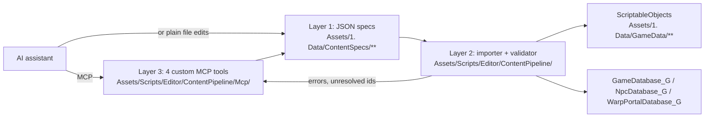

# AI-Assisted Content Authoring — Design

**Status:** design only, nothing implemented. Written 2026-09-04.

## Purpose

The goal is to let an AI assistant add quests, items, dialogs and NPCs to this project over MCP,
without a human hand-filling inspector fields, and without the assistant corrupting assets or
silently orphaning saved player data.

Three findings shape the whole document.

**The transport already exists.** `com.coplaydev.unity-mcp` is already a dependency in
`Packages/manifest.json` and resolved in `Packages/packages-lock.json`. It is an editor bridge that
exposes a generic Unity tool surface over MCP. Nothing needs to be built to *reach* the editor from
an assistant. What is missing is a domain layer, because the generic tools know how to write a
serialized field and know nothing about this project's invariants.

**The kit ships something that looks purpose-built for this, and it is an unfinished stub.**
`Core/Scripts/Patching/` exports game data to dictionaries and applies patches back. It is the
obvious foundation and it must not be used. Evidence in Part 2.

**The riskiest content type is dialogs**, because a dialog's runtime identity is its *index* in an
xNode graph rather than anything an author controls. Part 6.

Every claim below carries a `file:line` citation against the source in this repository so it can be
re-checked after a kit update. Paths are relative to `Assets/UnityMultiplayerARPG/Core/Scripts/`
unless stated otherwise.

## Scope

Inside this document:

- What the installed MCP bridge gives us, and the four invariants it cannot know about.
- Three routes for getting AI-authored content into the project, and why two of them are rejected.
- The recommended three-layer architecture: spec files, an editor importer, a thin MCP tool surface.
- The spec format, and the reference-by-id rule that makes it safe for an assistant to write.
- The three registries content has to land in, only one of which is `GameDatabase_G`.
- Dialog graphs, and the positional-identity problem that makes them the hard case.
- Gotchas verified in the source, a build order, and the decisions still open.

Outside this document:

- *What* content to write. This is a pipeline document, not a content plan.
- The extension mechanisms in general: `Documentation/EXTENDING.md`.
- Why the MMO entry scene is not wired to our assets: `Documentation/PROJECT_OVERVIEW.md`.

## Part 1 — The transport already exists

`Packages/manifest.json` pulls `com.coplaydev.unity-mcp` from
`https://github.com/CoplayDev/unity-mcp.git?path=/MCPForUnity#main`, and it is resolved in
`Packages/packages-lock.json`. The divergence index already notes it as "an editor bridge for AI
tooling with no runtime footprint"
(`Documentation/Systems/00_PROJECT_CUSTOMIZATIONS_AND_KIT_DIVERGENCE.md:285`).

The package's editor assembly is declared `"autoReferenced": true` in
`MCPForUnity/Editor/MCPForUnity.Editor.asmdef`. That matters here: `Assets/Scripts/Editor/` carries
no assembly definition and compiles into the predefined `Assembly-CSharp-Editor`, which
automatically references every auto-referenced assembly. So our editor code can call into the bridge
with no wiring and no new asmdef, which keeps the project's no-assembly-definition convention
intact.

### Why the generic tools are not enough

The bridge's built-in tools can create a ScriptableObject and set fields on it. They cannot know:

1. **That a new asset is invisible until it is registered.** Game data is loaded from explicit
   arrays on `GameDatabase` (`GameData/Database/GameDatabase.cs:40`–`:63`), not by scanning the
   project. An unregistered `.asset` file exists on disk and does not exist at runtime.
2. **That the asset's filename is load-bearing.** `BaseGameData.Id` falls back to the object name
   when the serialized `id` is empty (`GameData/BaseGameData.cs:30`–`:32`) and `DataId` hashes that
   string (`:147`–`:153`). All 48 game data assets under `Assets/1. Data/GameData/` currently
   leave `id` empty, so their filenames are their identity.
3. **Which fields are dead.** `Quest.tasks` is private, `[HideInInspector]`, and marked
   `// TODO: Deprecating, use random tasks` (`GameData/Quest/Quest.cs:16`–`:19`). Every read in the
   class goes through `randomTasks` instead (`:101`, `:103`, `:175`). An assistant that fills
   `tasks` produces a quest with no objectives and no error.
4. **Which defaults are traps.** `moveSpeedRateWhileAttacking` is declared `= 0f`
   (`GameData/Item/Implements/WeaponItem.cs:120`, and again on `Item.cs:87` and
   `GameData/Character/MonsterCharacter.cs:76`), which is a movement freeze for the length of every
   swing.

Each of those is a silent failure. That is the argument for a domain layer: encode the invariants
once, in code, instead of hoping the assistant remembers four paragraphs of prose.

## Part 2 — Three routes in, two of them dead ends

### Route A — the assistant writes `.asset` YAML directly. Rejected.

Attractive because it needs no editor running and no bridge at all. Rejected because Unity asset
YAML is not a format a language model can write safely: it needs the correct `m_Script` GUID per
type, correct `fileID`s, and — for dialogs — a node list with port connection records and graph
coordinates. Mistakes there do not fail loudly; they produce an asset that deserializes into
something subtly wrong.

The narrower version of this idea survives, though, and it is the basis of Route C: have the
assistant write *plain* text that is not Unity YAML, and let editor code do the serialization.

### Route B — the kit's runtime patch system. Rejected, with evidence.

`Core/Scripts/Patching/` looks exactly like the feature we want. `IPatchableData` gives every game
data object a string identity, `GetExportDataForPatching` walks the serialized fields into a
`Dictionary<string, object>` keyed by type and id, and `ApplyPatch` writes one back. Game data
classes already carry Newtonsoft `[JsonIgnore]` annotations. It reads like a supported JSON
authoring path.

It is unfinished. Three specific defects:

1. **Nothing ever supplies a patch.** `PatchDataManager.PatchingData`
   (`Patching/PatchDataManager.cs:27`) is read in exactly one place, `BaseGameData.OnEnable`
   (`GameData/BaseGameData.cs:194`), and is written nowhere in the repository. There is no loader,
   no file format, no entry point. The dictionary is always empty.
2. **Every cross-reference resolves to null.** Both branches that would rehydrate a reference to
   another game data object are stubs: `// TODO: Get data by type and id` followed by
   `IGameData foundData = null` at `Patching/PatchDataManager.cs:263`–`:264` and `:377`–`:378`. A
   patched quest would lose its reward items, its monsters and its follow-up quests.
3. **The single-reference path cannot execute at all.** `ApplyGameDataPatchData` guards with
   `if (field.DeclaringType is not IGameData) return;` (`Patching/PatchDataManager.cs:373`).
   `DeclaringType` is a `System.Type`, and a `Type` instance never implements `IGameData`, so the
   guard is always true and the method always returns before doing anything.

Since almost all interesting content is cross-references — a quest's rewards, an NPC's shop stock, a
dialog's next dialog — a system that drops every reference is not a partial solution. Do not build
on it, and do not "fix" it inside `Core/`; that tree is reverted wholesale on a kit update
(CLAUDE.md rule 1).

### Route C — spec files plus an editor importer. Accepted.

The assistant writes plain JSON that references everything by string id. Editor code turns that JSON
into real assets, resolves the references, registers them, and validates. The assistant never sees a
GUID, a `fileID` or a node port.



The split earns its keep in four ways. The assistant's output is text it is good at instead of a
binary-ish format it is bad at. The specs are diffable, so a content change reviews like a code
change rather than as an opaque `.asset` blob. The specs can be written with Unity closed, and
synced on next focus. And the importer is a single place to encode every invariant in Part 1, which
means the rules are enforced rather than remembered.

## Part 3 — Layer 1, the content spec

Specs live in `Assets/1. Data/ContentSpecs/<type>/<id>.json`, one file per content object, and are
committed. They are the authoring source of truth; the `.asset` files are the build product of the
importer.

JSON rather than YAML, because `Packages/manifest.json` already carries
`com.unity.nuget.newtonsoft-json` and `Newtonsoft.Json` is already used by kit game data
(`GameData/BaseGameData.cs` imports it), so the reader needs no new dependency.

A quest spec, showing the shape:

```json
{
  "type": "Quest",
  "id": "quest_wolf_cull",
  "title": "Thin the Pack",
  "description": "Grimwald wants the wolves west of the mill culled.",
  "requirement": { "level": 3 },
  "tasks": [
    { "task": "KillMonster", "monster": "monster_grey_wolf", "amount": 8 },
    { "task": "CollectItem", "item": "item_wolf_pelt", "amount": 4 }
  ],
  "rewards": {
    "exp": 450,
    "gold": 120,
    "items": [ { "item": "item_hunters_bow", "amount": 1 } ]
  },
  "repeatType": "None",
  "autoTrackQuest": true
}
```

Four rules make this safe to hand to an assistant:

- **Every reference is a string id**, never a path or a GUID. `"monster_grey_wolf"` is resolved by
  the importer against what is registered. An id that does not resolve is a hard error naming the
  spec file and the field, not a silent null.
- **`id` is mandatory and immutable.** It becomes the asset's serialized `id` field, which
  decouples runtime identity from the filename and closes the rename hazard described in Part 1.
  This is a deliberate departure from the existing 48 project assets, which all leave `id` empty.
- **The spec is a curated projection, not the full field list.** `Quest` has around thirty
  serialized fields; the spec exposes the dozen worth authoring and lets the importer default the
  rest. The projection is also where dead fields get hidden: the spec's flat `tasks` array maps to
  `randomTasks[0].tasks`, so the deprecated `Quest.tasks` field is unreachable by construction.
- **Enums are spelled, not numbered.** `"KillMonster"`, not `0`. `QuestTaskType` is
  `KillMonster, CollectItem, TalkToNpc, Custom = 254`
  (`GameData/Quest/QuestTaskType.cs:5`–`:8`), and that `254` is exactly the kind of thing an
  assistant guesses wrong.

## Part 4 — Layer 2, the importer

`Assets/Scripts/Editor/ContentPipeline/`, namespace `MMORPGGranny.EditorTools`, driven from
`Tools/MMORPG KIT/…` to match the two existing builders
(`Assets/Scripts/Editor/SyntyEquipmentContainerBuilder.cs:119`,
`SyntyLocomotionAnimationBuilder.cs:112`).

A sync pass runs in five phases, and the ordering is the design:

1. **Read and parse** every spec, reporting malformed JSON per file without aborting the run.
2. **Build the id index** across all specs *and* all already-registered assets, so a new quest can
   reference an existing item and vice versa.
3. **Create or update assets.** For each spec, find the existing asset by `id` or create one at
   `Assets/1. Data/GameData/<Category>/<Name>_G.asset`. Update in place — never delete and recreate,
   which would change the GUID and break every prefab and scene reference to it.
4. **Resolve references and register.** Fill object fields from the id index, then ensure the asset
   appears in the right registry array.
5. **Validate**, then `AssetDatabase.SaveAssets()`.

Two phases deserve more than a line.

### Registration is three registries, not one

`GameInstance` holds three separate database assets: `gameDatabase`
(`GameInstance/GameInstance.cs:373`), `npcDatabase` (`:378`) and `warpPortalDatabase` (`:381`).
Our copies are `Assets/1. Data/GameDatabase_G.asset`, `NpcDatabase_G.asset` and
`WarpPortalDatabase_G.asset`.

Items, quests, skills, monsters and maps go into the arrays on `GameDatabase_G`
(`GameData/Database/GameDatabase.cs:40`–`:63`). **NPCs do not.** They live in
`NpcDatabase_G.maps[].npcs[]`, which `GameInstance` feeds to `AddMapNpcs` at
`GameInstance/GameInstance.cs:1827`–`:1828`, and it is that walk which registers each NPC's start
dialog and dialog graph (`GameInstance/GameInstance_Data.cs:598`–`:601`). `NpcDatabase_G.asset`
currently holds `maps: []`, so an importer that only knows about `GameDatabase_G` will produce NPCs
and dialogs that never load.

### Validation is where the traps get caught

The validator should refuse to complete a sync when it finds any of these, and each maps to a known
failure in this project:

- An unresolved reference id.
- A duplicate `id` across specs, which would collide in `DataId`.
- A new weapon left at `moveSpeedRateWhileAttacking = 0`.
- A weapon type with a `weaponAnimations` entry but an empty attack clip array. Empty is not null,
  and `GetRightHandAttackAnimations` returns the weapon's own array whenever it is `!= null`
  (`GameData/Model/3D/PlayableCharacterModel.cs:455`), short-circuiting the `defaultAnimations`
  fallback on the next line. The result is a zero-length action rather than a default swing.
- A spec file under any `Resources/` folder. We use the explicit-list `GameDatabase`; anything under
  `Resources/` is force-included in every build.

After setting fields, call the asset's `Validate()`. For quests this is not optional: `Validate`
bakes `npcEntityId` from the `npcEntity` reference (`GameData/Quest/Quest.cs:183`–`:184`), and
`npcEntity` is compiled out of player builds by `#if UNITY_EDITOR`
(`GameData/Quest/QuestTask.cs:21`–`:29`). A `TalkToNpc` task that never went through editor-side
validation carries an `npcEntityId` of 0 and can never be completed.

### Deletion

The importer should not delete assets when a spec disappears. Deleting a registered `BaseGameData`
orphans any saved character data referencing its `DataId`. Report the orphan, leave the asset, let a
human decide.

## Part 5 — Layer 3, the MCP tool surface

The bridge supports project-defined tools. A tool is a static class in any `Editor/` folder carrying
`[McpForUnityTool("name")]` with a `static object HandleCommand(JObject)` method; the package
discovers them by reflection across editor assemblies. Parameters are declared on a nested
`Parameters` class with `[ToolParameterAttribute]`, and results are returned as `SuccessResponse` or
`ErrorResponse` from `MCPForUnity.Editor.Helpers`. The attribute is defined in
`MCPForUnity/Editor/Tools/McpForUnityToolAttribute.cs` in the package.

Four tools, deliberately generic over content type rather than one tool per type:

| Tool | Purpose |
|---|---|
| `granny_list_content` | Every registered id by type. Grounds the assistant so it references real content instead of inventing plausible ids. |
| `granny_get_schema` | The spec fields and legal enum values for one content type. Removes the guessing described in Part 3. |
| `granny_upsert_content` | Write a spec and run a sync limited to it. Returns validation errors. |
| `granny_validate_content` | Dry-run the whole spec tree, change nothing. |

Keeping the surface generic means a new content type costs a schema entry and an importer case, and
no new tool. It also keeps the tool count low, which matters because the bridge already advertises
forty-seven built-in tool entrypoints and every one of them consumes assistant context.

`granny_list_content` and `granny_get_schema` are the two that do the real work of making the
assistant accurate. The write tools are thin: they exist so the assistant gets validation errors
back in the same turn rather than discovering them when a human opens the editor.

## Part 6 — Dialog graphs, the hard case

Everything above assumes content is a ScriptableObject with a stable identity. Dialogs are not.

`BaseNpcDialog` extends xNode's `Node`, not `BaseGameData`
(`GameData/Npc/BaseNpcDialog.cs`), and dialogs are stored as sub-assets inside an `NpcDialogGraph`
(`GameData/Npc/NpcDialogGraph.cs`). Two facts combine badly:

- `BaseNpcDialog.Id` returns the object name with no serialized override:
  `public string Id { get { return name; } }` (`GameData/Npc/BaseNpcDialog.cs:152`), and `DataId`
  hashes it (`:154`). There is no `id` field to set, so the Part 3 rule that closes the rename
  hazard for every other content type **cannot be applied to dialogs**.
- `NpcDialogGraph.GetDialogs()` renames every node as it collects them:
  `nodes[i].name = name + " " + i;` (`GameData/Npc/NpcDialogGraph.cs:17`).

So a dialog's identity is `"<graph name> <index in the node list>"`, assigned at load. Inserting a
node at the front of a graph re-keys every dialog after it. This is not a rare path: `GetDialogs()`
is called from `GameInstance/GameInstance_Data.cs:601` during database load and again from
`Gameplay/Npcs/NpcEntity.cs:103` and `:119` when an NPC entity initializes.

Consequences for the importer, and they are strict:

- **Dialog graphs are append-only.** New nodes go on the end. The importer must never reorder or
  remove a node in a graph that has shipped, and should fail the sync if a spec would.
- **The spec's own dialog keys are not runtime ids.** A spec can call a node
  `"grimwald_greeting"` for authoring and cross-referencing, but the importer must maintain the
  spec-key-to-index mapping itself and warn that the runtime id is positional.
- **Renaming a graph re-keys every dialog in it**, for the same reason.

This is the single most likely way an AI-authored change breaks saved player state, and it is worth
a dedicated validation check rather than a comment.

## Gotchas verified in the source

- `PatchDataManager.PatchingData` is never written to anywhere in the repository
  (`Patching/PatchDataManager.cs:27`, read only at `GameData/BaseGameData.cs:194`).
- Patch reference resolution is stubbed to null in both branches
  (`Patching/PatchDataManager.cs:263`–`:264`, `:377`–`:378`).
- `ApplyGameDataPatchData` returns before doing anything, because it compares a `System.Type`
  against an interface (`Patching/PatchDataManager.cs:373`).
- `Quest.tasks` is dead; all reads go through `randomTasks`
  (`GameData/Quest/Quest.cs:16`–`:19`, `:101`–`:103`).
- `QuestTask.npcEntity` is editor-only and `npcEntityId` is baked by `Quest.Validate`
  (`GameData/Quest/QuestTask.cs:21`–`:29`, `GameData/Quest/Quest.cs:183`–`:184`).
- `BaseNpcDialog.Id` is the object name, with no serialized override
  (`GameData/Npc/BaseNpcDialog.cs:152`).
- `NpcDialogGraph.GetDialogs()` renames nodes by index (`GameData/Npc/NpcDialogGraph.cs:17`).
- NPCs register through `NpcDatabase`, not `GameDatabase`
  (`GameInstance/GameInstance.cs:1827`–`:1828`, `GameInstance/GameInstance_Data.cs:598`–`:601`).
- `BaseGameData.Id` falls back to the asset name and `DataId` hashes it
  (`GameData/BaseGameData.cs:30`–`:32`, `:147`–`:153`); all 48 assets under
  `Assets/1. Data/GameData/` leave `id` empty.
- An empty-but-not-null attack animation array suppresses the default fallback
  (`GameData/Model/3D/PlayableCharacterModel.cs:455`–`:457`).
- `moveSpeedRateWhileAttacking` is declared `= 0f`
  (`GameData/Item/Implements/WeaponItem.cs:120`, `GameData/Item/Item.cs:87`,
  `GameData/Character/MonsterCharacter.cs:76`).
- `MCPForUnity.Editor.asmdef` is `autoReferenced: true`, so `Assets/Scripts/Editor/` reaches it with
  no asmdef of our own.

## Build order

Riskiest assumption first, and each step is verifiable in the editor before the next is written.

1. **Items, end to end, no MCP.** Spec reader, importer, `GameDatabase_G` registration, validator,
   one menu item. Items are the simplest type with no graph and no second registry. If a spec cannot
   round-trip into a working item, nothing later matters.
2. **Quests.** Proves reference resolution against items and monsters, the `randomTasks` mapping,
   and the `Validate()` call that bakes `npcEntityId`.
3. **The four MCP tools**, wrapping what already works. Do this before dialogs so the assistant can
   be tested against a stable surface.
4. **NPCs and `NpcDatabase_G`.** The second registry, without dialogs.
5. **Dialog graphs**, with the append-only check from Part 6 written before the first graph is
   generated.

Steps 1–3 are the useful core, and cover the two content types most worth automating. Steps 4 and 5
carry all the risk.

## Open decisions

- **Do the specs or the assets win on conflict?** This document assumes specs are authoritative and
  assets are generated. That is clean for AI-authored content and awkward for a human who tunes a
  value in the inspector, which the importer would then overwrite. The alternative — export assets
  back to specs after a manual edit — needs a round-trip exporter, roughly doubling Layer 2.
- **Should `id` be backfilled on existing assets?** Setting `id` on the 48 existing project assets
  would end the rename hazard everywhere rather than only for new content. It is a one-time
  mechanical change, and it must be done *before* anything ships that players can own, because
  setting `id` on an asset that already has saved data changes its `DataId`.
- **Pin the bridge.** `Packages/manifest.json` tracks `#main`, so any two resolves can produce
  different package commits and, with custom tools, a different tool surface. A tag would make the
  pipeline reproducible.
- **Where do icons and prefabs come from?** Specs reference art by path or address. An assistant
  cannot author a sprite, so either every spec needs a human-supplied art reference or the importer
  needs a placeholder convention.
- **MMO parity.** `00Init_MMO.unity` still points at the kit's `GameInstance.prefab` and the kit
  demo database, so content synced into `GameDatabase_G` appears in LAN and offline play but not in
  the MMO flavour.

## Related

- `Documentation/EXTENDING.md` — the extension mechanisms this pipeline stays inside.
- `Documentation/Systems/00_PROJECT_CUSTOMIZATIONS_AND_KIT_DIVERGENCE.md` — ours versus vendored,
  and where `com.coplaydev.unity-mcp` is recorded.
- `Documentation/PROJECT_OVERVIEW.md` — startup flow and the LAN/MMO entry-scene divergence.
- `CLAUDE.md` — where new work goes, the `_G` convention, and why `Core/` must not be edited.
